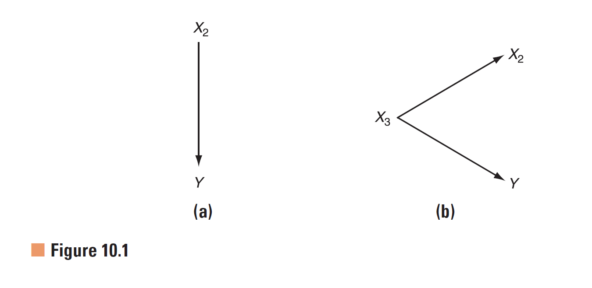
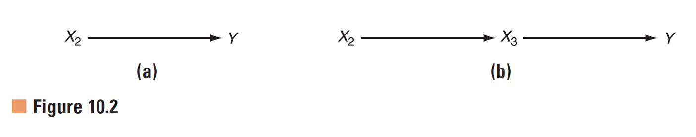
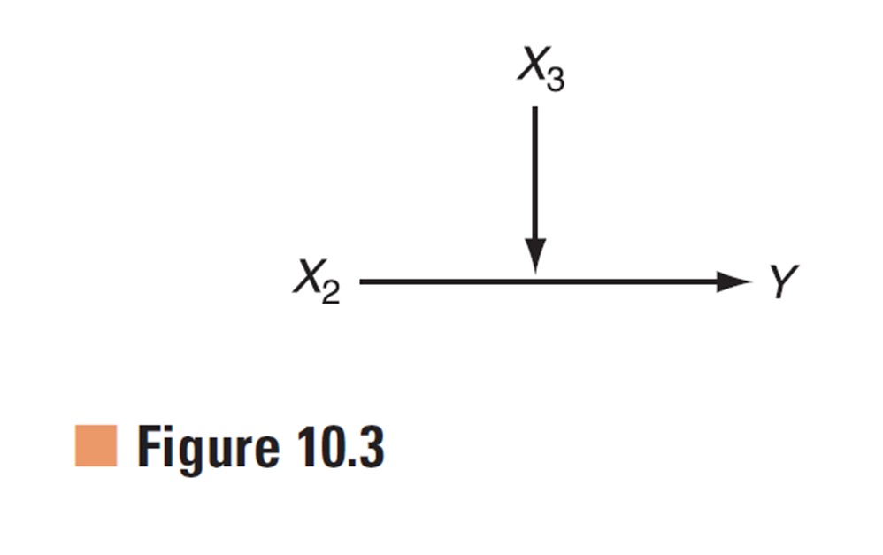
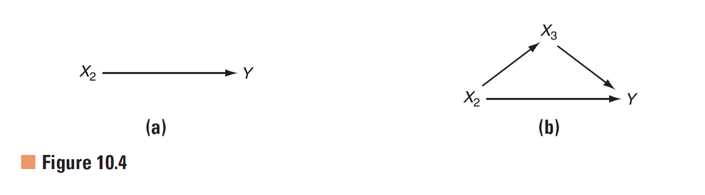
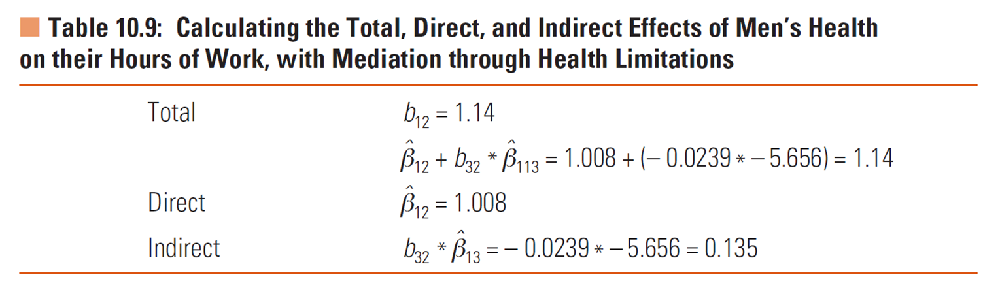
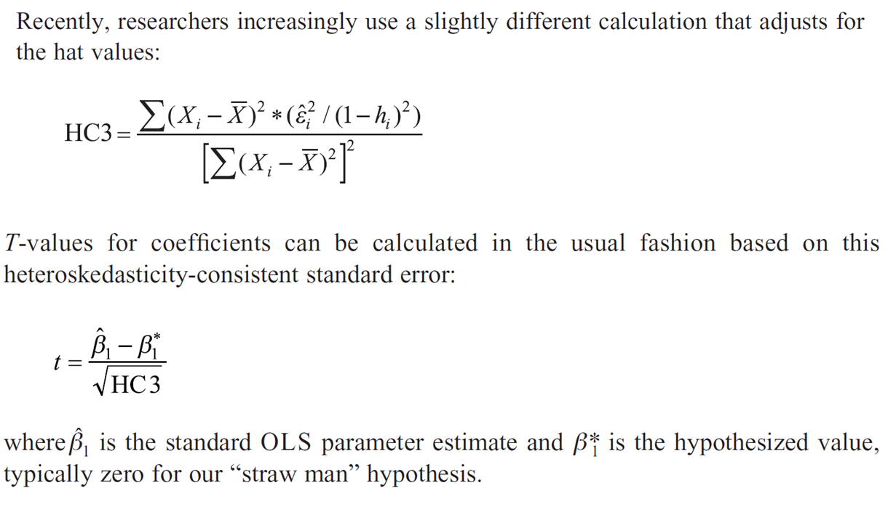

```{r setup, include=F}
knitr::opts_chunk$set(message=FALSE, warning=F, echo=F)
options(width = 2000)
options(repos="https://cran.rstudio.com")

require(tidyverse)
#californiatod <- read_csv("californiatod.csv")
```

# Outline

- Effect Size
- Indirect Effects
- OLS Model Diagnostics
    - Outliers and influential observations
    - Heteroskedasticity (homoscedasticity)
    - Multicolinearity
    
---

# Effect Size

- Effect size is a measure of a study's practical significance. A statistically significant result may have a weak effect. To gauge the research significance of their result, researchers are encouraged to always report an effect size along with p-values. An effect size measure quantifies the strength of an effect, such as the distance between two means in units of standard deviation (cf. Cohen's d), the correlation between two variables or its square, and other measures.

Many possible measures of effect size:

- The Pearson correlation coefficient or R2 is the basic effect size measure in the linear relationship set;
- Cohen's d: $\frac{y_{group1} - y_{group_2}}{\sigma_y}$
- Based on regression coefficients: non-standardized, semi-standardized, standardized
  
---

background-image: url("img/effect-size1.png")
background-size: 100%
class: bottom, center

Partial R2 (1)

---

background-image: url("img/effect-size2.png")
background-size: 100%
class: bottom, center

Partial R2 (2)

---

# Cohen's d from regression (1)

```{r}
require(tidyverse)
chores <- mtcars %>% select(hours=mpg, married=vs, women=am)
rownames(chores) <- NULL

(lm_hours <- lm(hours ~ married * women, data=chores)) %>% 
  summary

# effect size of gender
coef(lm_hours)["women"] / sd(chores$hours)

# confidence interval of effect size
confint(lm_hours)["women", ] / sd(chores$hours)
```

---

# Cohen's d from regression (2)

```{r, echo=TRUE, eval=FALSE}
require(tidyverse)
chores <- mtcars %>% select(hours=mpg, married=vs, women=am)
rownames(chores) <- NULL

(lm_hours <- lm(hours ~ married * women, data=chores)) %>% 
  summary

# effect size of gender
coef(lm_hours)["women"] / sd(chores$hours)

# confidence interval of effect size
confint(lm_hours)["women", ] / sd(chores$hours)
```

---

background-image: url("img/effect-size3.png")
background-size: 50%
class: bottom, center

Effect size based regression coefficients (Texbook page 203-206)

---

# Qualitive guidelines of effect sizes

- r rule of thumb: Small	0.10; Medium	0.30; Large	0.50
- Cohen's rule of thumb: 0.20 - small; 0.50 - medium, and 0.80 - large
- Place effect sizes in the context of related literature on the outcome and predictor of interest or 
- Compare the effect size for one predictor and outcome to effect sizes for other predictors

Review textbook pages 152-155, 200, 203-206, 262, 299

---

# Confounders (1)

- A confounder  (common cause or extraneous variable) is a third variable which is causally related to two other variables.
- When the confounder is ignored, it appears the two variable it causes are associated.
- Statistically, this situation is referred to as a spurious relationship: an apparent association between one variable and another variable is really due to a third variable. 



# Mediators

- Mediation occurs when a third variable represents the mechanism through which an association between a predictor and outcome operates.
- The third variable is typically referred to as a mediator an intervening variable or a proximal cause.  



---

# Moderators

- A moderator is a qualitative (e.g., sex, race, class) or quantitative (e.g., level of reward) variable that affects the direction and/or strength of the relation between an independent or predictor variable and a dependent or criterion variable. Specifically within a correlational analysis framework, a moderator is a third variable that affects the zero-order correlation between two other variables. 
- A basic moderator effect can be represented as an interaction between a focal independent variable and a factor that specifies the appropriate conditions for its operation. 



---

# Total, Direct and Indirect Effect



---

# Notation


---

# Direct and Indirect Effect Example (1)


---

# Direct and Indirect Effect Example (2)



---

# Suppressor variables

- Suppressor variables are mediators in which the indirect effect has the opposite sign as the direct effect.  
- In these cases, the total effect may be close to zero, and adding the mediator variable to the model may reveal a significant association between the predictor of interest and the outcome.  

---

# Omitted variable bias

Omitted variable bias is defined exactly the same as the indirect effect, although because we typically do not have a measure of the omitted variable we consider just the signs of the arrows on the direct and indirect pathways to anticipate the consequences of lacking this measure.

$$b_{32} * \beta_{13}$$
---

background-image: url("img/omitted_variable_bias.png")
background-size: 100%
class: bottom, center

---

# Omitting mediator/confounder of the same sign
- The direct effect and indirect effect having the same signs fall on the diagonal
- Omitting a mediator or confounder of the same sign as the direct effect overstates the direct effect of the predictor of interest
- This is sometimes referred to as biasing the effect away from zero
- e.g. health limitations mediating the association of health with hours of work

---

# Omitting suppressor variables

- Suppression effects, where the direct effect and indirect effect have opposite signs, fall off the diagonal.  
- Omitting the suppressor variable leads to an understatement of the direct effect of the predictor of interest.  
- This is sometimes referred to as bias toward zero.  
- In cases in which the indirect effect is larger than the direct effect, the sign on the coefficient estimate for the predictor of interest will be in the wrong direction, relative to its expected direct effect.

---

class: center, middle

# Model Diagnostics

---

# Assumptions of OLS

--

**I**dentically **I**ndependently Normal **D**istributed (or iid Normal) error term $\epsilon_i$ :
$$\epsilon_i \sim N(0, \sigma^2)$$


---

# Outliers and influential observations

- An outlier is a value that falls far from the rest of the values on a variable
    - outliers may go hand in hand with the outcome variable not being normally distributed (fat tails)
- Influential observation is an observation whose inclusion in or exclusion from the data file greatly changes the results of the regression analysis
    - Influential observations causes the residuals not being symmetrically distributed

- Reasons for outliers and influential observations
    - Data errors and 
    - Misspecification
        - curvlinear model specified as linear model
        - extreme cases may conform to a different model than the other cases

---


---


---

# Identifying Outliers and Influential Observations


---

# Strategies for Addressing Outliers and Influential Observations

- Check for possible data errors
- A common approach to dealing with non-normality of the outcome variable within the context of OLS is to transform the outcome variable, e.g. with log transformation
- Another common approach to dealing with influential cases in OLS is to see how these cases differ from other cases and refine the model accordingly.
    - When the influential cases are few in number, not an obvious data entry error, or have no apparent substantive meaning, it is possible to simply examine how sensitive the findings are to the inclusion or exclusion of the outlying observations.
    
---

# Heteroskedasticity


---

# Heteroskedasticity-Consistent Standard Errors (1)

- Capture heteroskedasticity within models: hiearchical models; weighted least regress; geographical weighted regression; time-series models
- General adjustments for heteroskedasticity of unknown form with heteroskedasticity-Consistent Standard Errors
    - referred to as robust standard errors, heteroskedasticity robust standard errors, White standard errors or Huber-White standard errors
    - Simulations by Long and Ervin (2000) found HC3 to have superior performance
    - with R: `car::hccm` or `sandwich::vcovHC`
  
---    

# Heteroskedasticity-Consistent Standard Errors (2)



---

# Multicollinearity

Multicollinearity is a situation of high correlation among predictor variables.
The multiple regression model allows us to obtain estimates of the direct effect of a predictor variable on the outcome, parsing out the portion due to confounders and the flows through indirect pathways.  
But, it is also the case that when the predictor variables are themselves correlated, it can be difficult to separate out their unique effects on the outcome variable, depending on the degree of the correlation.  
At the extreme, if two predictor variables are perfectly correlated then they are indistinguishable and we cannot disentangle their separate influences on the outcome variable.  

---

# Diagnosing Multicollinearity (1)

- Variance Inflation Factors
- Significant model F but no significant individual coefficients
- Rising standard errors in models with controls.

---

# Diagnosing Multicollinearity (2)

- A VIF of 4 would be interpreted as follows:  The estimated variance of the coefficient for this predictor variable is 4 times larger (i.e., the standard error for the coefficient for this predictor variable is sqrt(4)=2 times larger), due to the variation that this predictor variable shares with the other predictor variables in the model, all else equal. 
- A cutoff value of 4 or 10 is sometimes given for regarding a VIF as high.  
Bu- t, it is important to evaluate the consequences of the VIF in the context of the other elements of the standard error, which may offset it (such as sample size).

---

# Diagnosing Multicollinearity (3)


---

# Diagnosing Multicollinearity (4)

- A telltale sign of high multicollinearity is having a significant model F value but no significant t-values for individual coefficients in the model
- Seeing the standard errors become substantially larger in models with additional controls; useful when examining published results that report standard errors (but not VIF)

---

# Remedies for Multicollinearity

- If multicollinearity appears to be a problem with your data, what can you do?  
    - A high VIF in and of itself may not require action, especially if another component of the standard error can offset the multicollinearity (such as a large sample size, ample variation in X, or relatively small conditional variance).
    - Still, if you see a significant overall model F value with no significant t values, or see that standard errors increase dramatically between the bivariate and multiple regression models, then you may need to take steps to address it.
    - As you think about potential multicollinearity in your model, we recommend that you consider two key questions: (1) Are the predictor variables indicators of the same or different constructs? And (2) How strongly are the predictor variables correlated in the real world as opposed to your sample (and why)?

