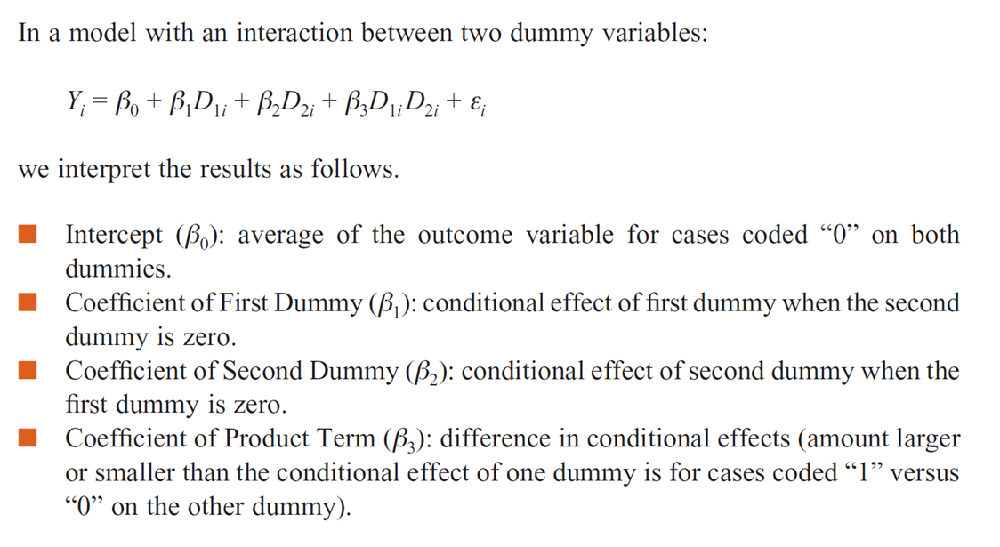

```{r setup, include=F}
knitr::opts_chunk$set(message=FALSE, warning=F, echo=F)
options(width = 2000)
options(repos="https://cran.rstudio.com")

require(tidyverse)
californiatod <- read_csv("californiatod.csv")
```

# Outline

- Regression with Categorical Independent Variables
   - Testing Differences in Means Among the Included Groups
   - Ordinal Categorical Variable
- Interaction
   - Research questions
   - Interaction terms
   - Simpson's Paradox

---

# Testing Differences in Means Among the Included Groups

The coefficients are the mean differences to the reference category for the corresponding group. What if we are interested in the difference between LA and SD?

1. Re-estimating the regression model with a different reference category
2. Using a partial F test
3. Testing the significance of a linear combination of coefficients

---

# Testing Differences in Means Among the Included Groups (1)

```{r, echo=TRUE}
catod2 <- californiatod %>% mutate(region = relevel(as.factor(region), ref = 4))
lm(houseval ~ region, data=catod2)  %>% summary
```

---

Testing Differences in Means Among the Included Groups (2a)

```{r, echo=TRUE, results="asis"}
catod2 <- californiatod %>% mutate(LA_SD_region = ifelse(region %in% c("LA", "SD"), "LA_SD", region))
require(huxtable); huxreg(lm(houseval ~ LA_SD_region, data=catod2), lm(houseval ~ region, data=catod2))
```

---

# Testing Differences in Means Among the Included Groups (2b)

```{r, echo=TRUE}
anova(
  lm(houseval ~ LA_SD_region, data=catod2),
  lm(houseval ~ region, data=catod2)
)
```

---

# Testing Differences in Means Among the Included Groups (3a)

- Generally, in our models, a linear combination will involve the addition of two coefficients or the subtraction of two coefficients. 
- Statistical theory tells us how to calculate the standard error of a linear combination, and we can divide the difference in estimated coefficients by this standard error.  
- The resulting value is a t-statistic, and thus we can use our standard procedures for calculating a p-value or comparing the calculated t-value to a critical t-value in order to make a conclusion about the null hypothesis.

---

# Testing Differences in Means Among the Included Groups (3b)

- Variance-covariance matrix of the estimated regression coefficients.  
    - The variances of the regression coefficients capture the variation in  the sampling distribution (i.e., in estimates across samples).  
    - We use the square root of these variances – the standard errors – whenever we calculate a t-statistic for an individual regression coefficient.  
    - The parameter estimates also covary (for some applications, when the intercept is large, the slope is also large; for other aookications, when the intercept is large, the slope is small; for yet other applications, the intercept and slope are hardly associated).  
    - The covariances – the values that fall “off the diagonal” of the matrix – capture this covariation among the coefficients.  
    - We use these covariances in the formula for the standard error of a linear combination of coefficients.
- With R, you can get the variance-covariance matrix with the `vcov` function

---

# Testing Differences in Means Among the Included Groups (3b)


---

# Testing Differences in Means Among the Included Groups (3c)

**Question: Is the difference between SD and LA significant?** 

First do this manually, information we need:

- Point estimate of $\beta$s
- Variance-Covariance matrix of $\beta$s

---

```{r, echo=TRUE}
 lm(houseval ~ region, data=californiatod) %>% summary
```

```{r, echo=TRUE}
lm(houseval ~ region, data=californiatod) %>% vcov
```

---

# Testing Differences in Means Among the Included Groups (3d)

We can use linear hypothesis testing function in software to do this for us:
```{r, echo=TRUE}
car::lht(lm(houseval ~ region, data=californiatod), "regionLA = regionSD")
```

Alternatively,
```{r, echo=TRUE}
car::lht(lm(houseval ~ region, data=californiatod), "regionLA - regionSD = 0")
```

---

# Summary

```{r, results="asis"}
tibble::tribble(
~Approach, ~test,  ~`test-stat`, ~`p-value`,
"1. Re-estimating with a different reference", "t test", 0.304, 0.764,
"2. Using a partial F test", "F test", 0.0925, 0.764,
"3. linear hypothesis testing", "t test/F test", 0.304, 0.764
) %>% knitr::kable("html")
```

---

# Discrete Numeric/Ordinal Predictors

```{r, echo=TRUE}
fit_numeric <- lm(mpg ~ cyl, data=mtcars)
fit_factor <- lm(mpg ~ factor(cyl), data=mtcars)
fit_ordered <- lm(mpg ~ ordered(cyl), data=mtcars, contrasts=list(`ordered(cyl)`=MASS::contr.sdif)) 
```

---

```{r, echo=TRUE}
require(huxtable)
huxreg(fit_numeric, fit_factor, fit_ordered)
```

---

# More than One Categorical Predictors

```{r, echo=TRUE}
lm(mpg ~ am + vs, data=mtcars) %>% 
  summary
```

---

# Additive Models
$$Y_{i} = \beta _ {0} + \beta_{1} D_{1i} + \beta_{2} D_{2i} + \epsilon_{i}$$

---

# Interactions between dummy variables (1)

Sample questions:
- “Is the gender gap in wages the same for African Americans and whites?”  
- “Are the health benefits that distinguish married from single adults the same for women and men?”  
- “Does the gap in educational attainment between teenage and adult mothers differ depending on their living arrangements (i.e., alone, extended family, married, cohabiting)?”		
- Does types of engine affects mpg similarly between cars with auto and manual transimissions?

---

# Interactions between dummy variables (2)

- am: 0 = auto transimission, 1 = manual transmission
- vs: 0 = V-engine, 1 = Stright-engine

```{r, echo=TRUE}
lm(mpg ~ am * vs, data=mtcars) %>% 
  summary
```

---

# Interactions between dummy variables (3)



---

# Interactions between dummy variables (4)

Does types of engine affects mpg similarly between cars with auto and manual transimissions?

- VS=0, AM=0: 15.050
- VS=0, AM=1: 15.050+4.700
- VS=1, AM=0: 15.050+5.693
- VS=1, AM=1: 15.050+4.700+5.693+2.929

---

# Interactions between a dummy variable and a numeric variable (2)

Sample Research Questions:

- “Are the returns to education (the link between educational attainment and earnings) greater for whites than other race/ethnicity groups?”  
- “Is the association between job satisfaction and complexity of job tasks stronger for people with a college degree than those with a high school degree?” 
- “Is the link between the level of crime in a community and the level of social disorganization in a community weaker in suburban or rural areas than in urban areas?” 
- Do the effects of weight on mpg differ for cars with different number of cylinder?

---

```{r}
mtcars2 <- mtcars %>% mutate(cyl=as.character(cyl))
(fit <- lm(mpg ~ wt * cyl, data=mtcars2)) %>% 
  summary
```

---

```{r, echo=FALSE}
require(ggplot2)
require(plyr)
require(reshape2)
require(ggiraph)
require(rgl)
require(ggiraphExtra)
mtcars2 <- mtcars %>% mutate(cyl=as.character(cyl))
fit <- lm(mpg ~ wt * cyl, data=mtcars2)
ggPredict(fit, interactive=TRUE)
```

---

# Interactions between numeric variables (1)

Sample Research Questions:

- “Job stress is associated with harsher parenting, but this association weakens with each additional increment of social support received from family and friends” or  
- “Living in a community where adults have higher average educational attainment relates to the educational aspirations of youth, but more strongly when a higher proportion of neighborhood adults are the same race/ethnicity as the youth.”
- cyl and weight may affect mpg in tandem - the weight is stronger for cars with more cylinders

---

```{r}
(fit <- lm(mpg ~ wt * cyl, data=mtcars)) %>% 
  summary

```

---

# Simpson's Paradox: A Demo (1)

```{r, echo=F}
library(MASS)  # For multivariate normals

# List of (vectors of) means
mu <- list(c(5, 175),
           c(6.25, 110))
# List of covariance matrices
sigma <- list(rbind(c(0.75, 25), c(25, 1000)),
              rbind(c(0.80, 10), c(10, 500)))
# Vector of colors
cols <- c("green", "blue")

if (any(sapply(sigma, det) <= 0)) {
  warning("One of your sigmas is not positive-definite")
}

vars <- c("height", "weight")

CreateDataFrame <- function(i, n=500) {
  # Create data frame containing n observations from the ith group
  df <- data.frame(type=rep(cols[i], n))
  df[ , vars] <- mvrnorm(n, mu[[i]], sigma[[i]])
  return(df)
}

df <- do.call(rbind, lapply(1:2, CreateDataFrame))

str2rgb <- function(str, alpha=255) {
  # Convert a vector of strings to a vector of color codes,
  #  eg "darkblue" -> "#00008B96" (a semi-transparent darkblue)
  # Is there a better way to do this?
  rgb.matrix <- col2rgb(str)
  return(rgb(rgb.matrix[1, ],
             rgb.matrix[2, ],
             rgb.matrix[3, ],
             alpha,
             maxColorValue=255))
}

# Sort data frame by vars[1] (for plotting)
df <- df[order(df[ , vars[1]]), ]

#dev.new(height=8, width=10)
plot(df[ , vars],
     main="Height and Weight in Two Populations",
     col=str2rgb(as.character(df$type), alpha=128),
     pch=as.integer(df$type),
     xlim=(range(df$height) + c(-1.5, 1.5)),
     ylim=(range(df$weight) + c(-20, 20)))
mtext("An illustration of Simpson's paradox")
```

Source: http://www.r-bloggers.com/simpsons-paradox/

---

# Simpson's Paradox: A Demo (2)

```{r, echo=F}
# Vector of model formulas
formulas <- c("weight ~ height",
              "weight ~ height + type",
              "weight ~ height * type")

# List of fitted models
models <- lapply(formulas, lm, data=df)

plot(df[ , vars],
     main="Height and Weight in Two Populations",
     col=str2rgb(as.character(df$type), alpha=128),
     pch=as.integer(df$type),
     xlim=(range(df$height) + c(-1.5, 1.5)),
     ylim=(range(df$weight) + c(-20, 20)))
mtext("An illustration of Simpson's paradox")

# Plot model 1
lines(df$height, fitted.values(models[[1]]),
      col="black", lwd=2, lty=2)

# Plot models 2:3
for (i in 2:3) {
  for (col in cols) {
    lines(df$height[df$type == col],
          fitted.values(models[[i]])[df$type == col],
          col="black", lwd=2, lty=(i + 1))
  }
}

legend("topleft", formulas, bty="n", lwd=2, lty=2:4)
legend("topright", sprintf("group %s", 1:2), bty="n",
       col=str2rgb(cols),
       pch=as.integer(factor(cols)))
```

---

# Simpson's Paradox: A Demo (3)

```{r, results="asis"}
huxtable::huxreg(models)
```