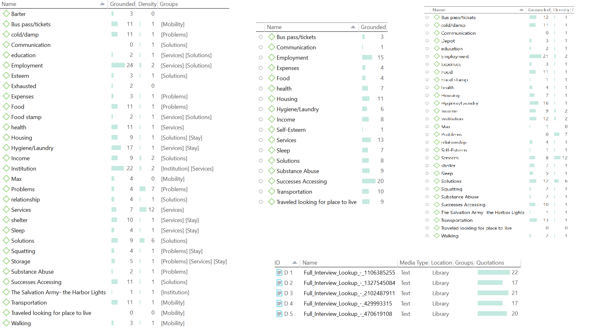

```{r setup, include=F}
knitr::opts_chunk$set(message=FALSE, warning=F, echo=F)
options(width = 2000)
options(repos="https://cran.rstudio.com")
```

# Sample of Zotero


---
# Sample of Atlas.ti



---
# Sample of Atlas.ti 


---

# Hypothesis Testing about OLS Coefficients

$$\beta_1 \sim t_{df}(\hat{\beta}_1, \hat{\sigma}_{\hat{\beta}_1})$$
$$H_o: \beta_1 = \beta^*_1$$
$$H_a: \beta_1 \neq \beta^*_1$$

---

# Scatter plot & regression line

```{r}
library(tidyverse)
ggplot(mtcars, aes(x=carb, y=hp)) + geom_point() + geom_smooth(method="lm", se=FALSE)
```

---
# Hypothesis Testing about OLS Coefficients

```{r, echo=TRUE}
library(tidyverse)
lm(hp ~ carb, data=mtcars) %>% summary()
```

---

```{r echo=TRUE, paged.print=TRUE,}
knitr::include_app("https://urbanstudies.shinyapps.io/website/", height = "600px")
knit_print.shiny.render.function()

library(shiny)

# Define UI for application that draws a histogram
ui <- fluidPage(

    # Application title
    titlePanel("Old Faithful Geyser Data"),

    # Sidebar with a slider input for number of bins 
    sidebarLayout(
        sidebarPanel(
            sliderInput("bins",
                        "Number of bins:",
                        min = 1,
                        max = 50,
                        value = 30)
        ),

        # Show a plot of the generated distribution
        mainPanel(
           plotOutput("distPlot")
        )
    )
)

# Define server logic required to draw a histogram
server <- function(input, output) {

    output$distPlot <- renderPlot({
        # generate bins based on input$bins from ui.R
        x    <- faithful[, 2]
        bins <- seq(min(x), max(x), length.out = input$bins + 1)

        # draw the histogram with the specified number of bins
        hist(x, breaks = bins, col = 'darkgray', border = 'white')
    })
}

# Run the application 
shinyApp(ui = ui, server = server)

```