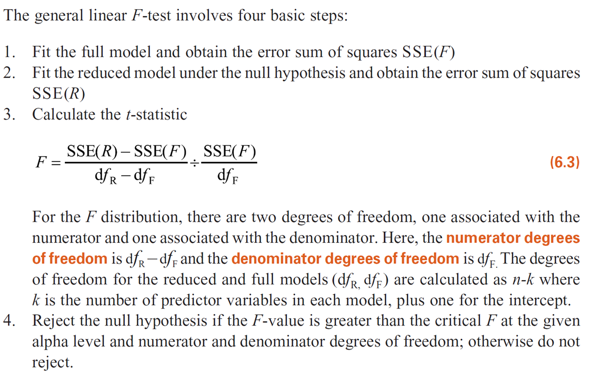

```{r setup, include=F}
knitr::opts_chunk$set(message=FALSE, warning=F, echo=F)
options(width = 2000)
options(repos="https://cran.rstudio.com")
```

# Outline

- PRL vs SRL
- Multiple Regression
   - Population Regression Model
   - OLS estimate of Multiple Regression
   - General Linear F Test

---

# PRL vs SRL 1
PRL for a hypothetic population with 1000 observations where $Y_i=1.0 + 5.0X_i + \epsilon_i$ and $X_i \sim \text{Uniform}(0, 1), $\epsilon_i \sim N(0, 1)$:
```{r, echo=F}
library(ggplot2)
library(tidyverse)

X <- runif(1000, min=0, max=1)
epsilon <- rnorm(1000, mean=0, sd=1)
beta0 <- 1
beta1 <- 5
Y <- beta0 + beta1 * X + epsilon

xy_df <- data_frame(X=X, Y=Y, epsilon=epsilon)

ggplot(data=xy_df, aes(x=X, y=Y)) + geom_point() + geom_smooth(method="lm", se=F)
```

---

# PRL vs SRL 2

SRL with 100 random samples from the population:

```{r, echo=F}
library(texreg)
sample_df <- xy_df %>% sample_n(100)

ggplot(data=sample_df, aes(x=X, y=Y)) + geom_point() + geom_smooth(method="lm", se=F)
```

---

# PRL vs SRL 3

SRL with 100 random samples:

```{r, echo=F, results="asis"}
lm(Y ~ X, data=sample_df) %>% 
  htmlreg(doctype = FALSE)
```

---

# PRL vs SRL 4

Repeatedly sample 100 observations from the population and estimate the SRLs (for 500 times):

```{r, echo=F}
require(broom)
require(gridExtra)
sample_betas <- data_frame(data=list(xy_df)) %>% 
  crossing(data_frame(rep=1:500)) %>% 
  mutate(sample=map(data, ~sample_n(.x, 100)),
         yxlm=map(sample, ~lm(Y ~ X, data=.x)),
         lmtidy=map(yxlm, tidy),
         intercept = map_dbl(lmtidy, ~.x[1, "estimate"]),
         slope = map_dbl(lmtidy, ~.x[2, "estimate"])
         ) 
  
grid.arrange(
  ggplot(sample_betas, aes(x=intercept)) + geom_density(),
  ggplot(sample_betas, aes(x=slope)) + geom_density(),
  ncol=2
)

```

---

# The need for Multiple Regression

Multiple factors affecting the outcome (dependent variable) of interest

- Randomization through experiment design 
- Statistical control: control for covariates statistically

---

# Multiple Regression: Population Regression Model

$$\text{Y}_i = \beta_0 + \beta_1 \text{X}_{1i} + \beta_2 \text{X}_{2i} + \epsilon_i, where \epsilon_i \sim N(0, \sigma)$$, 
$$\text{E}(Y_i|\text{X}_{1i}, \text{X}_{2i}) = \beta_0 + \beta_1 \text{X}_{1i} + \beta_2 \text{X}_{2i}$$

---

# Multiple Regression: Intercept

Substituting X1=0 and X2=0 into the equation for the conditional mean leads to all the terms dropping out of the right hand side of the equation except for the intercept.  

$$\text{E}(Y_i|\text{X}_{1i}=0, \text{X}_{2i}=0) = \beta_0 + \beta_1 * 0 + \beta_2 * 0 = \beta_0$$

---

# Multiple Regression: Slope

We can see that:
- If we hold one predictor variable constant at a particular level, then that value is subsumed into the intercept.
- And, the change in Y when we change the other predictor by 1 is equal to that other predictor’s coefficient.

$$\text{E}(Y_i|\text{X}_{1i}=m, \text{X}_{2i}) = \beta_0 + \beta_1 * m + \beta_2 * \text{X}_{2i} = (\beta_0 + \beta_1 * m) + \beta_2 * \text{X}_{2i}$$

---

# Visualize Multiple Regression

`mpg` model with the `mtcars` dataset: $\text{mpg}_i = \beta_0 + \beta_1 \text{wt}_i + \beta_2 * \text{cyl}_i + \epsilon_i$

```{r}
#devtools::install_github("cardiomoon/ggiraphExtra")
#detach("package:tidyverse", unload=TRUE)
require(ggplot2)
require(plyr)
require(reshape2)
require(ggiraph)
require(rgl)
require(ggiraphExtra)

fit <- lm(mpg ~ wt + cyl, data=mtcars)
ggPredict(fit, interactive=TRUE, colorn=3, colorAsFactor=TRUE)

```


---

3D representation of $\text{mpg}_i = \beta_0 + \beta_1 \text{wt}_i + \beta_2 * \text{cyl}_i + \epsilon_i$

```{r, warning=FALSE, echo=FALSE, fig.height=6}
ggPredict3d(fit, radius=0.15)
rglwidget()
```

---

# OLS Estimation of the Multiple Regression Model

$${\text{Y}}_i = \hat{\beta}_0 + \hat{\beta}_1 \text{X}_{1i} + \hat{\beta}_2 \text{X}_{2i} + \hat{\epsilon}_i$$
$$\hat{\text{Y}}_i = \hat{\beta}_0 + \hat{\beta}_1 \text{X}_{1i} + \hat{\beta}_2 \text{X}_{2i}$$

Find $\beta$'s that minimizes:

$$\sum{\hat{\epsilon}_i^2} = \sum{(Y_i - \hat{Y}_i)^2} = \sum{(Y_i - (\hat{\beta}_0 + \hat{\beta}_1 \text{X}_{1i} + \hat{\beta}_2 \text{X}_{2i}))^2}$$

---

# Standard Errors of the Slopes


---

# Decomposing Sum of Squares - 1


---

# Decomposing Sum of Squares - 2


---

# R-Squared (1)

$R^2=\frac{MSS}{TSS}=1 - \frac{SSE}{TSS}$

$R^2_a=1 - \frac{SSE/(n-k)}{TSS/(n-1)}$


---

# R-Squared - Bivariate regression

$correlation(mpg, wt) = with(mtcars, cor(mpg, wt)) =$ `r with(mtcars, cor(mpg, wt))`
$correlation(mpg, wt)^2$ = `r with(mtcars, cor(mpg, wt))` $^2$= `r with(mtcars, cor(mpg, wt))^2`

```{r, echo=TRUE}
lm(mpg ~ wt, data=mtcars) %>% summary
```

---

# R-Squared - Multiple regression

```{r, echo=TRUE, results="asis"}
lm(mpg ~ wt + cyl, data=mtcars) %>% 
  htmlreg(doctype = FALSE)
```

---

# General Linear F Test

Multiple regression also introduces the possibility of making joint tests about more than one slope at the same time.  
- Is at least one of the slopes in the model significant? 
- Is at least one of the slopes in a sub-set of the predictors significant?
- Do two slope coefficients differ from one another?  

---

# Nested Models

- The General Linear F test can be used to compare any two models that are nested.
- Models are nested whenever one model can be produced by placing constraints on the coefficients of another model. 

Which of the following models are nested?

- Model 1: $\text{mpg}_i = \beta_0 + \epsilon_i$
- Model 2: $\text{mpg}_i = \beta_0 + \beta_1 wt_i + \epsilon_i$
- Model 3: $\text{mpg}_i = \beta_0 + \beta_1 wt_i + \beta_2 cyl_i + \epsilon_i$
- Model 4: $\text{mpg}_i = \beta_0 + \beta_1 wt_i + \beta_2 hp_i + \epsilon_i$
- Model 5: $\text{mpg}_i = \beta_0 + \beta_1 wt_i + \beta_2 hp_i + \beta_3 cyl_i + \epsilon_i$
- Model 6: $\text{mpg}_i = \beta_0 + \beta_1 hp_i + \beta_3 cyl_i + \epsilon_i$

---

# Steps for General Linear F Test



---

# Steps for General Linear F Test

```{r, echo=TRUE, eval=FALSE}
lm_mpg_int <-    lm(mpg ~ 1, data=mtcars)
lm_mpg_wt <-     lm(mpg ~ wt, data=mtcars)
lm_mpg_wt.cyl <- lm(mpg ~ wt + cyl, data=mtcars)

anova(lm_mpg_int, lm_mpg_wt)
anova(lm_mpg_wt, lm_mpg_wt.cyl)
anova(lm_mpg_int, lm_mpg_wt, lm_mpg_wt.cyl)

```

---

# General Linear F Tests in action

[Eng, Sothy. 2012. “Cambodian Early Adolescents’ Academic Achievement: The Role of Social Capital.” Journal of Early Adolescence 33(3): 378–403.](http://journals.sagepub.com/doi/pdf/10.1177/0272431612441069) Table 3, page 393