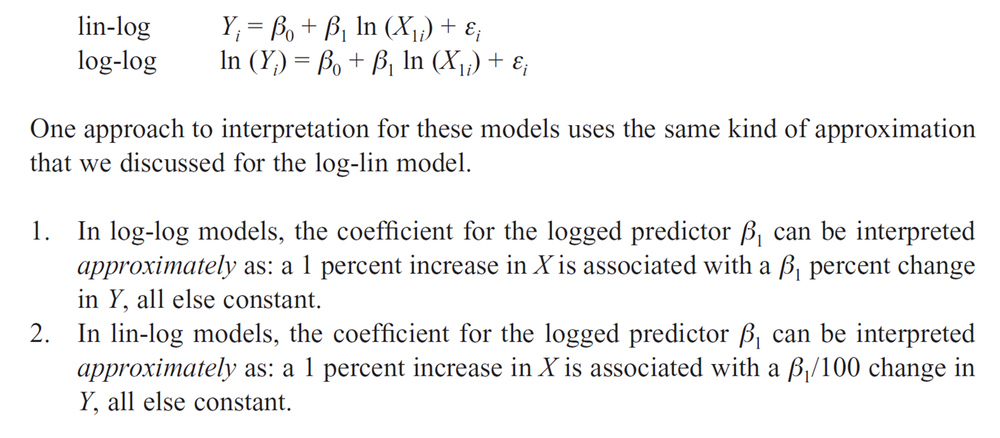

```{r setup, include=F}
knitr::opts_chunk$set(message=FALSE, warning=F, echo=F)
options(width = 2000)
options(repos="https://cran.rstudio.com")

require(tidyverse)
californiatod <- read_csv("californiatod.csv")
```

# Outline

- Additive vs Interactions
- Non-linear Relationship
    - Examples of nonlinear relationship
    - Quadratic Forms
    - log transformation
- Indirect Effects

---

# Additive vs Interactions (1)

- Variables:
    - Y: Hours spent on housework chores
    - D1: Marital Status
    - D2: Gender

- Additive Model: $Y_i=\beta_0+\beta_1 D_{1i} + \beta_2 D_{2i} + \epsilon_i$


Group            | Men (D2=0)         | Women (D2=1)               |
-----------------|--------------------|----------------------------|
Unmarried (D1=0) | $=\beta_0$         | $=\beta_0+\beta_2$         |
Married   (D1=1) | $=\beta_0+\beta_1$ | $=\beta_0+\beta_1+\beta_2$ |


- Interaction Model: $Y_i=\beta_0+\beta_1 D_{1i} + \beta_2 D_{2i} + \beta_3 D_{1i} D_{2i}+ \epsilon_i$

Group            | Men (D2=0)         | Women (D2=1)                       |
-----------------|--------------------|------------------------------------|
Unmarried (D1=0) | $=\beta_0$         | $=\beta_0+\beta_2$                 |
Married   (D1=1) | $=\beta_0+\beta_1$ | $=\beta_0+\beta_1+\beta_2+\beta_3$ |

---

# Additive vs Interactions (2)

```{r, echo=F}
require(tidyverse)

# create an artificial housework chore dataset
chores <- mtcars %>% select(hours=mpg, married=vs, women=am)
rownames(chores) <- NULL

lm(hours ~ married * women, data=chores) %>% 
  summary
```

---

background-image: url("img/Marsden1993_table5.png")
background-size: 60%

---

# Testing Differences in Means Among the Included Groups

We can use the same three approaches we introduced in Chapter 7 to calculate the significance of the conditional effects for the included categories:

- Re-estimating the regression model using different reference categories.
- Using a general linear F test.
- Testing the significance of a linear combination of coefficients.

More details in the Lab session

---

# Nonlinear Relationship

- Decreasing at a decreasing rate (9.2e)
    Slope begins steeply negative at lower values of X and then approaches zero at higher values of X.
- Decreasing at an increasing rate (9.2f)
    Slope begins near zero, and then becomes steeply negative.
- Increasing at a decreasing rate (9.2c)
    Slope begins steeply positive and then approaches zero.
- Increasing at an increasing rate (9.2d)	
    Slope begins close to zero and then becomes steeply positive.
- Quadratic “smile” (9.2a)
    Slope is decreasing at a decreasing rate at lower values of X and then increasing at an increasing rate at higher values of X.  At some point in the middle, the slope becomes zero.  
- Quadratic “frown” (9.2b)
    Increasing at a decreasing rate at lower values of X and decreasing at an increasing rate at higher values of X.  At some point in the middle, the slope becomes zero.

---

background-image: url("img/nonlinear_shapes.png")
background-size: 60%

---

background-image: url("img/nonlinear_shapes_ex1.png")
background-size: 70%

---

background-image: url("img/nonlinear_shapes_ex2.png")
background-size: 70%

---

background-image: url("img/nonlinear_shapes_ex3.png")
background-size: 85%

---

background-image: url("img/Newman1989.gif")
background-size: 60%
class: center, bottom

Source: Newman, P., and Kenworthy, J. R., 1989. Gasoline consumption and cities: a comparison of US cities with a global survey. Journal of the American Planning Association, 55(1), 24–37.

---

# Quadratic Form (1)

$Y_i=\beta_0+\beta_1 X_{1i} + \beta_2 X^2_{1i} + \epsilon_i$

- If the coefficient on the squared term is positive, then we have the “smile” (U) shape shown in Figure 9.2a.
- If the coefficient on the squared term is negative, then we have the “frown” (inverted U) shape shown in Figure 9.2b.
- If the coefficient of the square term is zero, then the model reduces to the linear functional form.

--
    - Thus, the linear model is nested within the quadratic model, and we can use a general linear F test to test whether the quadratic form fits better than a linear form.

---

# Quadratic Form (2)

- The value of X at which the slope becomes zero – the horizontal tangent lines in Figure 9.2 – can be calculated using the  following formula:
    
    $-\beta_1/2\beta_2$
    
- The slope at a particular value of X can be calculated using the equation shown below:
    
    $\beta_1 + 2\beta_2 X_{1}$

---

# Logarithmic Transformation (1)

- The shapes in Figure 9.2c, 9.2d, and 9.2e can be specified by taking the natural log of the outcome (9.2c,9.2e), predictor (9.2d, 9.2e), or both (all three shapes).  
- With the logarithmic transformations, we model the linear association between the log of X and/or log of Y.  
- We can then transform the coefficient estimates and predicted values back into the natural units of X and Y for interpretation, and reveal the non-linear relationship between X and Y. 

---

# Logarithmic Transformation (2)

Shorthand is sometimes used to refer to models in which Y and/or X are logged.

- Log-lin models: Y is logged, X is not logged.
- Log-log models: Y and X are both logged
- Lin-log models: Y is not logged, X is logged.

---

# Log-Lin Model

$\text{ln}(Y_i) = \beta_0 + \beta_1 X_{1i} + \epsilon_i$

Or the equivalent model after exponentiate both sides of the equation:

$Y_i = \text{exp}(\beta_0 + \beta_1 X_{1i} + \epsilon_i)$.

The prediction equation: $\hat{\text{ln}(Y_i)} = \hat{\beta_0} + \hat{\beta_1} X_{1i}$.

Note that transforming the prediction equation above to predict $Y_i$ is biased. See Miller, Don M. 1984Reducing Transformation Bias in Curve Fitting. The American Statistician 38(2): 124–126. http://www.jstor.org/stable/2683247.

---

background-image: url("img/log-lin_1.png")
background-size: 100%

---

background-image: url("img/log-lin_2.png")
background-size: 90%

Approximate Interpretation of Coefficient

---

# Log-Log and Lin-Log Models



---

class: center, middle

# Indirect Effects and Omitted Variable Bias

---

# Confounders (1)

- A confounder  (common cause or extraneous variable) is a third variable which is causally related to two other variables.
- When the confounder is ignored, it appears the two variable it causes are associated.
- Statistically, this situation is referred to as a spurious relationship: an apparent association between one variable and another variable is really due to a third variable. 


---

# Confounder Example (1)


---

# Confounder Example (2)


---

# Mediators

- Mediation occurs when a third variable represents the mechanism through which an association between a predictor and outcome operates.
- The third variable is typically referred to as a mediator an intervening variable or a proximal cause.  


---

# Mediator Example (1)


---

# Mediator Example (2)


---

# Moderators

- A moderator is a qualitative (e.g., sex, race, class) or quantitative (e.g., level of reward) variable that affects the direction and/or strength of the relation between an independent or predictor variable and a dependent or criterion variable. Specifically within a correlational analysis framework, a moderator is a third variable that affects the zero-order correlation between two other variables. 
- A basic moderator effect can be represented as an interaction between a focal independent variable and a factor that specifies the appropriate conditions for its operation. 


---

# Mediation vs Moderation

- Students (and scholars) often confuse the terms mediation and moderation.
- A moderator variable is one that influences the strength of a relationship between two other variables;
- A mediator variable is one that explains the relationship between the two other variables. 
    - As an example, let's consider the relation between Age and Income. Occupation might be a moderator variable, in that the relation between Age and Income could be stronger for occupations that value experiences and less strong or nonexistent for occupations that do not. Experiences might be a mediator variable in that it explains why there is a relation between Age and Income. When you remove the effect of Experiences, the relation between Age and Income disappears.

Further reading: Baron, R. M., & Kenny, D. A. (1986). The moderator-mediator variable distinction in social psychological research: Conceptual, strategic, and statistical considerations. Journal of Personality and Social Psychology, 51, 1173-1182.

