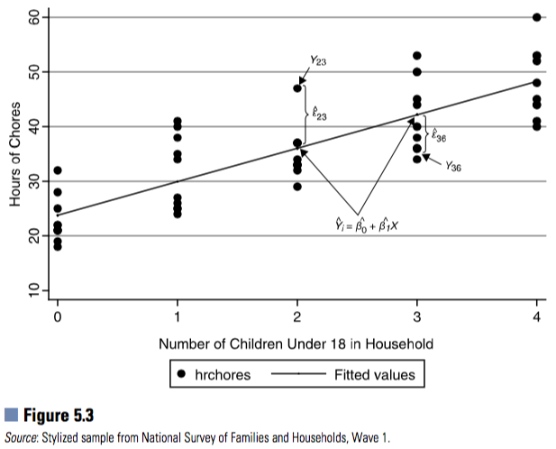

```{r setup, include=F}
knitr::opts_chunk$set(message=FALSE, warning=F, echo=F)
options(width = 2000)
options(repos="https://cran.rstudio.com")
```

# Outline

- Why Regression Analysis?
- Bivariate Regression
   - Interpretation of regression coefficients
   - Ordinary Least Squares Estimation
   - Hypothesis testing of coefficients
   - Confidence interval of coefficients
   - Standardized regression

---

# Why Regression Analysis?

- Regression analysis allows scientists to quantify how the average of one variable systematically varies according to the levels of another variable;
- Comparing with hypothesis testing techinque we reviewed before, additional variables can be introduced into regression models to help to determine if a relationship is genuine or spurious;
- Regression models also allow scientists to examine the mechanisms that their theories and ideas suggest explain the association between a particular predictor variable and an outcome;
- Regression models can be used to examine how two predictors jointly associate with an outcome variable;
- Regression models can be used for predictions or scenario analysis.

---

# Why Regression Analysis - An Example

[Eng, Sothy. 2012. “Cambodian Early Adolescents’ Academic Achievement: The Role of Social Capital.” Journal of Early Adolescence 33(3): 378–403.](http://journals.sagepub.com/doi/pdf/10.1177/0272431612441069)

---

# Scatter plot & regression line

```{r}
library(tidyverse)
ggplot(mtcars, aes(x=carb, y=hp)) + geom_point() + geom_smooth(method="lm", se=FALSE)
```

---

# Correlation

```{r, echo=TRUE}
cor(mtcars$hp, mtcars$carb)
cor(mtcars$hp, mtcars$carb)^2
```

---

# Interpretation of Regression Coefficients


---

# Regression Equations

Population regression line

$$\text{Y}_i = \beta_0 + \beta_1 \text{X}_i + \epsilon_i$$
$$\text{HP}_i = \beta_0 + \beta_1 \text{carb}_i + \epsilon_i$$
Sample regression model

$${\text{Y}}_i = \hat{\beta}_0 + \hat{\beta}_1 \text{X}_i + \epsilon_i$$

$${\text{HP}}_i = \hat{\beta}_0 + \hat{\beta}_1 \text{carb}_i + \epsilon_i$$

---

# Conditional distributions


---

# Ordinary Least Squares (OLS) Estimators



---

# Ordinary Least Squares (OLS) Estimators


---

# Ordinary Least Squares (OLS) Estimators


---

# Assumptions of OLS 

**I**dentically **I**ndependently Normal **D**istributed (or iid Normal) error term $\epsilon_i$ :
$$\epsilon_i \sim N(0, \sigma^2)$$
$$Y_i|X_i \sim N(\beta_0 + \beta_1 X_i, \sigma^2)$$

Will come back to checking of OLS assumptions later.

---

# Hypothesis Testing

1. List the null and alternative hypotheses about the value that you expect for the parameter being estimated (in regression models, typically the slope).
2. Calculate a test statistic (typically, the point estimate of the parameter minus the hypothesized value, divided by the estimated standard error).
3. Determine the critical value given the test statistic’s distribution (e.g., Z- or t-distribution) and a pre-specified alpha level (typically 0.05).
4. Reject the null hypothesis if the magnitude of the calculated test statistic is larger than the critical value or the corresponding p-value is lower than the pre-specified alpha.

---

# Hypothesis Testing about OLS Coefficients

$$\beta_1 \sim t_{df}(\hat{\beta}_1, \hat{\sigma}_{\hat{\beta}_1})$$
$$H_o: \beta_1 = \beta^*_1$$
$$H_a: \beta_1 \neq \beta^*_1$$

---

# Hypothesis Testing about OLS Coefficients

```{r, echo=TRUE}
library(tidyverse)
lm(hp ~ carb, data=mtcars) %>% summary()
```

---

# Confience intervals for OLS coefficients

```{r, echo=TRUE}
lm(hp ~ carb, data=mtcars) %>% 
  confint()
```

---

# Standardized coefficients
```{r, echo=TRUE}
install.packages("lm.beta"); library(lm.beta)
lm(hp ~ carb, data=mtcars) %>% 
  lm.beta() %>% 
  summary()
```