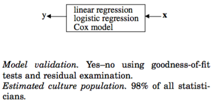

```{r setup, include=F}
knitr::opts_chunk$set(message=FALSE, warning=F, echo=F)
options(width = 2000)
options(repos="https://cran.rstudio.com")

require(tidyverse)
#californiatod <- read_csv("californiatod.csv")
```

# Outline

- Putting it all together
- Models for Discrete/Categorical Outcomes
    - Count outcome: Poisson model, Negative Binomial model, ZIP, ZINB
    - Categorical outcome: Binomial model; Multinomial model
    - Ordinal outcome: ordinal logit/probit model
- Where to go from here
    - Special topics: HLM, SEM, Time series models
    - Bayesian Statistics
- Data Science

---

# Putting it all together

[Eng, Sothy. 2012. “Cambodian Early Adolescents’ Academic Achievement: The Role of Social Capital.” Journal of Early Adolescence 33(3): 378–403.](http://journals.sagepub.com/doi/pdf/10.1177/0272431612441069)

---

- "One more hour of extra classes is associatedwith grades that are just .06 point higher, on average controlling for child gender and various demographic characteristics of the family." This association seems small, given that the outcome standard deviation is 1.68, although one hour is a relatively small dosage of extra classes and also small relative to the standard deviation of extra hours, of 4.87. 

- Indeed the effect is greater in magnitude, although still small on Cohen’s scale, in standardized form: "A standard deviation increase in extra classes is associated with grades that are about 0.16 of a standard deviation higher, on average controlling for child gender and various demographic characteristics of the family."

---

class: center, middle, inverse

# Models for Discrete/Categorical Outcomes; Generalized Linear Models

---

# Type of variables


---

background-image: url("img/Table12.1.png")
background-size: 70%

---

# Generalized Linear Model

A flexible generalization of ordinary linear regression that allows for response variables that have error distribution models other than a normal distribution,  unifying various statistical models, including linear regression, logistic regression and Poisson regression.

---

# Discrete Outcome: Count/Poisson Regression (1)

$ln(E(y_i|x_i)) = \beta_0 + \beta_1 x_{i1} + ... $
or
$E(y_i|x_i) = e^{\beta_0 + \beta_1 x_{i1} + ... }$

---

# Discrete Outcome: Count/Poisson Regression (2)

`mtcars` example: Number of carburetors ~ f(x1, x2, ...)
- lm: lm(carb ~ mpg + qsec, data=mtcars)
- glm: glm(carb ~ mpg + qsec, data=mtcars, family="poisson")

```{r, echo=FALSE}
require(MASS)
require(huxtable)
fit_lm <- lm(carb ~ mpg + qsec, data=mtcars)
fit_glm <- glm(carb ~ mpg + qsec, data=mtcars, family="poisson")
huxreg(OLS=fit_lm, Poisson=fit_glm)
```

---

# Extension of Models for Discrete Outcomes

- Zero-inflated Poisson
- Negative binomial
- Zero-inflated Negative Binomial, Hurdle Model
- Truncated/censored data: Tobit (for continous outcomes)

---

# Dichotomous (Binomial) Outcome: Logistic Regression (1)

$Pr(Y_i|x_i) = f(x_i) + \epsilon_i, Y_i=\{0, 1\}$

The issue here is whether we observe the outcome $Pr(Y_i)$:
- in cases of repeated or aggregated observations, we may approximate $Pr(Y_i=1)\frac{\sum_{j=1}^J{Y_{ij}}}J$, where $j=1 \dots J$ denotes number of repititions.
- when we don't have repeated observations, we can assume there is a underlying probability $\pi_i$ for $Y_i=1$, then $Pr(Y_i|\pi_i)$ follows a bernouli distribution $Pr(Y_i|\pi_i)=\pi_i^{Y_i}(1-\pi_i)^{1-Y_i}$. The regression tries to model $\pi_i$ such that it is most likely to observe the data we have through a properly named "maximum likelihood estimation" process.

---

#`californiatod` example

transit ~ f(x)

- lm: lm(transit ~ railtype + houseval + density, data=californiatod)
- log-odds ratio lm: lm(log(0.001 + transit/(1 - transit)) ~ railtype + houseval + density, data=californiatod)

```{r, echo=FALSE}
require(tidyverse)
require(huxtable)
californiatod <- read_csv("californiatod.csv")
fit_lm <- lm(transit ~ railtype + density, data=californiatod)
fit_lor_lm <- lm(log(0.001 + transit/(1 - transit)) ~ railtype + density, data=californiatod)
#fit_glm <- glm(transit ~ railtype + density, data=californiatod, family=binomial("logit"))
huxreg(OLS=fit_lm, "log odds ratio OLS"=fit_lor_lm)
```

---

- `mtcars` example

am ~ f(x):

- lm: lm(am ~ qsec + hp + cyl, data=mtcars)
- glm: glm(am ~ qsec + hp + cyl, data=mtcars, family=binomial("logit"))

```{r, echo=FALSE}
require(MASS)
require(huxtable)
require(ggplot2)
fit_lm <- lm(am ~ qsec + hp, data=mtcars)
fit_glm <- glm(am ~ qsec + hp, data=mtcars, family=binomial("logit"))
huxreg(OLS=fit_lm, logit=fit_glm)
```

---

# Multi-categorical/Multinomial Outcomes


- Multiple binomial models relative to a referecen category
- Discrete Choice Models
    - Ordinal logit/probit model
    - Multinomial logit/probit model

---

class: center, middle, inverse

# Where to go from here

---

- STAT 564: Applied Regression Analysis
- EC 571 Advanced Econometrics
- EC 575 Applied Advanced Econometrics

---

# Discrete/Categorical outcomes

- STAT 577: Categorical Data Analysis
- PSY 510/610: Categorical Data Analysis (Newsom)
- USP 657: Discrete Choice Modeling

---

# Special topics

- Time series
    - STAT 578: Survival Analysis
    - EC 572/472: Time Series Analysis and Forecasting
- Psy 510/610: Multilevel Regression (Newsome)
- Psy 510/610: Structural Equation Modeling (Newsom)

---

# Bayesian Statistics

- Frequentist: $Pr(Data | H_0)$
- Bayesian: $Pr(H | Data) = \frac{Pr(H, Data)}{Pr(Data)} \propto Pr(Data | H)Pr(H)$

- STAT 572: Bayesian Statistics

---

# Data Science

Two cultures of developing models (Breiman, 2001):

.pull-left[


**Statistical models** ("the data modeling"): Assuming a data generation model and use data and hypothesis testing framework to recover parameters of the data generation process;
]

.pull-right[


**Machine learning** ("algorithmic modeling"): With no assumption of data generation process, use computer algorithms for pattern recognition and data-driven predictions-making

]

---
