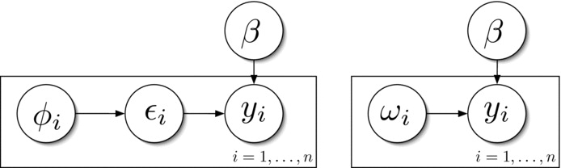

```{r setup, include=F}
knitr::opts_chunk$set(message=FALSE, warning=F, echo=TRUE)
options(width = 2000)
options(repos="https://cran.rstudio.com")
options(scipen=6)
options(digits=4)
if (!require(pacman)) {install.packages("pacman"); library(pacman)}
p_load(stargazer, pscl, mlmRev,mvtnorm, MASS, ggplot2,tidyverse,mlogit,BayesLogit,robcbi,kableExtra,truncnorm,lme4) # likelihoodAsy, coda,devtools,loo,dagitty,rethinking
```


#  {.tabset .tabset-fade .tabset-pills}

## (Albert &  Chib, 1993)

James H. Albert & Siddhartha Chib (1993) Bayesian Analysis of Binary and Polychotomous Response Data, Journal of the American Statistical Association, 88:422, 669-679, DOI: 10.1080/01621459.1993.10476321

### 1 Introduction

\(Y_1,..,Y_n\sim Bern(p_i)\). \(\beta_{k\times1}\) unknown vector of parameters. \(X_i^T=(X_{i1},..,X_{ik})\) known covariates.

\(p_i=H(\mathbf{x}_i^T\boldsymbol{\beta})\). \(H(\cdot)\) is a known CDF with linear structure \(\mathbf{x}_i^T\boldsymbol{\beta}\)

If \(H(\cdot)\) is standard normal CDF, it obtains the probit model,

if \(H(\cdot)\) is logistic CDF, it obtains the logit model.

\(\pi(\boldsymbol{\beta})\) is the prior density.

\(
\pi(\boldsymbol{\beta}|data) = \frac{\pi(\boldsymbol{\beta})\prod_{i=1}^{k}H (\mathbf{x}_i^T\boldsymbol{\beta})^{y_i}(1-H(\mathbf{x}_i^T\boldsymbol{\beta}))^{1-y_i}}{\int\pi(\boldsymbol{\beta})\prod_{i=1}^{k}H (\mathbf{x}_i^T\boldsymbol{\beta})^{y_i}(1-H(\mathbf{x}_i^T\boldsymbol{\beta}))^{1-y_i}d\boldsymbol{\beta}}
\)
is intractable.


For small number of parameter, a Bayesian approach summarized the posterior using numerical integration.

For large models (k large), posterior moments by Monte Carlo integration with a `multivariate Student's t importance function`.

This is a simulation-based approach for computing the exact posterior distribution of $\beta$.

The key idea is to introduce $N$ independent latent variables $Z_1,..Z_N\sim N(\mathbf{x}_i^T\boldsymbol{\beta},1)$ into the problem. \(Y_i=\begin{cases}1&\text{if } Z_i>0\\0&\text{if }Z_i\le0\end{cases}\)

This approach is very simular to the data augmentation/Gibbs sampling framework used in censored regression models.

### 2. The Gibbs Sampler

\(
\theta_1^{(1)}\quad\text{from}\quad\pi(\theta_1|\{\theta_j^{(0)},j\neq1\})\\
\theta_2^{(1)}\quad\text{from}\quad\pi(\theta_2|\{\theta_1^{(1)},j>2\})\\
\vdots\\
\theta_p^{(1)}\quad\text{from}\quad\pi(\theta_p|\{\theta_j^{(1)},j<p\})\\
\)

One cycle is iterated $t$ times. For sufficiently large $t^*$, $\theta^{(t^*)}$ can be regarded as one simulated value from the posterior of $\theta$. Replicating this process $m$ times $\{\theta_{1j}^{(t^*)},\theta_{2j}^{(t^*)},..,\theta_{pj}^{(t^*)},j=1,..,m\}$

Two practical drawbacks to the replication approach:

1. The method is inefficient. the samples $\{\theta_j^{(t)}\}$, for $t<t^*$ are discarded.

2. After the initial run it may be necessary to repeat the simulation with a larger number of replication to get accurate density estimates.

- A "one-run" Gibbs sampling scheme is efficient in that few observations are discarded.

1. One should collect the values staring at the cycle $t$. The value of $t$ is samll (10-40) relative to the total number of values collected. <span style="color: red;">(burn-in???)</span>

2.  If one wishes to obtain an approximate independent sample of the $\theta$, the simulated values of $\theta$ could be collected at cycles $t,t+n_1,t+2n_1,..$, where $n_1$ is the spacing between cycles where $\theta^{(t)}$ and $\theta^{(t)}$ are believed to be approximately independent. *But it is not necessary to obtain an independent sample of $\theta$ to obtain, say, a marginal posterior density estimate of $\theta_k$* <span style="color: red;">???</span>

- One goal of this article is to obtain estimates of the densities of the individual parameters or their functional. 

One can estimate the density of this function using a *kernel density* estimate of the simulated values of \(g(\theta_k)\{\theta_k^{(i)},i=1,..,m\}\). A slightly preferable estimate of this marginal posterior density is given by \(\hat\pi(g(\theta_k))\approx\frac1m\sum_{i=1}^m\pi(g(\theta_k)\{\theta_r^{(i)},r\neq k\})\) <span style="color: red;">???</span>

In practice, we collect values of $\theta$ in batches of 100-200 until all the marginal density estimates for the components of $\theta$ stabilize.

- A second goal is estimation of posterior expectations.

To compute this standard error from this correlated simulation sample, we apply *the well-known batch means method*. We batch or section the sample into subsamples of equal size. When the lag one autocorrelation of the batch means is under .05, the simulation standard error is computed as the standard deviation of the batch means divided by the square root of the number of batches.
\(se=\frac{sd}{\sqrt{B}}\) <span style="color: red;"> subsamples of equal size???</span>

### 3 Data augmentation and Gibbs sampling

#### 3.1 Introduction

\[
\begin{align} 
\pi(\boldsymbol{\beta|y,Z}) = C\pi(\boldsymbol{\beta})\prod_{i=1}^{N}\phi (Z_{i};\mathbf{x}_i^T\boldsymbol{\beta},1); &\quad\mathbf{Z}=\mathbf{X}\boldsymbol{\beta+\varepsilon}; &\quad \boldsymbol{\varepsilon}\sim N_N(0,\mathbf{I})&&(1)\\
\\
\boldsymbol{\beta}|\mathbf{y,Z}\sim N_k(\boldsymbol{\hat\beta_Z},(\mathbf{X}^T\mathbf{X})^{-1}); &\quad\boldsymbol{\hat\beta_Z}=(\mathbf{X}^T\mathbf{X})^{-1}\mathbf{X}^T\mathbf{Z}&&& (2)\\
\\
Z_i|\boldsymbol{y,\beta}\sim N(\mathbf{x}_i^T\boldsymbol{\beta},1) &\quad\text{truncated at the left by 0} & \text{if } y_i=1 &&\\
 &\quad\text{truncated at the right by 0} & \text{if } y_i=0 &&(3)
\end{align}
\]

The starting value $\beta^{(0)}$ may be taken to be the maximum likelihood (ML) estimate, or least squares (LS) estimate $(\mathbf{X}^T\mathbf{X})^{-1}\mathbf{X}^T\mathbf{y}$

#### 3.2 The $t$ Link

\(\mathbf{Y}\sim Bern(p_i)\) have an underlying \(N(Z)\); \(\boldsymbol{\beta}|\mathbf{Z}\sim N_k()\); generalize mixtures of Normal distribution.

$H()=t$ *investigate the sensitivity* of the fitted probabilities to the choice of link function.

The most popular link function for binary data is the logit, which corresponds to a choice of a logistic distribution for $H$

Logistic quantiles are approximately a linear function of $t(8)$ quantiles. The logistic distribution has the same kurtosis as a $t$ distribution with 9 df.

\(Z_i\sim t_{\nu}(\mathbf{x}_i^T\boldsymbol{\beta},1)\) equivalently, \(Z_i|\lambda_i\sim N(\mathbf{x}_i^T\boldsymbol{\beta},\lambda_i^{-1})\); \(\lambda_i\sim Gamma(\frac{\nu}{2},\frac{2}{\nu})\propto\lambda_i^{\frac{\nu}{2}-1}\exp(-\frac{\nu\lambda_i}{2})\); Suppose \(\beta\sim Unif()\)

\[
\begin{align} 
\boldsymbol{\beta|y,Z,\lambda,\nu}\sim N_k(\boldsymbol{\hat\beta_{Z,\lambda}},(\mathbf{X'WX})^{-1}); &\quad\boldsymbol{\hat\beta_{Z,\lambda}}=(\mathbf{X'WX})^{-1}\mathbf{X'WZ},\ \mathbf{W}=\mathrm{diag}(\lambda_i) &&& (4)\\
\\
\boldsymbol{Z_i|y,\beta,\lambda,\nu}\sim N(\mathbf{x}_i^T\boldsymbol{\beta},\lambda_i^{-1}) &\quad\text{truncated at the left by 0} & \text{if } y_i=1 &&\\
 &\quad\text{truncated at the right by 0} & \text{if } y_i=0 &&(5)\\
\\
\boldsymbol{\lambda_{1:N}|y,Z,\beta,\nu}\sim Gamma(\frac{\nu+1}{2},\frac{2}{\nu+(Z_i-\mathbf{x}_i^T\boldsymbol{\beta})^2})&\quad\text{independent with } \lambda_i&&&(6)\\
\boldsymbol{\nu|y,Z,\beta,\lambda}\propto\pi(\nu)\prod_{i=1}^N(c(\nu)\lambda_i^{\frac{\nu}{2}-1}e^{-\frac{\nu\lambda_i}{2}})&\quad\text{in a finite set}&&&(7)\\
\end{align}
\]

$\beta^{(0)}=$  least squares (LS) estimate under the probit model, set $\lambda_i=1,\forall i$

\[\hat\pi(\boldsymbol{\beta})\approx\frac1m\sum_{i=1}^m\pi(\boldsymbol{\beta|Z^{(i)},\lambda^{(i)}})\]

\(p_k=\Phi(\lambda_k^{\frac12}\mathbf{x}_k^T\boldsymbol{\beta})\) by a transformation of the conditional density of $\beta$

\[\hat\pi(p_k)=\frac1m\sum_{i=1}^m\frac{\phi(\Phi(p_k);\mu,\sigma^2)}{\phi(\Phi(p_k);0,1)}\]

\(\mu=\sqrt{\lambda_k^{(i)}}\mathbf{x}_k^T\boldsymbol{\hat\beta_{Z,\lambda}^{mu3(i)}}\) <span style="color: red;">????</span>

\(\sigma^2=\lambda_k^{(i)}\mathbf{x}_k^T(\mathbf{X'WX})^{-1}\mathbf{x}_k\)


#### 3.3 Hierarchical Analysis

(1) \(\mathbf{Z}\sim N(\boldsymbol{X\beta,I})\), (2) \(\boldsymbol{\beta}\sim N(\boldsymbol{A\beta^{(0)},\sigma^2I})\), (3) prior density \(\pi(\boldsymbol{\beta^{(0)},\sigma^2})\qquad\)  (8)

The hyperparameters \(\boldsymbol{\beta^{(0)}}\sim Unif()\), $\sigma^2$ given a noninformative prior <span style="color: red;">????</span>

 The posterior density of the regression vector $\beta$ compromises between least squares estimates from the "full" k-dimensional model and the "reduced" p-dimensional model where $\boldsymbol{\beta=A\beta^{(0)}}$

\[
\begin{align} 
\boldsymbol{\beta|Z,\sigma^2}&\sim N_k(\boldsymbol{\mu,V}) &&(9)\\ 
\boldsymbol{\mu}&=\boldsymbol{W_1\hat\theta_1+(I-W_1)A\hat\theta_2} \\
\boldsymbol{\hat\theta_1}&=(\mathbf{X'X})^{-1}\mathbf{X'Z} \\
\boldsymbol{\hat\theta_1}&=(\mathbf{X'X})^{-1}\mathbf{X'Z} \\
\boldsymbol{V}&=\boldsymbol{((I-W_1)A)[A^TX^T(I+XX^T\sigma^2)^{-1}XA]^{-1}((I-W_1)A)^T+[X^TX+I/\sigma^2]^{-1}} \\
\boldsymbol{\sigma^2|Z}&\propto c(\mathbf{Z)\frac{|(I+XX^T\sigma^2)^{-1}|^{\frac12}}{|A^TX^T(I+XX^T\sigma^2)^{-1}XA|^{\frac12}}}\exp{\left\{\frac12Q(\boldsymbol{Z,XA\hat\theta_2,I+XX^T\sigma^2})\right\}}\pi(\sigma^2) &&(10)\\ 
\end{align}
\]

where \(Q(\boldsymbol{Z,\mu,\Sigma})=\boldsymbol{(Z-\mu)^T\Sigma^{-1}(Z-\mu)}\) and \(c(\mathbf{Z)}\) is a proportionality constant.

one starts with initial guesses at $\boldsymbol{\beta}$ and $\sigma^2$, simulates the $Z_i$ from (3), and then simulates $\boldsymbol{\beta}$ and $\sigma^2$ from the distributions (9) and (10)

### 4 Generalizations to a Multinomial response

#### 4.1 Ordered Categories

\(Y_1,..,Y_N\) are observed. \(Y_i\) takes one of $J$ ordered categories. \(p_{ij}=P[Y_i=j]\), we define the cumulative probabilities \(\eta_{ij}=\sum_{k=1}^jp_{ij},j=1,..,J-1\) <span style="color: red;">k????</span>

One popular regression model is given by \(\eta_{ij}=\Phi(\gamma_i-\mathbf{x}_i^T\boldsymbol{\beta}),i=1,..,N; j=1,..,J-1\)

A latent continuous variable $Z_i\sim N(\mathbf{x}_i^T\boldsymbol{\beta},1)$. \(Y_i=j\text{ if } \gamma_{j-1}<Z_i\le\gamma_{j}, \gamma_{0}=-\infty,\gamma_{J}=\infty\)

 The posterior distribution of $\beta$ conditional on $y$ and $Z$ is given by the multivariate normal form (2)

\[
\begin{align} 
\pi(\boldsymbol{\beta,\gamma|y})&= C\pi(\boldsymbol{\beta})\prod_{i=1}^{N}\sum_{j=1}^{J}\mathbf{1}_{(y_i=j)}[\Phi (\gamma_{j}-\mathbf{x}_i^T\boldsymbol{\beta})-\Phi (\gamma_{j-1}-\mathbf{x}_i^T\boldsymbol{\beta})]\\
\pi(\boldsymbol{\beta,\gamma,Z|y})&= C\prod_{i=1}^{N}\left[\frac{1}{\sqrt{2\pi}}\exp(-\frac12(Z_i-\mathbf{x}_i^T\boldsymbol{\beta})^2)(\sum_{j=1}^{J}\mathbf{1}_{(Y_i=j)}\mathbf{1}_{(\gamma_{j-1}<Z_i\le\gamma_{j})})\right]&&(11)\\
Z_i|\boldsymbol{\beta,\gamma},y_i&\sim N(\mathbf{x}_i^T\boldsymbol{\beta},1) \quad\text{truncated at the left(right) by } \gamma_{j-1}(\gamma_{j}) &&(12)\\
\gamma_j|\boldsymbol{Z,y,\beta,},\{\gamma_k,k\neq j\}&\propto  \prod_{i=1}^{N}\left[\mathbf{1}_{(Y_i=j)}\mathbf{1}_{(\gamma_{j-1}<Z_i\le\gamma_{j})})+\mathbf{1}_{(Y_i=j+1)}\mathbf{1}_{(\gamma_{j}<Z_i\le\gamma_{j+1})})\right]&&(13)\\
\end{align}
\]

(13) can be seen to be uniform on the interval \([\max \{\max \{Z_i: Y_i = j \}, \gamma_{j-1} \}, \min \{\min \{Z_i: Y_i = j + 1\}, \gamma_{j+1} \}]\). 

To implement the Gibbs sampler here, start with ($\beta,\gamma$) set equal to the MLE and simulate from the distributions (13), (12), and (1), in that order.

#### 4.2 Unordered Categories With a Latent Multinormal Distribution

We introduce independent latent variables \(Z_i=(Z_{i1},..,Z_{iJ})(J>2)\) and define \(Z_{ij}=\mathbf{x}_{ij}^T\boldsymbol{\beta}+\varepsilon_{ij},\ i=1,..,N;j=1,..,J\), whrre \(\varepsilon_i=(\varepsilon_{i1},..,\varepsilon_{iJ})^T\sim N_J(\mathbf{0,\Sigma_{J\times J}})\)

\(\mathbf{\Sigma}\) is parameterized in terms of a parameter vector $\theta$ of dimension not exceeding \(\frac12J(J-1)\).

On unit $i$ we observe one of $J$ possible outcomes with respective probabilities $p_{i1},..,p_{ij}$. Category $j$ is observed if $Z_{ij}>Z_{ik}$ for all $k\neq j$.

The multinomial logit model can be derived in this setup if and only if the errors \(\varepsilon_{ij}\) are a random sample from a Type I extreme value distribution. The multinomial probabilities are given by \(p_{ij}=P[\mathbf{x}_{ij}^T\boldsymbol{\beta}+\varepsilon_{ij}>\mathbf{x}_{ik}^T\boldsymbol{\beta}+\varepsilon_{ik}, \forall k\neq j]\)

\(\mathbf{Z=X}\boldsymbol{\beta+\varepsilon}\) where \(\varepsilon=(\varepsilon_{1}^T,..,\varepsilon_{N}^T)^T\sim N_{NJ}(\mathbf{0,I_N\otimes\Sigma})\)

\[
\begin{align} 
\boldsymbol{\beta|Z_{1:N},Y,\theta}&\sim N_k(\boldsymbol{\hat\beta_{Z}},(\mathbf{X'\Omega^{-1} X})^{-1}); \quad\boldsymbol{\hat\beta_{Z}}=(\mathbf{X'\Omega^{-1} X})^{-1}\mathbf{X'\Omega^{-1} Z}\\
\boldsymbol{Z_i|y,\beta,\theta,\{Z_i\}}&\sim N(\mathbf{x}_i^T\boldsymbol{\beta},\Sigma) \quad\text{such that
 the }y_i^{th}\text{ component of }Z_i\text{ is the maximum}  &&\\
\boldsymbol{\theta|Z_{1:N},Y,\beta}&\propto \boldsymbol{\pi(\theta)|\Omega|^{-\frac12}} \exp\left[-\frac12\boldsymbol{(Z-X\beta)^T\Omega^{-1}(Z-X\beta)}\right]&&(14)\\
\end{align}
\]

\(\mathbf{\Omega}^{-1}\) is a block diagonal matrix with \(\mathbf{\Sigma}^{-1}\) as the typical block. <span style="color: red;"> ???</span>


### 5.1 Finney Data

\[\Phi^{-1}(p_i)=\beta_0+\beta_1x_{1i}+\beta_2x_{2i},\ i=1,..,39\]

where $x_{1i}$ is the volume of air inspired, $x_{2i}$ is the rate of air inspired, and the binary outcome observed is the occurrence or nonoccurrence on a transient vasorestriction on the skin of the digits. $\beta\sim Unif$
 prior is placed on the regression parameter

```{r,echo=T,collapse=T}
data(Finney)
Vol <- Finney$Vol; Rate <- Finney$Rate; Resp <- Finney$Resp
lVol <-log(Vol); lRate <- log(Rate)
# plotFdat <- Finney$plotFdat
# plotFdat(Rs=Resp,lV=lVol,lR=lRate,zc,zr,rob=F,cont=F)
plot(Vol,Rate,type="n",xlab="Vol",ylab="Rate")
points(Vol[Resp==0],Rate[Resp==0],pch=5, cex=1.2)
points(Vol[Resp==1],Rate[Resp==1],pch=16,cex=1.2)

finney <- data.frame(Finney[1:3])
finney[,3] <- as.factor(finney[,3])
table(finney[3])
n <- nrow(finney)
```


The starting value $\beta^{(0)}$ is the least square estimate $(\mathbf{X}^T\mathbf{X})^{-1}\mathbf{X}^T\mathbf{y}$

```{r, echo=T,collapse=T}
# X <- cbind(Vol, Rate)
# (beta <- solve( t(X) %*% X ) %*% t(X) %*% Resp) #start from LS estimate
X <- cbind(1, Vol, Rate)
(beta <- as.vector(solve( t(X) %*% X ) %*% t(X) %*% Resp))
p <- dim(X)[2]
```

\(\mu=\mathbf{x}_i^T\boldsymbol{\beta}\)

```{r, echo=T,collapse=T}
(mu <- as.vector(X %*% beta)) # Initial mu of Z
```

\(Z_i|\boldsymbol{y,\beta}\sim N(\mathbf{x}_i^T\boldsymbol{\beta},1)\) truncated by 0 at the \(\begin{cases}\text{left if}&y_i=1\\\text{right if}&y_i=0\end{cases}\)


```{r,eval=T, echo=T,collapse=T}
# only works for the second probit model
ez<-as.vector(X%*%beta)
set.seed(123); u<-runif(n,0,1)
(z<- ez + qnorm(ifelse(Resp==1,u+(1-u)*pnorm(0,ez,1),u*pnorm(0,ez,1))))
```

```{r, echo=T,collapse=T}
# only works for the first probit model
tr_norm<-function(n,mu,v,truc_side='left'){ # Truncated Normal function
u<-runif(n,min=0,max=1)
  if(truc_side=='left'){
 tr_norm_value<-u-u*pnorm(0,mean=mu,sd=sqrt(v))+pnorm(0,mean=mu,sd=sqrt(v))}
 if(truc_side=='right'){
   tr_norm_value<-u*pnorm(0,mean=mu,sd=sqrt(v))}
  qnorm(tr_norm_value,mu,sqrt(v))
}

set.seed(123)
(z<- ifelse(Resp==1, # Initial Z
tr_norm(1,mu,1),
tr_norm(1,mu,1,'right')
))
```

*other attempts of sampling from truncated normal*

```{r,eval=F, echo=T,collapse=T}

#for(j in 1:n){  
#ifelse(Resp[j]==1,
#z[j] <- rtruncnorm(1,a=0,b=Inf,mean=mu[j],sd=1),
#z[j] <- rtruncnorm(1,a=Inf,b=0,mean=mu[j],sd=1)
#)
#}

# anohter attempt of truncated
#z<- abs(rnorm(n,mean=mu,sd=1)),
#z<- -abs(rnorm(n,mean=mu,sd=1))
```

\(\boldsymbol{\hat\beta_Z}=(\mathbf{X}^T\mathbf{X})^{-1}\mathbf{X}^T\mathbf{Z}\)

\(\Omega=(\mathbf{X}^T\mathbf{X})^{-1})\)

```{r, echo=T,collapse=T}
solve(t(X)%*%X)%*%t(X)%*%z # first mu for Beta
solve(t(X)%*%X)            # first omega for Beta

iXX<-solve(t(X)%*%X)  ; V<-iXX*(n/(n+1)) ; cholV<-chol(V) # from Hoff (2009, Ch.12)

```

#### The first Gibbs sampling

```{r}
M <- 25000; set.seed(123)
Gibbs <- matrix(NA,ncol=p,nrow=M); ZZ<-matrix(NA,M,n)      #For full Sample
gibbs <- matrix(NA,ncol=p,nrow=1000); Z<-matrix(NA,1000,n) #For Sub Sample
for(m in 1:M){  #Gibbs Sampler
  
# beta <- mvrnorm(1, solve(t(X)%*%X)%*%(t(X)%*%z), solve(t(X)%*%X)) # without n/(n+1)
beta <- mvrnorm(1, V%*%(t(X)%*%z), V) # draw beta from Normal

z<- ifelse(Resp==1, # draw Z from truncated Normal
tr_norm(1 ,t(X %*% beta), 1),
tr_norm(1 ,t(X %*% beta), 1 ,'right')
)

#ez<-(X%*%beta)
#u<-runif(n,0,1)
#z<- ez + qnorm(ifelse(Resp==1,u+(1-u)*pnorm(0,ez,1),u*pnorm(0,ez,1)))

Gibbs[m,] <- t(beta); ZZ[m,]<- z                                        # full samples
if(m%%(M/1000)==0) { gibbs[m/(M/1000),] <- t(beta); Z[m/(M/1000),]<- z}   # subsamples of equal size
}
```

\(\boldsymbol{\hat\beta}\approx\frac1m\sum_{i=1}^m(\boldsymbol{\beta|Z^{(i)}})\)

```{r,echo=T,collapse=T}
full.mean <- colMeans(Gibbs[,])
burnin <- 24000:25000
tail.mean <- colMeans(Gibbs[burnin,])
sub.mean <- colMeans(gibbs)
par<- cbind(full.mean,tail.mean,sub.mean)
rownames(par) <- c("Beta0","Beta1","Beta2")
pander::pander(round((par),4))
```

```{r,eval=F,echo=T}
full.quant <- apply(Gibbs[burnin,],2,quantile,probs=c(0.025,0.5,0.975)) 
tail.quant <- apply(Gibbs[burnin,],2,quantile,probs=c(0.025,0.5,0.975)) 
sub.quant <- apply(gibbs,2,quantile,probs=c(0.025,0.5,0.975)) 
par<- rbind(full.quant,tail.quant,sub.quant)
colnames(par) <- c("Beta0","Beta1","Beta2")
pander::pander(round(t(par),4))
```

```{r,echo=T,include=T,fig.show='hold', fig.width=9, fig.height=6, fig.align='center'}
par(mar=c(5,3,1,1),mgp=c(1.75,.75,0)); par(mfrow=c(3,3))
lab<-c(expression(beta[0]),expression(beta[1]),expression(beta[2]))
for(j in 1:3) {
acf(Gibbs[,j],ci.col="dodgerblue4",xlab=lab[j])}  
for(j in 1:3) {
acf(Gibbs[burnin,j],ci.col="dodgerblue4",xlab=lab[j])} 
for(j in 1:3) {
acf(gibbs[,j],xlab=lab[j],ci.col="dodgerblue4")}
mtext("autocorrelation functions with Gibbs1.full(above),Gibbs1.tail(middle) ,Gibbs1.sub(below)",side=1,line=-1,outer=T)
```

Choose sub-sampling

```{r,echo=T,include=T, fig.width=9, fig.height=6, fig.align='center'}
par(mfrow=c(3,3),mar=c(3,3.2,.5,.5),mgp=c(1.70,.70,0))
for(j in 1:p){
plot(gibbs[,j],  ylab=lab[j],main="",pch=1,cex=0.1,
     xlab="Gibbs iteration (k)",col="cornflowerblue")  
plot(cumsum(gibbs[,j])/(1:1000),  ylab=lab[j],main="",
     type="l",col="cornflowerblue",lwd=2,pch=20,cex=0.7,xlab="Gibbs iteration (k)")
#hist(gibbs.mat[-burnin,j],freq =F,xlab=paste("distribution of est. for beta",j-1),
#     main="",col="cornflowerblue")
plot(density(gibbs[,j],adj=2),lwd=2,main="",col="cornflowerblue",
    xlab=lab[j],ylab="density")
abline(v=quantile(gibbs[,j],c(0.025,0.975)),col="gray",lwd=1)
}
```


\(p_i=\Phi(\mathbf{x}_i^T\boldsymbol{\beta})\)

```{r,echo=T,collapse=T}
(prob <- pnorm(t(X %*% beta),0,1))
```

```{r,echo=F,eval=F, message=F, warning=F, fig.width=6, fig.height=3, fig.align='center'}
par(mfrow=c(2,3),mar=c(3,3,.5,.5),mgp=c(1.70,.70,0))
plot(gibbs.mat[-burnin,(n+1)],  ylab=expression(beta^{(k)}),main="",pch=20,cex=0.3,
     xlab="Gibbs iteration (k)",col="cornflowerblue")
plot(cumsum(gibbs.mat[-burnin,(n+1)])/(1:(S/2)),  ylab=expression(E(beta)),main="",
     type="l",col="cornflowerblue",lwd=2,pch=20,cex=0.7,xlab="Gibbs iteration (k)")
hist(gibbs.mat[-burnin,(n+1)],  xlab=expression(paste("distribution of est. for ",beta)),
     main="",col="cornflowerblue")
abline(v=quantile(gibbs.mat[-burnin,(n+1)],c(0.025,0.975)),col="red",lwd=1)

u <- seq(0.01,4,length=1000)
d <- dgamma(u,shape=alpha,rate=pumps.par["50%","Beta"])
plot(u,d,type="l",xlab=expression(lambda),ylab="density",col="cornflowerblue",lwd=2,pch=20,cex=0.7)
abline(v=pumps.quant["50%",1:10],col="grey",lwd=1)

par(las=1,mar=c(3,5,.5,.5))
plot(c(0,4),c(1,10),type="n",xlab=expression(lambda),ylab=" ",axes=FALSE)
axis(side=1)
axis(side=2,at=1:10,labels=paste("Pump #",10:1,sep=""))
segments(pumps.quant["2.5%",1:10],10:1,pumps.quant["97.5%",1:10],10:1,col="cornflowerblue",lwd=2,pch=20,cex=0.7)
segments(pumps.quant["50%",1:10],(10:1)-0.25,pumps.quant["50%",1:10],(10:1)+0.25,col="cornflowerblue",lwd=2,pch=20,cex=0.7)
```

#### The second Gibbs sampling, refer to (Hoff, 2009, Ch.12)

```{r}
iXX<-solve(t(X)%*%X)  ; V<-iXX*(n/(n+1)) ; cholV<-chol(V)
```

```{r,echo=T,include=T}
#### probit regression
## setup
set.seed(123)
beta<-rep(0,p) 
z<-qnorm(rank(Resp,ties.method="random")/(n+1)) # random initial Z
BETA<-matrix(NA,1000,p) ; Z<-matrix(NA,1000,n) ; ac<-0
mu<-0 ; sigma<-100  ### Why????

## MCMC
S<-25000
for(s in 1:S) 
{
  #update beta
  E<- V%*%( t(X)%*%z )
  beta<- cholV%*%rnorm(p) + E  # ????????

  #update z
  ez<-X%*%beta
  u<-runif(n,0,1)
  z<- ez + qnorm(ifelse(Resp==1,u+(1-u)*pnorm(0,ez,1),u*pnorm(0,ez,1)))
    
  #help mixing
c<-rnorm(1,0,n^(-1/3))  #  sd responding the sample size ????
zp<-z+c #;g <- 0 ; gp<-g+c
lhr<-  sum(dnorm(zp,ez,1,log=T) - dnorm(z,ez,1,log=T) ) #+ sum(dnorm(c,mu,sigma,log=T) - dnorm(0,mu,sigma,log=T) )
if(log(runif(1))<lhr) { z<-zp ; ac<-ac+1 }              # ; g<-gp

  if(s%%(S/1000)==0) 
  { 
    # cat(s/S,ac/s,"\n")
    BETA[s/(S/1000),]<-  beta
    Z[s/(S/1000),]<- z
  }
} 
```

```{r,echo=T,include=T, message=F, warning=F, fig.width=9, fig.height=3, fig.align='center'}
(beta.pm<-apply(BETA,2,mean))
par(mfrow=c(1,3),mar=c(3,3.2,.5,.5),mgp=c(1.70,.70,0))
laby<-c("density","","")
for(j in 1:p){
plot(density(BETA[,j],adj=2),lwd=2,main="",#xlim=c(-10,5),
    xlab=lab[j],ylab=laby[j],col="cornflowerblue")
sd<-sqrt(  solve(t(X)%*%X/n)[j,j] )
x<-seq(min(BETA[,j]),max(BETA[,j]),length=100)
lines(x,dnorm(x,E[j],sd),lwd=2,col="gray")
if(j==3) {legend(2.1,1,legend=c("prior","posterior"),lwd=c(2,2),col=c("gray","cornflowerblue"),bty="n")}
}
```

```{r,echo=T,collapse=T}
source("rlreg.R")
rfit<-treg(Resp,X)
```

```{r,echo=T,include=T, fig.width=9, fig.height=3, fig.align='center'}
par(mfrow=c(1,3),mar=c(3,3.2,.5,.5),mgp=c(1.70,.70,0))
ymx<-c(0.3,0.75,1.25)
for(j in 1:3) {
plot(density(rfit$BETA[,j],adj=2),lwd=2,main="",
 xlab=lab[j],col="gray",ylim=c(0,ymx[j]),ylab=laby[j])
lines(density(Gibbs[burnin,j],adj=2),col="cornflowerblue",lwd=2)
lines(density(gibbs[,j],adj=2),col="cornflowerblue",lwd=2,lty=2)
lines(density(BETA[,j],adj=2),col="cyan",lwd=2)
if(j==3) {
 legend(1.75,1.25,legend=c("likelihood","Gibbs1.tail","Gibbs1.sub","Gibbs2"), lty=c(1,1,2,1),
       lwd=c(2,2,2,2),col=c("gray","cornflowerblue","cornflowerblue","cyan"))
          } 
               }
```


#### Compare with the results by GLM

Using glm function, the fitted logit model gives the largest value of coefficients and residual scale.

Linear regression treat response as a continuous value <span style="color: red;">????</span> and gives the smallest value of coefficients.

What is the benifit of log transform?

```{r,eval=T,echo=T,collapse=T}
fit.probit.lm <- lm(Resp~Vol+Rate)
fit.probit.glm <- glm(Resp~Vol+Rate,family=binomial(link="probit"))
fit.logit.glm <- glm(Resp~Vol+Rate,family=binomial(link="logit"))
comp <- fits.compare(fit.probit.lm, fit.probit.glm, fit.logit.glm)
comp
plot(comp)
```

#### Compare with the results after log transform

```{r,eval=T,echo=T,collapse=T}
fit.probit.lm.l <- lm(Resp~lVol+lRate)
fit.probit.glm.l <- glm(Resp~lVol+lRate,family=binomial(link="probit"))
fit.logit.glm.l <- glm(Resp~lVol+lRate,family=binomial(link="logit"))
comp <- fits.compare(fit.probit.lm.l, fit.probit.glm.l, fit.logit.glm.l)
comp
# plot(comp)
```

```{r,eval=F,echo=F}
summary(z.logit)
correl(z.logit)
covar(z.logit)
Rank(z.logit)
rscale(z.logit)
# kable(t(data_frame(weights(z.logit))))
```

```{r,eval=F,echo=F}

# From https://data.princeton.edu/
fit.mle.glmer <- glmer(Resp~(1|Vol)+(1|Rate), family=binomial) #, nAGQ = 12, REML=FALSE
summary(fit.mle.glmer)
```

```{r,eval=F,echo=F}
# From Kenneth Train’s exercises using the mlogit package for R

# data("Mode", package="mlogit")
# Mo <- mlogit.data(Mode, choice='choice', shape='wide', varying=c(2:9))
# p1 <- mlogit(choice~cost+time, Mo, seed = 20, R = 100, probit = TRUE)

finney.mlogit <- mlogit.data(finney, choice='Resp', shape='wide') #, varying=c(1:2)
fit.probit.mlogit <- mlogit(Resp~1|Vol+Rate, probit=F,finney.mlogit) #|0 ,reflevel=5,seed=20,R=100
```

```{r,eval=F,echo=F}
# From lecture5_sample;# response must have 3 or more levels
# fit.probit.plr <- polr(Resp~Vol+Rate, method = "probit",finney) 
```


```{r,echo=F,out.width='50%'}
#z.cub <- glm(Resp~lVol+lRate,family=binomial,method="cubinf", ufact=3.2)
# summary(z.cub)
# plot(z.cub, smooth=TRUE, ask=TRUE)
```


```{r,eval=F,echo=F,out.width='50%'}
## Adds a QQ-line for the values in x in the current plot.
x <- residuals(z.probit, type="deviance")
qqnorm(x, ylab = "Deviance Residuals")
QQline(x, lty = 2)
# Predictions provided by a model fit when method is "cubinf".
rVol <- runif(20,0.4,3.7); rRate <- runif(20,0.3,3.75)
newdat <- data.frame(lVol=log(rVol),lRate=log(rRate))
predict(z.probit, newdat, type="response")

```


### 5.2 Election Data


### 5.3 A Trivariate Probit Example


## (Polson etal, 2013)

Nicholas G. Polson, James G. Scott & Jesse Windle (2013) Bayesian Inference for Logistic Models Using Pólya–Gamma Latent Variables, Journal of the American Statistical Association, 108:504, 1339-1349, [DOI: 10.1080/01621459.2013.829001](https://www-tandfonline-com/doi/full/10.1080/01621459.2013.829001)

### Introduction

[Home page of James Scott](https://jgscott.github.io/)

[R package BayesLogit and Thesis](https://github.com/jwindle/BayesLogit)

*Definition 1*. A random variable X has a Pólya–Gamma distribution with parameters b > 0 and , denoted as $X\sim PG(b, c),$ if

\[X\overset{\mathcal{D}}{=}\frac1{2\pi^2}\sum_{k=1}^\infty\frac{g_k}{((k-\frac12)^2 + \frac{c^2}{4\pi^2})}\quad (1)\]

where the $g_k ∼ Ga(b, 1)$ are independent gamma random variables, and where  indicates equality in distribution.


### 2 The Polya-Gamma distribution

#### 2.1. The Case $PG(b,0)$

The $PG(b,0)$ class of distributions is closely related to a subset of distributions that are surveyed by Biane, Pitman, and Yor (2001). This family of distributions, which we denote by $J^\star(b), b>0$, has close connections with <span style="color: red;">the Jacobi Theta and Riemann Zeta functions, and with Brownian excursions</span>. Its Laplace transform is

\[E[\exp(-tJ^\star(b))]=\cosh^{-b}\sqrt{2t}\quad (4)\]

implying that \(PG(b,0)\overset{\mathcal{D}}{=}\frac14J^\star(b)\)

#### 2.2. The General $PG(b,c)$ Class

\[p(x|b,c)=\frac{\exp(-\frac{c^2}2x) p(x|b,0)}{E[\exp x(-\frac{c^2}2\omega)]}\quad (5)\]

where $p(x|b,0)$ is the density of an $\omega\sim PG(b,0)$ random variable.

### 3 A data-augmentation strategy

A data-augmentation scheme for binomial likelihoods

#### 3.1 Main Result

|   | Polson et al. (2013)  | Albert and Chib (1993)  |
|---|---|---|
Gaussian  | scale mixture  | location mixture |
Latent variables | Polya-Gamma | truncated normals |

The number of successes $y_i\sim Bino(n_i,\frac{1}{\{1+e^{-\psi_i}\}})$, where $n_i$ is the number of trials, $\psi_i=x_i^T\boldsymbol{\beta}$ are the log odds of success. $x_i=(x_{i1},..,x_{ip} )$ the vector of regressors for observation $i\in\{1,..,N\}$. $\boldsymbol{\beta}\sim N(b,B)$

To sample from the posterior distribution using the Pólya–Gamma method, simply iterate two steps:

\[\begin{align}
(\omega_i|\boldsymbol{\beta})&\sim PG(n_i,x_i^T\boldsymbol{\beta})\\
(\boldsymbol{\beta}|y,\omega)&\sim N(m_\omega,V_\omega);\quad m_\omega=V_\omega(X^T\kappa+B^{-1}b);V_\omega=(X^T\Omega X+B^{-1})^{-1}
\end{align}\]

where \(\kappa=(y_1-\frac{n_1}2,..,y_N-\frac{n_N}2)\), and $\Omega$ is the diagonal matrix of $\omega_i$'s.

#### 3.2 Existing Data-Augmentation Schemes

The outcomes $y_i$ are assumed to be thresholded versions of an underlying continuous quantity $z_i$

Assume $n_i=1$, \(y_i=\begin{cases}1&\text{if } z_i>0\\0&\text{if }z_i\le0\end{cases}\)

\(z_i=x_i^T\boldsymbol{\beta}+\epsilon_i\), \(\epsilon_i\sim Logistic(1)\)

The standard approach has been to add another layer of auxiliary variables to handle the logistic error model on the latent-utility scale. One strategy is to represent the logistic distribution as a normal-scale mixture

\[(\epsilon_i|\phi_i)\sim N(0,\phi_i);\quad \phi_i=(2\lambda_i)^2; \lambda_i\sim KS(1)\quad\text{Kolmogorov–Smirnov distribution}\]

Alternatively, one may approximate the logistic error term as a discrete mixture of normals.

\[(\epsilon_i|\phi_i)\sim N(0,\phi_i);\quad \phi_i=\sum_{k=1}^K\omega_k\delta_{\phi^{(k)}}\]

where $\delta_{\phi}$ indicates a <span style="color: red;">*Dirac measure*</span> at $\phi$. The weights $\omega_k$ and the points $\phi^{(k)}$ in the discrete mixture are fixed for a given choice of $k$ so that *<span style="color: red;">the Kullback–Leibler divergence</span>* from the true distribution of the random utilities is minimized. Frühwirth-Schnatter and Frühwirth (2010) found that the choice of $K=10$ leads to a good approximation.

The discrete mixture of normals is an approximation, but it outperforms the scale mixture of normals in terms of effective sampling rate, as it is much faster.

One may also arrive at the hierarchy above by manipulating the random utility derivation of McFadden (1974)

The dRUM. One must use a table of different weights and variances representing different normal mixtures, to approximate a finite collection of type-III logistic distributions, and interpolate within this table to approximate the entire family.

Another approximation: the use of a Student-t link function as a close substitute for the logistic link. This also introduces a second layer of latent variables, in that the Student-t error model for $z_i$ is represented as a scale mixture of normals.

Our data-augmentation scheme differs from each of these approaches in several ways. 

1. it does not appeal directly to the random-utility interpretation of the logit model. Instead, it represents the logistic CDF as a mixture with respect to an infinite convolution of gammas. 

2. the method is exact, in the sense of making draws from the correct joint posterior distribution, rather than an approximation to the posterior that arises out of an approximation to the link function. 

3. like the Albert and Chib (1993) method, it requires only a single layer of latent variables.


Directed acyclic graphs depicting two latent-variable constructions for the logistic-regression model: the difference of random-utility model versus direct data-augmentation scheme. 

#### 3.3. Mixed Model Example

The real advantage of data augmentation, and the Pólya–Gamma technique in particular, is that it becomes easy to construct and fit more complicated models. For instance, the Pólya–Gamma method trivially accommodates *mixed models, factor models, and models with a spatial or dynamic structure*. For most problems in this class, good MH samplers are difficult to design, and at the very least will require ad hoc tuning to yield good performance.


\[\begin{align}
y_{ij}&\sim Bino(1,p_{ij}),\quad p_{ij}=\frac{e^{\psi_{ij}}}{1+e^{\psi_{ij}}}\\
\psi_{ij}&=m+\delta_j+x'_{ij}\beta,\quad\delta_j\sim N(0,1/\phi);\quad m\sim N(0,\kappa^2/\phi)
\end{align}\]

where $i$ and $j$ correspond to the $i^{th}$ observation from the $j^{th}$ district. The fixed effect $\beta$ is given an $N(0, 100I)$ prior, while the precision parameter $\phi$ is given $Ga(1, 1)$ prior. We take $\kappa\to\infty$ to recover an improper prior for the global intercept $m$.


Bangladesh Fertility Survey, 1989

```{r,eval=T,echo=T,collapse=T}
data(Contraception)
```

As seen in the negative binomial examples below, one may also painlessly incorporate a more complex prior structure using the Pólya–Gamma technique. For instance, if given information about *the geographic location* of each district, one could place a *spatial process prior* upon the random offsets $\{\delta_j\}$.

### 4 Simulating Polya-Gamma random Variables

a method for simulating from the Pólya–Gamma distribution, which we have implemented as a stand-alone sampler in the BayesLogit R package.

#### 4.1. The $PG(1,z)$ Sampler

 An exponentially tilted Jacobi distribution $J^\star(1,z)$ via the density

\[f(x|z)=\cosh(z)\exp\left(-\frac{z^{2}x}2\right)f(x)\quad(9)\]
\[PG(1,z)=\frac14J^\star(1,\frac z2)\quad (10)\]


When \(f(x)=\sum_{n=0}^\infty(-1)^na_n(x)\) and the coefficients $a_n(x)$ are decreasing for all , for fixed $x$ in the support of $f$, then the partial sums, \(S_n(x)=\sum_{i=0}^n(-1)^ia_i(x)\), satisfy 

\[S_0(x)>S_2(x)>..>f(x)>..>S_3(x)>S_1(x)\quad (11)\]

For the $J^\star(1,z)$ distribution the algorithm will accept with high probability upon checking $U\le S_1(X)$.

The Jacobi density has two alternating-sum representations, \(\sum_{n=0}^\infty(-1)^na_i^L(x)\) and \(\sum_{n=0}^\infty(-1)^na_i^R(x)\), neither of which satisfy Equation (11) for all $x$ in the support of $f$. However, each satisfies Equation (11) on an interval. These two intervals, respectively, denoted as $I_L$ and $I_R$ , satisfy \(I_L\cup I_R = (0,\infty)\) and \(I_L\cap I_R\neq\emptyset\) Thus, one may pick \(t\in I_L\cap I_R\)and define the piecewise coefficients.

\[a_n(x)=\pi(n+\frac{1}2)\begin{cases}(\frac{2}{\pi x})^{\frac32}\exp\left(-\frac{2(n+\frac{1}2)^2}{x}\right) & 0<x\le t&(12)\\ \exp\left(-(\frac{\pi^2(n+\frac{1}2)^{2}}2)x\right) & x>t&(13)\end{cases}\]

so that \(f(x)=\sum_{n=0}^\infty(-1)^na_n(x)\) satisfies the partial sum criterion (11) for $x>0$. Devroye shows that the best choice of $t$ is near 0.64.

The $J^\star(1,z)$ density can be written as an infinite, alternating sum \(f(x|z)=\sum_{n=0}^\infty(-1)^na_n(x|z)\), where

\[a_n(x|z)=\cosh(z)\exp\left(-\frac{z^{2}x}2\right)a_n(x)\]

This satisfies Equation (11), as \(\frac{a_{n+1}(x|z)}{a_n(x|z)}=\frac{a_{n+1}(x)}{a_n(x)}\). 


Since \(a_0(x|z)\ge f(x|z)\), the first term of the series provides a natural proposal:

\[c(z) g(x|z)=\frac{\pi}2\cosh(z)\begin{cases}(\frac{2}{\pi x})^{\frac32}\exp\left(-\frac{z^{2}x}2-\frac{1}{2x}\right) & 0<x\le t\\ \exp\left(-(\frac{z^{2}}2+\frac{\pi^{2}}8)x\right) & x>t\end{cases}(14)\]

$X\sim g(x|z)$ may be sampled from a mixture of an inverse-Gaussian and an exponential:

\[X\sim \begin{cases}IG(|z|^{-1},1)\mathbf{1}_{(0,t]} & \text{with prob } \frac{p}{p+q}\\ Expo(-\frac{z^{2}}2+\frac{\pi^{2}}8)\mathbf{1}_{(t,\infty)} & \text{with prob } \frac{q}{p+q}\end{cases}\]

where \(p(z) =\int^t_0 c(z) g(x|z)dx\) and \(q(z) =\int_t^\infty c(z) g(x|z)dx\). Note that we are implicitly suppressing the dependence of p, q, c, and g upon t.


<span style="color: red;">\(Expo(-(\frac{z^{2}}2+\frac{\pi^{2}}8))\)???</span>

sampling $J^\star(1,z)$ proceeds as follows:

1. Generate a proposal $X\sim g(x|z)$.

2. Generate $U\sim Unif(0,c(z)g(X|z))$.

3. Iteratively calculate $S_n (X|z)$, starting at $S_1(X|z)$, until $U\le S_n(X|z)$ for an odd $n$ or until $U>S_n (X|z)$ for an even $n$.

4. Accept $X$ if $n$ is odd; return to step 1 if $n$ is even.

To sample $Y\sim PG(1, z)$, draw $X\sim J^\star(1,z/2)$ and then let $Y=X/4$


#### 4.2. Analysis of Acceptance Rate

**Proposition 1** Define

\[p(z,t)=\int^t_0 \frac\pi2\cosh(z)\exp\left(-\frac{z^{2}x}2\right)a_0^L(x)dx\]
\[q(z,t)=\int^\infty_t \frac\pi2\cosh(z)\exp\left(-\frac{z^{2}x}2\right)a_0^R(x)dx\]

1. The best truncation point $t^\star$ is independent of $z\ge0$.

2. For a fixed truncation point $t$, $p(z,t)$ and $q(z,t)$ are continuous, $p(z,t)$ decreases to zero as $z$ diverges, and $q(z, t)$ converges to 1 as $z$ diverges. Thus, $c(z,t)= p(z,t) + q(z,t)$ is continuous and converges to 1 as $z$ diverges.

3. For fixed $t$, the average probability of accepting a draw, $1/c(z,t)$, is bounded below for all $z$. For $t^\star$, this bound to five digits is $0.99919$, which is attained at $z\simeq1.378.$


#### 4.3. Analysis of Tail Probabilities

**Proposition 2**: When sampling $X\sim J^\star(1, z)$, the probability of deciding to accept or reject upon checking the $n^{th}$ partial sum $S_n$, $n\ge1$, is

\[\frac1{c(z)}\int^\infty_0 [a_{n-1}(x|z)-a_n(x|z)]dx\]

#### 4.4. The General $PG(b, z)$ Case

The effective sample size (ESS) for the ith parameter in the model is

\[ESS_i=\frac{M}{1+2\sum_{j=1}^k\rho_i(j)}\]

where $M$ is the number of post-burn-in samples, and $\rho_i(j)$ is the $j^{th}$ autocorrelation of the chain corresponding to $\beta_i$

### 5 Experiment

presents the results of an extensive benchmarking study comparing the efficiency of our method to other data-augmentation schemes. 

The eight datasets


- In binary logit models.  

First, the Pólya–Gamma is more efficient than all previously proposed data-augmentation schemes. 

Second, the Pólya–Gamma method always had a higher effective sample size than the two default Metropolis samplers we tried. 

Finally, the Pólya–Gamma method truly shines when the model has a complex prior structure.

- In negative-binomial models.  

The Pólya–Gamma method consistently yields the best effective sample sizes in negative-binomial regression. However, its effective sampling rate suffers when working with a large count or a nonintegral overdispersion parameter. 

Using either the Pólya–Gamma or the Frühwirth-Schnatter et al. (2009) techniques, one arrives at a multivariate Gaussian conditional for $\psi$ whose covariance matrix involves latent variables. Producing a random variate from this distribution is expensive, as one must calculate the Cholesky decomposition of a relatively large matrix at each iteration. Therefore, the overall sampler spends relatively less time drawing auxiliary variables. Since the Pólya–Gamma method leads to a higher effective sample size, it wastes fewer of the expensive draws for the main parameter.

### 6 Discussion

concludes with a discussion of some open issues related to our proposal.

## Technical supplement

### 1 Details of Polya-Gamma sampling algorithm

### 2 Benchmarks: overview

### 3 Benchmarks: binary logistic regression

#### 3.1 Data Sets

Nodal: part of the boot R package (Canty and Ripley, 2012). The response indicates if cancer has spread from the prostate to surrounding lymph nodes. There are 53
observations and 5 binary predictors.

Pima Indian: There are 768 observations and 8 continuous predictors. It is noted on [the UCI website](http://archive.ics.uci.edu/ml/datasets/Pima+Indians+Diabetes) that there are many predictor values coded as 0, though the physical measurement should be non-zero. We have removed all of those entries to generate a data set with 392 observations. The marginal mean incidence of diabetes is roughly 0.33 before and after removing these data points.

[Heart](http://archive.ics.uci.edu/ml/datasets/Statlog+(Heart)): The response represents either an absence or presence of heart disease. There are 270 observations and 13 attributes, of which 6 are categorical or binary and 1 is ordinal. The ordinal covariate has been stratified by dummy variables.

[Australian Credit](http://archive.ics.uci.edu/ml/datasets/Statlog+(Australian+Credit+Approval)): The response represents either accepting or rejecting a credit card application.3 The meaning of each predictor was removed to protect the propriety of the original data. There are 690 observations and 14 attributes, of which 8 are categorical or binary. There were 37 observations with missing attribute values. These
missing values were replaced by the mode of the attribute in the case of categorical data and the mean of the attribute for continuous data. This dataset is linearly
separable and results in some divergent regression coefficients, which are kept in check by the prior.

[German Credit 1 and 2](http://archive.ics.uci.edu/ml/datasets/Statlog+(German+Credit+Data)): The response represents either a good or bad credit risk.4
There are 1000 observations and 20 attributes, including both continuous and categorical data. We benchmark two scenarios. In the first, the ordinal covariates have
been given integer values and have not been stratified by dummy variables, yielding
a total of 24 numeric predictors. In the second, the ordinal data has been stratified
by dummy variables, yielding a total of 48 predictors.

Synthetic 1: Simulated data with 150 outcomes and 10 predictors. The design points were chosen to be orthogonal. The data are included as a supplemental file.

Synthetic 2: Simulated data with 500 outcomes and 20 predictors. The design points were simulated from a Gaussian factor model, to yield pronounced patterns of collinearity.
The data are included as a supplemental file.


#### 3.2 Methods

#### 3.3 Results

### 4 Benchmarks: logit mixed models

### 5 Benchmarks: negative-binomial models

### 6 Extensions

## (McElreath 2020)

[McElreath 2020. Statistical Rethinking](https://xcelab.net/rm/statistical-rethinking/)

[R package rethinking](https://github.com/rmcelreath/rethinking)

```{r,eval=F,echo=F,collapse=T}
library(devtools)
devtools::install_github("rmcelreath/rethinking")
install.packages("V8")
library(rethinking)
data(bangladesh)
#woman  ID number for each woman in sample
#district  Number for each district
#use.contraception  0/1 indicator of contraceptive use
#living.children  Number of living children
#age.centered  Centered age
#urban  0/1 indicator of urban context
```
