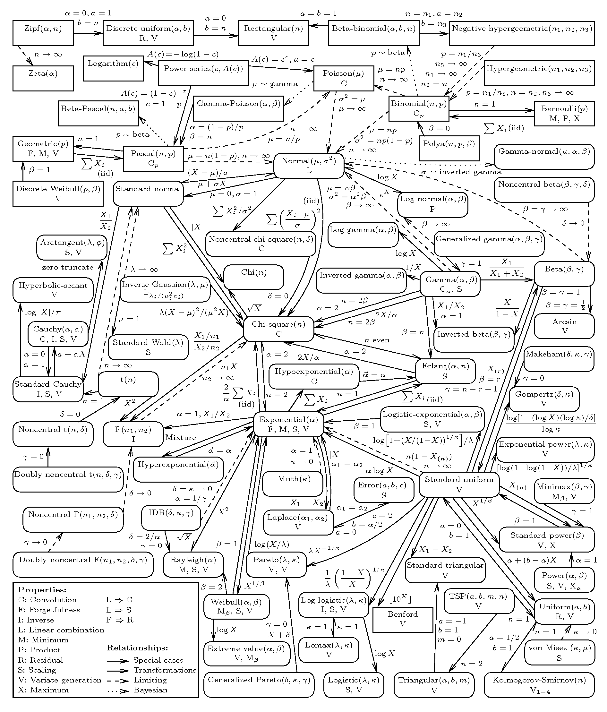

# 

## 2000F

### 2000F1

Suppose $X\sim Poisson(\lambda)$.

A) Find $E[X]$ $=\lambda$

B) Find $E[X(X-1)]$ $VX+EX^2-EX$

C) Find $E[X(X-1)(X-2)]$ $EX^3-3EX^2+2EX$

### 2000F2

Suppose X1 and X2 are independent random variables with $X_1\sim Poisson(\lambda_1),X_2\sim Poisson(\lambda_2)$. Prove that $X_1+X_2\sim Poisson(\lambda_1+\lambda_2)$.

$M(t)=e^{\lambda(e^t-1)}$ [3.2]

### 2000F3
[2003F6][]

Suppose $X\sim Binomial(n,p)$.

A) Find $E[X]$. $np$

B) Find $E[X(X-1)]$. $EX^2-EX=npq+n^2p^2-np$

C) Find $E[X(n-X)]$. $n(np)-EX=npq-npq+n^2p^2$

### 2000F4
[unbias][7.3.1] [CRLB][7.3.2] [UMVUE][7.3.2] [suff][8.2.1]

Suppose $X\sim Binomial(n,p)$

A) Find an unbiased estimator of $p^2$ and an unbiased estimator of $pq$ where $q=1-p$. (Hint:Use 3.)

B) Determine the Cramer-Rao lower bound of the variance of all unbiased estimators $T$ of $p^2$.

C) Find a MVUE (minimum variance unbiased estimator) of $p^2$. Is it unique wp1? Why or why not? State the name(s) of the theorem(s) you are using.

D) Is the estimator you found in part (c) an efficient estimator? Why or why not?

### 2000F5
[3.E]

A) Let $Z\sim N(0, 1)$. Find $E[Z^k]$ for $k=0,1,2,3,4$.

$E(Z^{2k})=\frac{(2k)!}{2^KK!}, k=1,2,..$;
$E(Z^{2k+1})=0$

$E[(Z^2)^2]=V+E^2=2+1$

B) Let $X\sim N(\mu,\sigma^2)$. Find $E[X^k]$ for $k=0,1,2,3$.

$M(0)=1$, $M'(0)=\mu$, $M''(0)=\mu^2+\sigma^2$, $M'''(0)=\mu^3+3\mu\sigma^2$, $M^{(4)}(0)=\mu^4+4\mu^2\sigma^2$

### 2000F6

A) What is the numerical value of $\sum_{k=0}^6\binom{6}{k}$?

Pascal's Triangle sums $2^6$

B) What is the numerical value of $\sum_{k=0}^6(-1)^k\binom{6}{k}$?

### 2000F7
[UMP][8.3.2]

In genetic applications the truncated Binomial distribution has been used for
a model. We say X has a truncated binomial distribution if: 
$P(X=x)=\frac{\binom{n}{x}\theta^x(1-\theta)^{n-x}}{1-(1-\theta)^n}$ for $x=1,2,3,..,n$.

A) Construct in detail the most powerful critical region for testing
$H_0:\theta=\theta_0$ against $H_1:\theta=\theta_1$, with $\theta_0<\theta_1$.

B) Will this test be UMP (uniformly most powerful) for testing $H_0:\theta\le\theta_0$ against $H_1:\theta>\theta_0$?

### 2000F8
[MLE](#MLE) [suff][8.2.1] [UMVUE][7.3.2] 

Suppose $X_1,X_2,..,X_n$ is a random sample from a distribution with density $f(x,\alpha,\beta)=\frac1{\beta}e^{-\frac{x-\alpha}\beta}$, where $x\ge\alpha;\alpha\in\mathbb R;\beta>0$. Define $\hat\alpha=\min(X_i)$, and $\beta=\bar X-\min(X_i)$.

A) Show that $\hat\alpha,\hat\beta$ are MLE’s for $\alpha,\beta$.

B) Show that $\hat\alpha,\hat\beta$ are sufficient for $\alpha,\beta$.

C) Using the fact that the above estimators are complete, find the MVUE’s of $\alpha,\beta$.

### 2000F9
[BayesE](#BayesE)

Let $X_1,X_2,..,X_n$ be a random sample from $f(x|\theta)=\theta(1-\theta)^x$, with $x=0,1,2,..$ Let $g(\theta)=1$ when $0<\theta<1$ be a uniform prior distribution for $\Theta$.

A) Find the posterior distribution of $\theta$.

B) Find the Bayes estimator of $\theta$ (assuming squared error loss).

## 2003S

### 2003S1
[2008S1A][]

An urn contains 6 red and 3 blue balls. One ball is selected at random and replaced by a ball of the other color. A second ball is then chosen. What is the probability that the first ball selected is red given that the second was red?

### 2003S2

Let $X$ be a continuous random variable with PDF $f(x)=1-|x|$, with $-1<x<1$. Let $Y=X^2$. Find the PDF of $Y$.

### 2003S3
[2019SA1][]

Let $X$ and $Y$ be continuous random variables with joint PDF $f(x,y)=8xy$, with $0\le x\le y\le1$, and zero elsewhere. Let $W=XY$. Find the PDF of $W$.

### 2003S4

The time X for an appliance dealer to travel between Cityville and Ruralville is a normally distributed random variable with mean 30 minutes and standard deviation 10 minutes. The time Y it takes to install an appliance is also a normally distributed random variable with mean 20 minutes and standard deviation 5 minutes. If $X$ and $Y$ are independent, what is:

A) The mean and variance of the total time to drive from Cityville to Ruralville, install an appliance, and return?

B) The probability that the total time required in (a) is over 95 minutes? Set up only.

### 2003S5
[Pois](#Pois) [Bino](#Bino)

Suppose that $X\sim Poisson(\theta)$ and $(Y|X=x)\sim Binomial(x,p)$.

A) Find the distribution of $Y$.

B) Show that $Y$ and $X-Y$ are independent.

### 2003S6
[LimD](#LimD)

The MGF of a random variable $X$ is of the form: $M(t)=\frac{e^t+e^{-t}}2$.

A) Find the mean and variance of the sample mean $\bar X$ based upon a random sample of size n taken from the random variable $\bar X$.

B) Find the MGF of the sample mean $\bar X$.

C) What is the limiting distribution of $\sqrt{n}\bar X$? Why?

### 2003S7
[2008F5][] [2009SB1][] [2009FB4][] [2016S4][] [2016F7][] [2017FB4][] [2018FB2][] [2019SB4][] [MOM][7.2.1] [MLE](#MLE) [CRLB][7.3.2]

Let X be a random variable with PDF $f(x)=\frac1\theta x^{-\frac1\theta-1}$,where $x>1$(and 0 elsewhere),$\theta>0$ Based on a sample of size n,

A) Find the method of moments estimator of $\theta$.

B) Find the maximum likelihood estimator of $\theta$.

C) Find the Cramer-Rao lower bound for the variance of an unbiased estimator of $\theta$.

D) Find the efficiency of the maximum likelihood estimator of $\theta$.

### 2003S8
[2007F1B][] [2010SB3] [2010FB3][] [MLE](#MLE)  [UMVUE][7.3.2]

Let $X_1,X_2,..,X_n$ denote a random sample from a distribution that is $N(0,\theta)$. Find the unbiased minimum variance estimator of $\theta^2$.

### 2003S9
[2003S9][] [2007F5B][] [2015S4B][] [2018S3B][] [2019SB3][] [UMP][8.3.2]

Let $X_1,X_2,..,X_n$ be a random sample from a distribution with PDF $f(x)=\theta x^{\theta-1}, x>1$ (and 0 elsewhere). Find the best critical region for testing $H_0:\theta=1$ against $H_1:\theta=2$.

### 2003S10
[2008F6][] [2016F5][] [Basu](#Basu) 

Let $Y_n$ be the $n{th}$ order stat of a random sample of size n from the normal distribution $N(\theta,\sigma^2)$. Prove that $Y_n-\bar Y$ and $\bar Y$ are independent.

## 2003F

### 2003F1

Let random variables X and Y have joint PDF $f(x,y)=e^{-x-y}$ for $x>0, y>0$, and zero otherwise. Let $Z=X+Y$.

A) Find the joint PDF of $X$ and $Z$.

B) Find the PDF of $Z$.

C) Find the PDF of $Z$, given $X=x$.

D) Find the PDF of $X$, given $Z=z$.

### 2003F2

Suppose $X_1$ has variance $\sigma^2=4$, $X_2$ has variance $\sigma^2=3$, and $Cov(X_1,X_2)=-2$. If $U=X_1+2X_2$ and $V= 3X_1+4X_2$,

a Find $Var[U]$ and $Var[V]$.
b Find $Cov(U,V)$.
c Find $Corr(U,V)$.

### 2003F3

Let $X\sim uniform(0,1)$ and $Y=-\log(X)$.

a Find the CDF and PDF of $Y$.
b Find $E[Y]$ and $Var[Y]$.

### 2003F4
[MLE](#MLE) [CRLB][7.3.2] [suff][8.2.1]

Suppose $X_1,X_2,..,X_n$ iid $Poisson(\theta)$ random variables with common marginal PDF $f(x)=\frac{\theta^xe^{-\theta}}{x!},x=0,1,2,..$

a Find the maximum likelihood estimator of $\theta$.

b Find a sufficient statistic for $\theta$.

c Find the Cramer-Rao lower bound for the variance of unbiased estimators of $\theta$.

d Does the MLE achieve the CRLB?

### 2003F5
[comp](#comp)

a Show that the $Binomial(n,p)$, $0\le p\le1$ family of PDFs is complete. $f(x)=\frac{n!}{x!(n-x)!}p^x(1-p)^{n-x}$

b Show that the $Normal(0,\sigma^2)$, $0<\sigma^2<1$ family of PDFs is not complete. $f(x)=\frac1{\sqrt{2\pi}}e^{\frac{-x^2}{2\sigma^2}}$.
But shouldn’t there be a $\sigma$ in the denominator of the constant?

c Show that the $Poisson(\theta)$, $0<\theta<1$ family of PDFs is complete. $f(x)=\frac{\theta^xe^{-\theta}}{x!}$

### 2003F6
[2000F3][]

Let $X\sim Binomial(n,p)$ be a random variable.

A) Prove that $E[X]=np$.

B) Find $E[X(X-1)(X-2)]$.

C) Find $E[X(n-X)]$.

### 2003F7

Let X be a single random variable having PDF $f(x)=\frac1{\theta}e^{-\frac{x}{\theta}},x>0$, zero elsewhere. Consider
testing the null hypothesis $H_0:\theta=2$ versus the alternative $H_1:\theta=4$ using the critical region
$x\ge4$.

A) Find $\alpha$, the probability of a Type-I error.

B) Find $\beta$, the probability of a Type-II error.

### 2003F8
[2014SA2][] [2015F2][] [2017FA3][]  [Expo](#Expo) [Basu](#Basu)

Let random variables X and Y have joint PDF $f(x,y)=e^{-x-y}$ for $x>0,y>0$, and zero otherwise. Define $U=\frac{X}{X+Y}$ and $V =X+Y$.

A) Find the joint PDF of $U$ and $V$.

B) Show that $U$ and $V$ are independent.

C) Find the PDF of $U$.

### 2003F9
[2011F6][] [2017S6][] [UMP][8.3.2]

Suppose $X_1,X_2,..,X_n$ are iid $Poisson(\theta)$ random variables with common marginal PDF $f(x)=\frac{\theta^xe^{-\theta}}{x!}$ for $x = 0,1,2,..$

Find the form of a uniformly most powerful (UMP) test of $H_0:\theta=\theta_0$ versus $H_1:\theta>\theta_0$. Explain why your test is a UMP.

## 2004F

### 2004F1

Let $X_1,X_2,..,X_n$ be iid $uniform[0,1]$ random variables. Define $Y_1=\min(X_1,X_2,..,X_n)$ and $Y_n=\max(X_1,X_2,..,X_n)$ Prove

$f(x)=1$,$F(x)=x$

(a) $E(Y_1) =1/(n+1)$

$Y_1=nf(x)[1-F(x)]^{n-1}$, $E[Y_1]=\int_0^1xn(1-x)^{n-1}dx$

(b) $E(Y_n) =n/(n+1)$

$Y_1=nf(x)[1-F(x)]^{n-1}$, $E[Y_n]=\int_0^1xnx^{n-1}dx$

### 2004F2

Let $X_1,X_2,..,X_n$ be iid $uniform[\theta_1,\theta_2]$ random variables, where $-\infty<\theta_1<\theta_2<\infty$. Define $Y_1=\min(X_1,X_2,..,X_n)$ and $Y_n=\max(X_1,X_2,..,X_n)$. Find the joint sufficient statistics for $\theta_1$ and $\theta_2$.

### 2004F3

Let $Y=e^X$, where $X\sim N(\mu,\sigma^2)$. Find

(a) the mean of $Y$, and

(b) the variance of $Y$.

### 2004F4

Let $T$ be a positive random variable with cdf $F(t)$. Define the function $H(t)$ as $H(t)=-\log(1-F(t))$. Show that $H (T)\sim\exp(\lambda=1)$.
Note: The pdf of an exponential is $f(x|\lambda)=\lambda\exp(\lambda x)$, for $0<x<\infty$ and $\lambda>0$. It equals 0 elsewhere.

### 2004F5
[2009SB2][]  

Let $X_1,X_2,..,X_n$ be a random sample of size $n=5$ from a normal distribution $N(0,\theta)$.

(a) Argue that the ratio and its denominator are independent.
$R=(X_1^2+ X_2^2)/(X_1^2+ X_2^2+X_3^2+ X_4^2+X_5^2)$

(b) Does $5R/2$ have an F-distribution with 2 and 5 degrees of freedom? Explain.

### 2004F6
  [unbias][7.3.1] 

Let Y be $binomial(n,p)$.

(a) Find an unbiased estimator $a(Y)$ of $p$.

(b) Find an unbiased estimator $b(Y)$ of $pq$, where $q=1-p$.

(c) Determine a lower bound for the variance of the estimator $b(Y)$ in part (b).

### 2004F7

Let $X_1,X_2,..,X_n$ be lid $Poisson(\lambda)$. 

Let$\bar X=\frac{\sum_{i=1}^{n}X_{i}}{n}$ and $S^2=\frac{\sum_{i=1}^{n}(X_{i}-\bar X)^2}{n-1}$. 

Determine $E(S^2|\bar X)$. State your argument clearly.

### 2004F8
[2007F4B][] [2013FB4][] [2015S3B][] [2018S1B][] [2019SB2][] [Laplace](#Laplace) [MLE](#MLE) [median](#median)  [7.E.13][]

Suppose the $X_1,X_2,..,X_n$ form a random sample from a population
with density function
$f(x,\theta) =\frac12e^{-|x-\theta|}, -\infty<x<\infty, -\infty<\theta<\infty$
Find the M.L.E. of $\theta$.

### 2004F9
[2003S9][] [2007F5B][] [2015S4B][] [2018S3B][] [2019SB3][] [power](#power) [UMP][8.3.2]

Suppose $Y$ is a random variable of size 1 from a population with density function
$f(y|\theta)=\begin{cases}\theta y^{\theta-1}& 0\le y\le1\\0& o.w.\end{cases}$, where $\theta>0$

(a) Sketch the power function of the test of the rejection: $Y>0.5$.

(b) Based on the single observation $Y$ , find the uniformly most powerful test of size $\alpha$ for testing $H_0:\theta=1$ against $H_A :\theta>1$.

### 2004F10
[2014F5A][]

Let $Z_1,Z_2,..$ be a sequence of random variables random variables; and suppose that, for $n=1,2,..$, the distribution of $Z_n$ is follows: $P(Z_n=n^2)=1/n$ and $P(Z_n=0)=1-1/n$.
Show that 

(a) $\lim_{n\to\infty}E(Z_n)=\infty$ and

(b) $Z_n\overset{p}\to0$ as $n\to\infty$

### 2004F11
[2015S1Ab][]

Suppose a box contains a large number of tacks, and the probability $X$ that a particular tack will land with its point up when it is tossed varies from tack to tack in accordance with the following pdf:

$f(x)=\begin{cases}2(1-x)&0<x<1\\0& o.w.\end{cases}$

Suppose a tack is selected at random from this box and this tack is then tossed three times independently. Determine the probability the tack will land with its point up on all three tosses.

### 2004F12
[2010SB4][] [2010FB4][] [2011S6][] [2015F5][] [2018S4B][] [Expo](#Expo) [LRT](#LRT) [HypoT](#HypoT)

Let $T_1,T_2,..,T_n$ be a random sample with density function
$f(t|\theta)=\frac1\theta\exp(-t/\theta)$ for $0<t<\infty$ and $0<\theta<\infty$, $f(t|\theta)=0$ elsewhere.

(a) Show that the likelihood ratio test (LRT) to test $H_0:\theta=\theta_0$ against $H_A:\theta\neq\theta_0$ is equivalent to the two-sided test based on the test statistic
$T^*=\frac{2}{\theta_0}\sum^n_{i=1}T_i$

(b) Under $H_0:\theta=\theta_0$, what is the distribution of $T*$?

## 2005S
Kochar

### 2005S1

Let $F(x,y)=1$ if $x+y\ge1$, and zero otherwise. Show that $F(x,y)$ cannot be a joint cdf of two random variables $X$ and $Y$.

### 2005S2

Let $X_1,X_2,..,X_n$ be iid rv's from a distribution which has pdf $f(x)=e^{-x},0\le x<\infty$, and zero gtherwise.
Let $0\le Y_1<Y_2<..<Y_n$ denote the order statistics of the sample. Define $W_i= Y_i-Y_{i-1}$ for $i = 1,2,..,n$, with $Y_0=0$.

(a) (6) Show that the $W_i$'s are independent random variables.

(b) (3) Find $E(W_i)$ for $i = 1,2,..,n$.

(c) (3) Find $E(Y_i)$ for $i = 1,2,..,n$.

### 2005S3
[2015S1Aa][]

Let X be a rv with finite mean $\mu$, finite variance $\sigma^2$, and assume $E(X^8)<\infty$. Prove or disprove:

(a) $E[(\frac{X-\mu}{\sigma})^2]\ge1$.

(b) $E[(\frac{X-\mu}{\sigma})^4]\ge1$.

### 2005S4
 [Cor](#Cor) 

Let X andY have joint mgf
$M(t_1,t_2)=E(e^{t_1X + t_2Y})=e^{t_1^2+t_1t_2+2t_@^2}$
$-\infty<t_1,t_2<\infty$

(a) (10) State the formal name and the defining parameter values for this joint distribution.

(b) (5) Find the correlation between $X$ and $Y$; that is, $\rho(X, Y)$.

### 2005S5
[suff][8.2.1]

Let the rv's $X_1,X_2,..,X_n$ form a random sample from a distribution with pdf denoted by $f(x|\theta)$. The unknown value of $\theta$ belongs to some parameter space $\Omega$; that is, $\theta\in\Omega\subset\mathbb R$. Define what we
mean when we say $T=T(X_1,X_2,..,X_n)$ is a sufficient statistic for the parameter $\theta$. That is, state the definition of a sufficient statistic for $\theta$.

### 2005S6

Let $X_1,X_2,..,X_n$ form a random sample from $N(\theta,\sigma^2)$, $-\infty<\theta<\infty$,$0<\sigma^2<\infty$. Argue that statistic $Z$ defined as $Z=\frac{\sum_{i=1}^{n-1}(X_{i+1}-X_{i})^2}{\sum_{i=1}^{n}(X_{i}-\bar X)^2}$
is independent from the sample mean $\bar X$ and the sample variance $S^2$

### 2005S7

Let X have pdf of the form $f(x|\theta)=1/\theta, 0<x<\theta$, zero elsewhere. Let $Y_1<Y_2,<Y_3<Y_4$ denote the order statistics of a random sample of size 4 from this distribution. Let the observed value
of $Y_4$ be $y_4$· We reject $H_0:\theta=1$ and accept $H_1:\theta\neq1$ if either $y_4\le1/2$or $y_4\ge1$.

(a) (6) Find the power function $K(\theta), 0<\theta$, of the test.

(b) (4) What is the signficance level (size) of the test?

### 2005S8
[2014SA3][] [2014SA5][] [2015S3A][] [2016S3][]  

First,let $\Phi(.)$ and $\phi(.)$ denote the standard normal cdf and pdf respectively. Then, let $X_1,..,X_n$ denotes a random sample from a normal distribution with means $\theta$ and variance $\sigma^2$, and let $F(.)$ and $f(.)$ denote the common cdf and pdf of the r.s. respectively. Assume the sample size $n$ is odd; that is, $n=2k-1$; $k=1,2,3,..$ In this situation, the sample
median is the $k^{th}$ order statistic, denoted by $Y_k$.

(a) (5) Let $g(y)$ denote the pdf of the sample median $Y_k$. Derive $g(y)$. You may use the symbols $F(.)$ and $f(.)$.

(b) (3) Show that the pdf $g(y)$ is symmetric about $\theta$.

(c) (2) Find $E(Y_k)$·

(d) (5) Determine the $E(Y_k|\bar X)$, where $\bar X$ is the sample mean of the above random sample. Justify your answer.

### 2005S9
[2013FB5][] [2018FB4][]  [MLE](#MLE) [suff][8.2.1]

Suppose $X_1,X_2,..,X_n$ form a random sample from a uniform distribution over the interval $(\theta,\theta+1)$, where the value of the parameter $\theta$ is unknown $-\infty<theta<\infty$. The joint pdf $f_n(\underline{x}|\theta)$ of the random sample is expressed as follows:
$f_n(\underline{x}|\theta)=\begin{cases}1&\theta\le x_i\le\theta+1\\0& o.w.\end{cases}$

(a) Express the joint pdf in terms of the $\min(x_i)$ and $\max(x_i)$.

(b) Show that the statistics $\min(X_i)$ and $\max(X_i)$ are jointly sufficient statistics for $\theta$.

(c) If the MLE of $\theta$ exists, find it. Is it unique?

## 2007F

### 2007F1A
[2008S4A] [2013FB1] [MLE](#MLE) [suff][8.2.1] [consi][10.1.1] [unbias][7.3.1]

Let $Y_1,Y_2,..,Y_{n}$ be a random sample from $N(\mu,\sigma^2)$ distribution and let $X_1,X_2,..,X_{m}$ be an independent random sample from $N(2\mu,\sigma^2)$ distribution.

(a) What is the distribution of $\frac{\sum_{i=1}^m(X_i-\bar X)^2}{\sigma^2}$

(b) Show that
$\hat\sigma^2=\frac{\sum_{i=1}^m(X_i-\bar X)^2+\sum_{j=1}^n(Y_j-\bar Y)^2}{m+n-2}$
is unbiased and consistent for estimating $\sigma^2$

$P(\hat\sigma^2-\sigma^2)=0$

$E[\hat\sigma^2]=\sigma^2$

### 2007F2A
[2008S5A][] [2009FA1][] [2014F4A][] **[2015S2A][]** [2019SA2][]

Suppose $Y_1$ and $Y_2$ are i.i.d. random variables and the p.d.f. of each of them is as follows:
$f(x)=\begin{cases}10e^{-10x}& x>0\\0& o.w.\end{cases}$
Find the p.d.f. of $X=Y_1-Y_2$.

$f(y_1,y_2)=$

$f(x,w)=$

$f(x)=$

### 2007F3A
[2008S2A][] [2009FA2][] [2016F8][] [2018FA1][] [2019SA1][] 

Suppose $Y_1$ and $Y_2$ have the joint pdf
$f(y_1,y_2)=\begin{cases}2&0\le y1\le y2\le 1\\0& o.w.\end{cases}$

(a) Find the marginal density functions of $Y_1$ and $Y_2$ and check whether they are independent.

(b) Find $E[Y_1+Y_2]$

(c) Find $P(Y_1\le3/4|Y_2>1/3)$

$f(w)=w,w<1, E[w]=2/3$;
$f(w)=2-w,w>1, E[w]=1/3$

### 2007F4A
[2015S4A][]

(a) Let $X$ be a continuous type random variable with cumulative distribution function $F(x)$. Find the distribution of the random variable $Y=\ln(1-F(X))$:

(b) Prove that for any $y\ge c$, the function $G_c(y)=P[X\le y|X\ge c]$ has the properties of a distribution function.

### 2007F5A
[2013FB2][] [2014F1B][] [2015S1B][] [MLE](#MLE)

Let $X_1,X_2,..,X_n$ be a random sample from a distribution with cumulative distribution function
$F(x)=\begin{cases}0&x<0\\(\frac{x}\theta)^2& 0\le x<\theta\\1& x\ge\theta\end{cases}$

(a) Find $\hat\theta$, the mle of $\theta$.

(b) Find $E[\hat\theta]$.

(c) Prove that $\hat\theta$ is consistent for $\theta$.

### 2007F1B
[2003S8][] [2010SB3] [2010FB3][] [MLE](#MLE)  [UMVUE][7.3.2]

Let $X_1,X_2,..,X_n$ be a random sample of size $m$ from $N(\theta,1)$ distribution. Find MLE and UMVUE of $\theta^2$.

### 2007F2B
[2014F5B][] [2017FB2][]  [HypoT](#HypoT) [power](#power)

Let $Y_1,Y_2,..,Y_{10}$ be a random sample from uniform distribution over $(0,\theta)$.
For testing $H_0:\theta=0$ against the alternative $H_a:\theta>1$, a reasonable test is to reject $H_0$ if $X_{(n)}=\max\{X_1,X_2,..,X_{10}\}\ge C$. Find $C$ so that type I error probability is .05. Also find the power of the above test at $\theta=1.5$.

### 2007F3B
[2010SB1][] [2010FB1][] [2011S5][] [2013FB3][] [2015S2B][] [2018S2B][] [FishI][7.3.2] [CRLB][7.3.2] [perc](#perc)

Let $X_1,X_2,..,X_n$ be a random sample from exponential distribution with p.d.f.
$f(x,\theta)=\begin{cases}\theta e^{-\theta x}& x\ge0\\0& o.w.\end{cases}$
for which the parameter $\theta>0$ is unknown.

(a) Find the Fisher information $I(\theta)$ about $\theta$ in the sample.

(b) Find the 90th percentile of this distribution as a function of $\theta$ and call it $g(\theta)$.

(c) Find the Cramer-Rao lower bound on the variance of any unbiased estimator of $g(\theta)$.

### 2007F4B
[2004F8][] [2013FB4][] [2015S3B][] [2018S1B][] [2019SB2][] [Laplace](#Laplace) [MLE](#MLE) [median](#median)  [7.E.13][]

Let $X_1,X_2,..,X_9$ be a random sample of size 9 from a distribution with pdf
$f(x,\theta) =\frac12e^{-|x-\theta|}, -\infty<x<\infty$;
where $-\infty<\theta<\infty$ is unknown.
Find the m.l.e. of $\theta$ and find its bias.

### 2007F5B
[2003S9][] [2004F9][] [2015S4B][] [2018S3B][] [2019SB3][] [UMP][8.3.2]

Suppose $X_1,X_2,..,X_n$ is a random sample from a distribution with pdf
$f(x,\theta)=\begin{cases}\theta x^{\theta-1}& 0<x<1\\0& o.w.\end{cases}$
Suppose that the value of $\theta$ is unknown and it is desired to test the following hypotheses :
$H_0:\theta=1\quad H_1 :\theta>1$
Derive the UMP test of size $\alpha$ and obtain the null distribution of your test statistic.

## 2008S

### 2008S1A
[2003S1][]

A box contains 2 red balls, 2 white balls, and 3 blue balls. If 5 balls are selected at random without replacement, what is the probability that only one color is missing from the selection?

### 2008S2A
[2016F8][]

Let $(Y_1,Y_2)$ have the joint pdf
$f(y_1,y_2)=\begin{cases}c(1-y_2)&0\le y_1\le y_2\le 1\\0& o.w.\end{cases}$

(a) Find the value of c.

(b) Find the marginal density functions of $Y_1$ and $Y_2$.

(c) Find $P(Y_2\le1/2|Y_1\le3/4)$

### 2008S3A
[2008F1][] [2016F4][]

Let $(Y_1,Y_2)$ denote a random sample of size $n=2$ from the uniform distribution on the interval $(0, 1)$. Find the probability density and cumulative distribution functions of $U=Y_1+Y_2$..

### 2008S4A
[2007F1A][] [2013FB1][]  [unbias][7.3.1] [consi][10.1.1]

Let $Y_1,Y_2,..,Y_{n}$ be a random sample of size $n$ from a normal population with mean $\mu$ and variance $\sigma^2$. Assuming $n=2k$ for some integer $k$, one possible estimator for $\sigma^2$ is given by:
$\hat\sigma^2=\frac1{2k}\sum_{i=1}^k(Y_{2i}-Y_{2i-1})^2$

(a) Show that $\hat\sigma^2$ is an unbiased estimator for $\sigma^2$

(b) Show that $\hat\sigma^2$ is a consistent estimator for $\sigma^2$

### 2008S5A
[2007F2A][] [2009FA1][] [2014F4A][] [2015S2A][] [2019SA2][]

The lifetime (in hours) Y of an electronic component is a random variable with density function
$f(y)=\begin{cases}\frac1{300}e^{-\frac1{300}y}& y>0\\0& o.w.\end{cases}$

(a) What is the probability that a randomly selected component will operate for at least 300 hours?

(b) Five of these components operate independently in a piece of equipment. The equipment fails if at least three of the components fail.

Find the probability that the equipment will operate for at least 300 hours without failure?

### 2008S1B
[2009FA4][] [2015F1][] [suff][8.2.1] [UMVUE][7.3.2] 

Let $X_1,X_2,..,X_{n}$ be a random sample of size $n$ from a uniform distribution over the interval $[-\theta/2,\theta/2], \theta>0$ being unknown.

(a) Prove tbat $T=\max_{1\le i\le n}|X_{i}|$ is complete and sufficient for $\theta$.

(b) Find the UMVU estimator of $\theta$.

### 2008S2B
[2014F2B][]  [FishI][7.3.2]

Let $X_1,X_2,..,X_{n}$ be a random sample from Poisson distribution with parameter $\lambda(>0)$.

(a) Find the Fisher's information in the sample about the parameter $\lambda$.

(b) Suppose we want to estimate $P[X_1=0]=e^{-\lambda}$. Find a lower bound on the variance of any unbiased estimator of this parametric function.

### 2008S3B
[consi][10.1.1]

Let $X_1,X_2,..,X_{n}$ be a random sample from a distribution with probability density function
$f_{\theta_1}(x)=\begin{cases}\frac1{\theta_1} e^{-\frac{x}{\theta_1}}& x>0\\0& o.w.\end{cases}$
and $Y_1,Y_2,..,Y_{n}$ an independent random sample from
$f_{\theta_2}(x)=\begin{cases}\frac1{\theta_2} e^{-\frac{x}{\theta_2}}& x>0\\0& o.w.\end{cases}$

(a) Find $p_{\theta_1,\theta_2}= P[X_1\le Y_1]$.

(b) Find the MLE, $\hat p_n$, of $p_{\theta_1,\theta_2}= P[X_1\le Y_1]$.

(c) Show that $\hat p_n$ is a consistent estimator of $p_{\theta_1,\theta_2}$.

### 2008S4B
[2014SB2][] 

Let $X_1,X_2,..,X_{10}$ be independent random variables such that $X$, has $U(0,i\theta)$ distribution for $i= 1,2,..,10$. Based on these 10 observations, find the maximum likelihood estimator of $\theta$ and find its bias.

### 2008S5B
[2017FB3][] [MLR][8.3.2] [UMP][8.3.2] [power](#power) [HypoT](#HypoT)

Let $X_1,X_2,..,X_m$ be a random sample of size m from $N(\theta,1)$ distribution and let $Y_1,..,Y_m$ be an independent random sample of size $m$ from $N(3\theta,1)$.

(a) Show that the joint distribution of X's and Y's has MLR (monotone likelihood ratio) property.

(b) Find the UMP test of size $\alpha$ for testing $H_0:\theta\le0$ vs $H_1:\theta>0$.

(c) Find an expression of the power function of the UMP test.

## 2008F
Fountain

### 2008F1
[2008S3A][] [2016F4][]   

Let $Y_1$ and $Y_2$ be a random sample of size 2 from $Uniform(0,1)$. Find the cumulative distribution and probability density functions of $U=Y_1+Y_2$.

### 2008F2
[2010SA1][] [2014F2A][]

Only 5 in 1000 adults are afflicted with a rare disease for which a diagnostic test has been developed. The test is such that when an individual actually has the disease, a positive result will occur 99% of the time, whereas an individual without the disease will show a positive result only 2% of the time. If a randomly selected individual is tested and the result is positive, what is the probability that the individual has the disease? A man committed a suicide in a week after learning from his doctor that he has a terminal cancer. What do you think of his reaction based on your answer to this problem?

$\frac{5*0.99}{5*0.99+995*0.02}=0.1991952$ There is only 19.9% probability that the indicdual has the disease.

### 2008F3
[2016F3][] [Cheb][3.6.1]

If X is a random variable such that $E[X]=3$ and $E[X^2]=13$, determine a lower bound for
the probability $P(-2<X<8)$. (Hint: Use a famous inequality.)

$\mu=3$, $\sigma=2$, $t=\frac52$,$P(-2<x<8)=1-\frac4{25}=\frac{21}{25}$

### 2008F4
[2017FB2][]

Let $Y_1$ be the minimum of a random sample of size n from a distribution that has p.d.f.
$f(x)=e^{-(x-\theta)},\theta<x<\infty$, zero elsewhere. Let $Z_n= n(Y_1-\theta)$. Determine the limiting distribution of $Z_n$. (Hint: Determine the p.d.f. of Y, and then apply the change of variable technique.)

$X_{(1)}=ne^{-n(x-\theta)}$

$Y_{(1)}=\frac{Z_n}{n}-\theta$, $\frac{dy_1}{dz_n}=\frac1n$, $g(z_n)=e^{-z_n}\sim Expo(1)$

### 2008F5
[2003S7][] [2009SB1][] [2009FB4][] [2016S4][] [2016F7][] [2017FB4][] [2018FB2][] [2019SB4][] [MOM][7.2.1] [MLE](#MLE) [MSE][7.3.1] [CRLB][7.3.2]

Let $X_1,X_2,..,X_n$$\sim$i.i.d.$f(x;\theta)=\theta(x+1)^{-\theta-1},\ x>0,\theta>2$

a. Find $\hat\theta_{MOM}$, the method of moments estimator of $\theta$.

$EX=\int_0^\infty x\theta(x+1)^{-\theta-1}dx=\frac1{\theta+1}$, $\hat\theta_{MOM}=\frac{1}{\bar X}+1$

b. Find $\hat\theta_{MLE}$, the maximum likelihood estimator of $\theta$.

 $\hat\theta_{MLE}=\frac{n}{\sum\ln(x+1)}$

c. Find the MSE (mean squared error) of $\hat\theta_{MLE}$.

Let $y=\ln(x+1)$, $x=e^y-1$, $\frac{dx}{dy}=e^y$, $Y=\theta e^{-\theta y}\sim Expo{\theta}, Gamma(1,\frac1\theta)$

$E[\hat\theta_{MLE}]=\frac{n\theta}{n-1}$, $Bias=\frac{\theta}{n-1}$

$E[\hat\theta_{MLE}^2]=\frac{n^2\theta^2}{(n-1)(n-2)}$, $V[\hat\theta_{MLE}]=\frac{n^2\theta^2}{(n-1)^2(n-2)}$

$MSE=\frac{n^2\theta^2}{(n-1)^2(n-2)}+(\frac{\theta}{n-1})^2=\frac{n+1}{(n-1)^2}\theta^2$

d. Using $\hat\theta_{MLE}$, create an unbiased estimator $\hat\theta_{U}$.

$\hat\theta_{U}=\frac{n-1}{\sum\ln(x+1)}$

e. Find the efficiency of $\hat\theta_{U}$.

$CRLB=\frac{\theta^2}{n}$

$\lim\limits_{n\to\infty}\frac{CRLB}{V\hat\theta_{U}}=\lim\limits_{n\to\infty}\frac{\theta^2/n}{\theta^2/(n-2)}=\lim\limits_{n\to\infty}\frac{n-2}{n}=1$

f. Construct the most powerful test of $H_0:\theta=3$ vs. $H_1:\theta=4$.

$\theta_0<\theta_1$, By Neyman-Pearson, RR is $R=\{\vec x:\Lambda\in C\}$, $\Lambda\nearrow$ has MLR, by Lehmann-Scheffe

$P_{H_0}(6\sum\ln(x+1)<\chi^2_{2n,\alpha})=\alpha$ is UMP for testing $\theta$

### 2008F6
[2003S10][] [2016F5][] [Basu](#Basu) 

Let $Y_n$ be the $n^{th}$ order statistic of a random sample of size n from the normal distribution $N(\theta,\sigma^2)$. Prove that $Y_n-\bar Y$ and $\bar Y$ are independent.

562-2

### 2008F7
[2016F6][] [Expo](#Expo) [BayesE](#BayesE)

Suppose that $X_1,X_2,..,X_n$ i.i.d. $Exponential(\theta)$, i.e. $f(x;\theta)=\theta e^{-\theta x},x>0$. Also assume that the prior distribution of $\theta$ is $h(\theta)=\lambda e^{-\lambda\theta},\theta>0$. Find the Bayes estimator of $\theta$, assuming squared error loss.

## 2009S
unkown, Fountain

### 2009SA1

Suppose random variables X and Y have a joint probability mass function
$p(x,y)=\begin{cases}\frac{x+y+1}{30}& x,y=0,1,2,..,x+y\le3\\0& o.w.\end{cases}$
Determine the marginal probability mass function of Y.

### 2009SA2

Suppose a random variable $X$ has a probability mass function $p(x)=\frac{e^{-\mu}\mu^x}{x!},x=0,1,2,..$,zero, elsewhere. Find the values of $\mu$, so that $x=1$ is the unique mode.

### 2009SA3
[Pois][]

Let $X_1,X_2,..,X_n$ be the independent $Poisson(m_i)$ random variables. Show that $Y=\sum_{i=1}^n X_i$ has $Poisson(\sum_{i=1}^n m_i)$.

### 2009SA4
[Cor](#Cor) [Cheb][3.6.1]

Let $\sigma_1^2=\sigma_2^2=\sigma^2$ be the common variance, $\rho$ the correlation coefficient, $\mu_1$ and $\mu_2$ the means of $X_1$ and $X_2$ , respectively. Show that

$P[|(X_1-\mu_1)+(X_2-\mu_2)|\ge k\sigma]\le\frac{2(1+p)}{k^2}$

### 2009SA5
[Expo](#Expo)

Let Xn have a probability density function
$f(x;n)=\begin{cases}ne^{-nx}& 0<x<\infty\\0& o.w.\end{cases}$
Find the limiting distribution of $Y_n=X_n/n$.

### 2009SB1
[2003S7][] [2008F5][] [2009FB4][] [2016S4][] [2016F7][] [2017FB4][] [2018FB2][] [2019SB4][] [MOM][7.2.1] [MLE](#MLE) [MSE][7.3.1] [CRLB][7.3.2]

Let $X_1,X_2,..,X_n$ be a random sample of size n from the following distribution:
$f(x;\theta)=(\theta+1)x^\theta,\ 0\le x\le 1,\theta>-1$

(a) Find $\hat\theta_{MOM}$, the method of moments estimator for $\theta$.

(b) Find $\hat\theta_{MLE}$, the maximum likelihood estimator for $\theta$.

(c) Using $\hat\theta_{MLE}$, create an unbiased estimator $\hat\theta_{U}$.

(d) Find the Cramer-Rao lower bound on the variance of an unbiased estimator of $\theta$.

(e) Construct the most powerful test of $H_0:\theta=0$ vs. $H_1:\theta=1$, showing as much detail as possible.

### 2009SB2
[2004F5][]
 
Let $X_1,X_2,..,X_5$ be a random sample of size 5 from the normal distribution $N(0,\sigma^2)$. Prove
that $R=(X_1^2+ X_2^2)/(X_1^2+ X_2^2+X_3^2+ X_4^2+X_5^2)$ and $D=X_1^2+ X_2^2+X_3^2+ X_4^2+X_5^2$ are independent.

$R=\frac{\chi_2^2}{\chi_2^2+\chi_3^2}=Beta(2/2,2/3)$
$D=\chi_5^2$

### 2009SB3
[BayesE](#BayesE)

Suppose thfrt $X_1,X_2,..,X_{n}$ have i.i.d. $Poisson(\theta)$. Also assume that the prior distribution
of is e is $Gamma(\alpha,\beta)$. Find the Bayes estimator of $\theta$, assuming squared-error loss.

## 2009F

### 2009FA1
[2007F2A][] [2008S5A][] [2014F4A][] [2015S2A][] [2019SA2][]

The lifetime (in hours) Y of an electronic component is a random variable with density function
$f(y)=\begin{cases}\frac1{200}e^{-\frac1{200}y}& y>0\\0& o.w.\end{cases}$

(a) What is the probability that a randomly selected component will operate for at least 400 hours?

(b) What is the probability that the lifetime of a randomly selected component will exceed its mean lifetime by more than two standard deviations?

(c) Four of these components operate independently in a piece of equipment. The equipment fails if at least three of the components fail. Find the probability that the equipment will operate for at least 400 hours without failure?

### 2009FA2
[2007F3A][] [2008S2A][] [2016F8][] [2018FA1][] [2019SA1][]

Suppose $(Y_1,Y_2)$ have the joint pdf
$f(y_1,y_2)=\begin{cases}c&0\le y_1\le y_2\le 1\\0& o.w.\end{cases}$

(a) Find the value of c.

(b) Find the marginal density functions of $Y_1$ and $Y_2$ and check whether they are independent.

(c) Find $P(Y_1\le1|Y_2>1)$

### 2009FA3
[2015S5A][] [2019SA4][] [3.2]

Let $Y_1,Y_2,..,Y_{12}$ be a random sample from a Poisson distribution with mean $\lambda$.

(a) (4 Ppts) Use the method of moment generating functions to find the distribution of $S_{12}=\sum^{12}_{i=1} Y_i$.

$M_X(t)=e^{\lambda(e^t-1)}$
$M_{\sum x}(t)=e^{n\lambda(e^t-1)}$

(b) (6 pts) Let $S_4=\sum_{i=1}^4Y_i$ Find the conditional distribution of $S_4$ given $S_{12}=s$.

$f(S_{12})=\frac{e^{12\lambda}(12\lambda)^{y_i}}{\sum y_i}$

Let $S_4+S_8=S_{12}$

$\frac{P(S_4)P(S_8=S_{12}-S_4)}{P(S_{12})}$

$Beta(4y+1,12-47+1)$, $Bino(12,1/3)$

### 2009FA4
[2008S1B][] [2015F1][] [consi][10.1.1]

Suppose $X_1,X_2,..,X_{n}$ is a random sample from a unform distribution over $[1,\theta]$, where $\theta>1$. Let $Y_{n}=\max\{X_1,X_2,..,X_{n}\}$

(a) (3 pts) Find the probability density-function of $Y_{n}$.

(b) (4 pts) Find the mean and the variance of $Y_{n}$.

(c) (3 pts) Examine whether $Y_{n}$ is a consistent estimator of $\theta$.

### 2009FB1
[2019SB1][]

Let $X_1,X_2,..,X_n$ be a random sample from a normal distribution $N(\mu,\sigma^2=25)$. Reject $H_0:\mu=50$ and accept $H_1:\mu=55$ if $\bar X_n\ge c$. Find the two equations in n and c that you would solve to get $P(\bar X_n\ge c|\mu)=K(\mu)$ to be equal to $K(50)=0.05$ and $K(55)=0.90$.
Solve these two equations. Round up if n is not an integer. Hint: $z_{.05}=1.645$ and $z_{.1}=1.28$

### 2009FB2
[MLE](#MLE) [LRT](#LRT)
[3.E.23] [8.E.5] [Pareto][3.E.23]

The Pareto distribution is a frequently used model in study of incomes and has the distribution function
$F(x;\theta_1,\theta_2)=\begin{cases}1-(\theta_1/x)^{\theta_2}& \theta_1<x\\0& o.w.\end{cases}$
where $\theta_1>0$ and $\theta_2>0$.

(a) (4 pts) Let $X_1,X_2,..,X_n$ be a random sample from this distribution. Find the MLEs of $\theta_1$ and $\theta_2$.

$f(x|\theta_1,\theta_2)=\frac{\theta_2\theta_1^{\theta_2}}{x^{\theta_2+1}}$

$\hat\theta_1=X_{(1)}$,
$\hat\theta_2=\frac{n}{\sum\ln(X_i/X_{(1)})}$

(b) (3 pts) Find the likelihood ratio test for testing $H_0:\theta_1=1$ against $H_1:\theta_1\neq1$.

Under $H_0$
$\Lambda=$

(c) (3 pts) Using $\alpha=.05$, find out the critical value for your test. Hint: $\chi^2_{1,.025}= 5.024$;$\chi^2_{1,.05}= 3.841$; $\chi^2_{1,.975}=.001$; $\chi^2_{1,.95}=.004$; $\chi^2_{2,.025}=7.378$; $\chi^2_{2,.05}= 5.991$; $\chi^2_{2,.975}=.051$;$\chi^2_{2,.95}=.103$

### 2009FB3
[UMVUE][7.3.2] [Expo](#Expo) [Basu][6.2.4]

Let $X_1,X_2$ denote a random sample of size $n=2$ from a distribution with pdf
$f(x;\theta)=\begin{cases}\frac1\theta e^{-\frac{x}\theta}& 0<x<\infty\\0& o.w.\end{cases}$
where $0<\theta<\infty$ is an unknown parameter.

(a) (5 pts) Show that $Y_1=X_1+X_2$ is independent of $X_1/X_2$.

$Y_1\sim Gamma(2,\theta)$ is complete

$X_1/X_2$ is ancillary.

(b) (5 pts) Find the UMVUE of $\theta^2$

### 2009FB4
[2003S7][] [2008F5][] [2009SB1][] [2016S4][] [2016F7][] [2017FB4][] [2018FB2][] [2019SB4][]

Let $X_1,X_2,..,X_n$ be a random sample of size n from a probability density function
$f(x;\theta)=\begin{cases}(\theta+1)x^\theta& 0<x<1\\0& o.w.\end{cases}$
where $\theta>-1$ is an unknown parameter.

(a) Find $\hat\theta$, the maximum likelihood estimator of $\theta$.

(b) Using $\hat\theta$, create an unbiased estimator $\hat\theta_U$ of $\theta$.

(c) Find the Cramer-Rao lower bound for an unbiased estimator of $\theta$.

(d) What is the asymptotic distribution of $\hat\theta$?

## 2010S

### 2010SA1
[2008F2][] [2014F2A][]

Only 1 in 1000 adults is afflicted with a rare disease for which a diagnostic test has been developed. The test is such that when an individual actually has the disease, a positive result will occur 99% of the time, whereas an individual without the disease will show a positive result only 2% of the time (false positive). If a randomly selected individual is tested and the result is positive, what is the probability that the individual has the disease?

### 2010SA2
[2.E.22]

Let $X_1$ and $X_2$ be a random sample of size 2 from the following pdf
$f(x,\beta)=\begin{cases} \frac1{2\beta^3}x^2e^{-x/\beta}& x\ge0\\0& o.w.\end{cases}$

$Gamma(3,\beta)$ [3.3.14]

(a) Compute the expected value of $X_1/X_2$

$E[X_1]E[\frac1{X_2}]=3/2$

(b) Compute the variance of $X_1/X_2$

$Var[X_1\cdot\frac1{X_2}]=15/4$

### 2010SA3
[2011S4][] [2018FA4][]  [LimD](#LimD)

Let $X_1,X_2,..,X_n$ be a random sample from $Poisson(\mu)$. Derive the limiting distribution of
$\sqrt{n}(e^{-\bar X_n}-e^{-\mu})$.

### 2010SA4
[2016S5][]

Let $X$ and $Y$ have the following joint pdf:
$f(x,y) =\begin{cases}6(y-x)& 0<x<y<1\\0& o.w.\end{cases}$
Define $Z=(X+Y)=2$ and $W=Y$, respectively.

(a) Find the joint pdf of Z and W.

(b) Find the marginal pdf of Z.

### 2010SB1
[2007F3B][] [2010FB1][] [2011S5][] [2013FB3][] [2015S2B][] [2018S2B][] [Expo](#Expo) [FishI][7.3.2] [CRLB][7.3.2] [perc](#perc)

Let $X_1,X_2,..,X_{20}$ be a random sample from exponential distribution with p.d.f.
$f(x,\theta)=\begin{cases}\theta e^{-\theta x}& x\ge0\\0& o.w.\end{cases}$
for which the parameter $\theta>0$ is unknown.

(a) Find the Fisher information $I(\theta)$ about $\theta$ in the sample.

(b) Find the 75th percentile of this distribution as a function of $\theta$ and call it $g(\theta)$.

(c) Find the Cramer-Rao lower bound on the variance of any unbiased estimator of $g(\theta)$.

### 2010SB2
[power](#power)

Let $f_1(x)=\begin{cases}1&0<x\le1\\0& o.w.\end{cases}$
and
$f_2(x)=\begin{cases}4x&0<x\le1/2\\4(1-x)& 1/2<x\le1\\0& o.w.\end{cases}$
Based on a single observation $X$, derive the most powerful level $\alpha=0.1$ test for testing $H_0:X\sim f_1$ against the alternative $H_2:X\sim f_2$. Also find the power of your test.

### 2010SB3
[2003S8][] [2007F1B][] [2010SB3] [2010FB3][] [MLE](#MLE)  [UMVUE][7.3.2]

Let $X_1,X_2,..,X_n$ be a random sample from $N(1,\sigma^2)$ distribution.

(a) Find the MLE of $\sigma^2$

(b) Is it an unbiased estimator of $\sigma^2$? Justify your answer.

(c) Is it a UMVUE of $\sigma^2$? Justify your answer.

### 2010SB4
[2004F12][] [2010FB4][] [2011S6][] [2015F5][] [2018S4B][] [Expo](#Expo) [LRT](#LRT) [HypoT](#HypoT)

Let $X_1,X_2,..,X_{m}$ be a random sample from the exponential distribution with mean $\theta_1$ and let $Y_1,Y_2,..,Y_{n}$ be an independent random sample from another exponential distribution with mean $\theta_2$. 

(a) Find the likelihood ratio test for testing $H0:\theta_1=\theta_2$ vs $H_a:\theta_1\neq\theta_2$

(b) Show that the test in (a) is equivalent to to an exact F test. (Hint : Transform $\sum X_i$; and
$\sum Y_i$ to $\chi^2$ random variables).

## 2010F

### 2010FA1
[2013FA2]    [Cor](#Cor)

Suppose $X$ is $uniform[0,1]$. Assume Y, given $X=x$, is $uniform[0,x]$ Find the joint pdf of $X$ and $Y$. Find the mean and variance of $X$ and $Y$. Find the covariance and correlation of $X$ and Y.

E[XY]=1/6 ?indep

$EX=1/2$, $Var[X]=1/12$

$EY=1/4$, $Var[Y]=7/144$

$Cov(x,y)=1/24$, $Cor(x,y)=\sqrt{3/7}$

### 2010FA2 
[2013FA3]   [LimD](#LimD)

Let $X_1,X_2,..,X_{n}$ be iid uniform[0,1] random variables, and define $Y_1=\min{X_1,X_2,..,X_{n}}$. Find the cdf of $Y_1$. Suppose $W_1=nY_1$. Note that $0<Y_1<1$, but $0<W_1<n$. Find the limiting distribution of $W_1$ as $n\to\infty$. 

### 2010FA3
Suppose $X$ is $N(\mu,\sigma^2)$. Define $Y=e^X$. Find the mean and variance of $Y$.

### 2010FA4
Assume that $X_i$ is $Poisson(\mu_i),i=1,..,n$. If the $X_i$'s are independent, use moment generating
functions to show that $\sum_{i=1}^n X_i$ is also Poisson. Do you think $\sum_{i=1}^n iX_i$ is Poisson?

### 2010FB1
[2007F3B][] [2010SB1][] [2011S5][] [2013FB3][] [2015S2B][] [2018S2B][] [Expo](#Expo) [FishI][7.3.2] [CRLB][7.3.2] [perc](#perc)

Let $X_1,X_2,..,X_{20}$ be a random sample from exponential distribution with p.d.f.
$f(x,\theta)=\begin{cases}\theta e^{-\theta x}& x\ge0\\0& o.w.\end{cases}$
for which the parameter $\theta>0$ is unknown.

(a) Find the Fisher information $I(\theta)$ about $\theta$ in the sample.

(b) Find the 75th percentile of this distribution as a function of $\theta$ and call it $g(\theta)$.

(c) Find the Cramer-Rao lower bound on the variance of any unbiased estimator of $g(\theta)$.

### 2010FB2
[2015F4] [HypoT](#HypoT) [power](#power)

Let X1 be a random sample of size $n=1$ from the Beta distribution with pdf
$f(x|\theta)=\begin{cases}\frac{\Gamma(2\theta)}{\Gamma(\theta)\Gamma(\theta)}x^{\theta-1}(1-x)^{\theta-1}&0<x<1\\0&o.w.\end{cases}$
Suppose a researcher is interested in testing $H_0:\theta=1$ against $H_1:\theta=2$. The researcher decides to reject $H_0$ in favor of $H_1$ if $X_1<2/3$.

(a) Find the size of the test

(b) Compute the power of the test at $\theta=2$.

### 2010FB3
[2003S8][] [2007F1B] [2010SB3][] [MLE](#MLE)  [UMVUE][7.3.2]

Let $X_1,X_2,..,X_n$ be a random sample from $N(1,\sigma^2)$ distribution.

(a) Find the MLE of $\sigma^2$ 
$=\frac{\sum(x_i-1)^2}{n}$

(b) Is it an unbiased estimator of $\sigma^2$? Justify your answer.
$E[\frac{\sum(x_i-1)^2}{n}]\neq\sigma^2$

(c) Is it a UMVUE of $\sigma^2$? Justify your answer.

$\sum(x_i-1)^2$ is suff

### 2010FB4
[2004F12][] [2010SB4][] [2011S6][] **[2015F5][]** [2018S4B][] [Expo](#Expo) [LRT](#LRT) [HypoT](#HypoT)

Let $X_1,X_2,..,X_{m}$ be a random sample from the exponential distribution with mean $\theta_1$ and let $Y_1,Y_2,..,Y_{n}$ be an independent random sample from another exponential distribution with mean $\theta_2$. 

(a) Find the likelihood ratio test for testing $H0:\theta_1=\theta_2$ vs $H_a:\theta_1\neq\theta_2$

(b) Show that the test in (a) is equivalent to to an exact F test. (Hint : Transform $\sum X_i$; and
$\sum Y_i$ to $\chi^2$ random variables).

## 2011S

### 2011S1
[Cor](#Cor) [Cov](#Cov) [Var](Var)

Let $U$ and $V$ be r.v.'s such that $Var(U+V)=30$ and $Var(U-V)=10$.

(a) Find $Cov(U,V)$.=5

(b) If additionally, we know $Var(U)=Var(V)$, find the correlation of $U$ and $V$.=1/2

### 2011S2

Let $X_1,X_2,..,X_{n}$, be iid $Uniform[0,\theta]$ r.v. 's.

(a) Find an unbiased estimator of $\theta$.

(b) Finri the minimum variance unbiased estimator of $\theta$.

(c) Find an unbiased estimator of $\theta^2$

(d) Find the minimum variance unbiased estimator of $\theta^2$

### 2011S3 
[Weib][3.3]

Let $f(x)=2xe^{-x^2},0<x<\infty$, and zero elsewhere.

(a) Show $f(x)$ is a probability density function.

(b) If $X$ has pdf $f(x)$, find $E(X)$.

(c) If $X$ has pdx $f(x)$, find $E(X^2)$.

### 2011S4
[2010SA3][] [2018FA4][]  [LimD](#LimD)

Let $X_1,X_2,..,X_n$ be a random sample from $Poisson(\mu)$. Derive the limiting distribution of
$\sqrt{n}(e^{-\bar X_n}-e^{-\mu})$.

### 2011S5
[2007F3B][] [2010SB1][] [2010FB1][] [2013FB3][] [2015S2B][] [2018S2B][] [Expo](#Expo) [FishI][7.3.2] [CRLB][7.3.2] [perc](#perc)

Let $X_1,X_2,..,X_{20}$ be a random sample from exponential distribution with p.d.f.
$f(x,\theta)=\begin{cases}\theta e^{-\theta x}& x\ge0\\0& o.w.\end{cases}$
for which the parameter $\theta>0$ is unknown.

(a) Find the Fisher information $I(\theta)$ about $\theta$ in the sample.

(b) Find the 75th percentile of this distribution as a function of $\theta$ and call it $g(\theta)$.

(c) Find the Cramer-Rao lower bound on the variance of any unbiased estimator of $g(\theta)$.

### 2011S6
[2004F12][] [2010SB4][] [2010FB4][] [2015F5][] [2018S4B][] [Expo](#Expo) [LRT](#LRT) [HypoT](#HypoT)

Let $X_1,X_2,..,X_{m}$ be a random sample from the exponential distribution with mean $\theta_1$ and let $Y_1,Y_2,..,Y_{n}$ be an independent random sample from another exponential distribution with mean $\theta_2$. 

(a) Find the likelihood ratio test for testing $H0:\theta_1=\theta_2$ vs $H_a:\theta_1\neq\theta_2$

(b) Show that the test in (a) is equivalent to to an exact F test. (Hint : Transform $\sum X_i$; and
$\sum Y_i$ to $\chi^2$ random variables).

## 2011F

### 2011F1

Let $X$ be a $N(0,\sigma^2)$ random variable. Find $E(X^4)$.

### 2011F2
[Dirichle][4.E.40]

Let $(X,Y)$ have bivariate density $f(x,y)=\frac{\Gamma(\alpha+\beta+\gamma)}{\Gamma(\alpha)\Gamma(\beta)\Gamma(\gamma)}x^{\alpha-1}y^{\beta-1}(1-x-y)^{\gamma-1},0<x<1,0<yx<1,0<x+y<1$ for parameters $\alpha>0,\beta>0,\gamma>0$. Determine

(a) the conditional density of $Y$ given $X=.5$,

(b) the density of $Y/.5$ given $X=.5$,

(c) the marginal density of $X$.

### 2011F3
[Weib][3.3]

Determine the transformation $g$ that will make $X=g(U)$ have the Weibull density $f(x)=2xe^{-x^2},x>0$, where $U$ is a $unifonn(0,1)$ random variable.

### 2011F4
[t][5.3.2]

Suppose $X_1,X_2,..,X_{n}$ is a random sample of $N(\mu,\sigma^2)$ random variables. Find the moment generating function $M(t)=E(e^{tT}),t\in\mathbb R$, where $T=\frac{\bar X-\mu}{S/\sqrt{n}}$ is the usual t-statistic.

### 2011F5
 [Cor](#Cor)  

Suppose $X_1,X_2,..,X_{n}$ is a random sample of $N(\mu,\sigma^2)$ random variables.

(a) Find the correlation of $\bar X$ and $S^2$, the sample mean and sample variance.

(b) Find the variance of $S^2$.

(c) Compute the covariance of $X_1$ and $\bar X$.

### 2011F6
[2003F9][] [2011F6][]  [UMP][8.3.2] [HypoT](#HypoT)

Let $X_1,X_2,X_3$ be iid $Poisson(\lambda)$ random variables. Find a UMP (uniformly most powerful)
test of $H_0:\lambda\ge1$ versus $H_1:\lambda<1$ at a level $\alpha$ near .05.

### 2011F7
 [MLE](#MLE) [MSE][7.3.1]

Let $X_1,..,X_{n}$ be lid $Poisson(\lambda)$ random variables.

(a) Find the best unbiased estimator of $e^{-\lambda}$, the probability that $X=0$.

(b) Find the MLE (maximum likelihood estimator) for $e^{-\lambda}$.

(c) Compute the MSE (mean-squared error) for the MLE as a function of $\lambda$,

### 2011F8
 [CRLB][7.3.2] [MLE](#MLE)

Let $X$ have tbe binomial distribution $bin(n,p)$. Find the Cramer-Rao lower bound on the variance of an unbiased estimator for $p$, and compare it to the variance of the MLE for $p$.

## 2013S

### 2013S1

Let $X_1,X_2,..,X_{n}$ be iid $N(\mu,\sigma^2)$ random variables. If we have convergence in distribution $\sqrt{n}(S^2-\sigma^2)\to N(0,2\sigma^4)$ for the sample variance $S^2$, use it to get a normal approximation for the distribution of $S$.

### 2013S2
[2014F3A][]

Let $(X,Y)$ have bivariate density $f(x,y)=e^{-x},0<y<x$. Determine

(a) the marginal density of $X$,

(b) the conditional density of $Y$ given $X=x$.

### 2013S3
 [MLE](#MLE) [MOM][7.2.1]

Let X have the $Poisson(\lambda)$ distribution. Find the Cramer-Rao lower bound on the variance of an unbiased estimator for $\lambda$ and compare it to the variance of the Method of Moments estimator for $\lambda$. 

### 2013S4

Find a transformation $g$ that will make $X=g(U)$ have the $\chi^2(2)$ density where $U$ is a $uniform(0,1)$ random variable (useful for the Box-Mueller method of simulating standard normal random variables). 

### 2013S5
[MLE](#MLE)

Suppose $X_1,X_2,..,X_{n}$ is a random sample of $N(\mu,\sigma^2)$ random variables. Find the
mean-squared error of the MLE for $\sigma^2$ and the mean-squared error of its best unbiased estimator. 

### 2013S6

Suppose $X_1,X_2,..,X_{n}$ is a random sample of $N(\mu,\sigma^2)$ random variables.

(a) Find the exact distribution of $\bar X$.

(b) Compute the covariance of $X_1-\bar X$ and $X$.

### 2013S7
[UMP][8.3.2] 

Let $X_1,X_2$ be two iid $bin(5,p)$ random variables. Find a UMP (uniformly most powerful) test of $H_0: p\le 0.5$ versus $H_1: p>.5$ at a level $\alpha$ near .01.

### 2013S8
[MLE](#MLE)

Let $X_1,X_2,..,X_{n}$ be iid $Gamma(\alpha=1,\beta)$ random variables. Find the expectation of
the MLE $1/\bar X$ for the rate $\lambda=1/\beta$ and say whether it is greater than or less than $\lambda$

## 2013F

### 2013FA1

Assume an urn contains R red and B blue marbles. Marbles are drawn from the urn, one at a time and without replacement, until all the marbles have been drawn.

(a) What is the probability that the first marble drawn is red?

(b) What is the probability that the second marble is red?

(c) What is the probability that the last marble is red?

(d) What is the probability that the first ai:td last marbles are red?

### 2013FA2
[2010FA1]

Let $X$ be a $uniform[0,1]$ random variable. Let $Y$, given $X$, be $uniform[0,X]$.

(a) What are the mean and variance of $X$?

(b) What are the mean and variance of $Y$?

(c) What is the joint pdf $f(x,y)$ of $X$ and $Y$?

### 2013FA3
[2010FA2]

Suppose $U_1,U_2,..,U_n$ are iid $uniform[0,\theta]$ random variables, where $0<\theta<\infty$. Let $W_n=n\times\min\{U_1,U_2,..,U_n\}$, so that $0\le W_n\le n\times\theta$.
Let $H_n(w)=P(W_n\le w)$ be the cdf of $W_n$, and let $h_n(w)$ be the pdf of $W_n$

(a) Find the limit $H(w)$ of $H_n(w)$ as $n\to\infty$. Is it a cdf of a random variable?

(b) Find the limit $h(w)$ of $h_n(w)$ as $n\to\infty$.

(c) What is the asymptotic distribution of $W_n$?

(d) What is the mean, $E(W_n)$, of $W_n$?

### 2013FA4

Suppose $X$ has a negative binomial distribution, with pdf.
$P(X=x)=\binom{x-1}{r-1})p^rq^{x-r},x=r,r+1,r+2,...$,
where $p+ q=1$, and $r$ is a fixed positive integer, namely the required number of successes to stop.

(a) Find the mean $E[X]$ of $X$.

(b) Find the variance $Var[X]$ of $X$.

### 2013FA5

Let X and Y be two continuous type independent random variables with distribution functions $F$ and $G$, respectively. Find

(a) the pdf of $V=F(X)+G(Y)$,

(b) the pdf of $W=\min\{F(X),G(Y)\}$.

### 2013FB1
[2007F1A] [2008S4A]  [Min-Suff][6.2.2] [suff][8.2.1] [consi][10.1.1] [unbias][7.3.1]

Let $Y_1,Y_2,..,Y_{n}$ be a random sample from $N(\mu,\sigma^2)$ distribution and let $X_1,X_2,..,X_{m}$ be an independent random sample from $N(2\mu,\sigma^2)$ distribution.

(a) Find minimal sufficient statistics for $(\mu,\sigma^2)$

(b) Find maximum likelihood estimators of $\mu$ and $\sigma^2$

(c) Show that
$\hat\sigma^2=\frac{\sum_{i=1}^m(X_i-\bar X)^2+\sum_{j=1}^n(Y_j-\bar Y)^2}{m+n-2}$
is unbiased and consistent for estimating $\sigma^2$

### 2013FB2
[2007F5A][] [2014F1B][] [2015S1B][]  [MLE](#MLE)

Let $X_1,X_2,..,X_n$ be a random sample from a distribution with cumulative distribution function
$F(x)=\begin{cases}0&x<0\\(\frac{x}\theta)^2& 0\le x<\theta\\1& x\ge\theta\end{cases}$

(a) Find $\hat\theta$, the mle of $\theta$.

(b) Find $E[\hat\theta]$.

(c) Prove that $\hat\theta$ is consistent for $\theta$.

### 2013FB3
[2007F3B][] [2010SB1][] [2010FB1][] [2011S5][] [2015S2B][] [2018S2B][] [Expo](#Expo) [FishI][7.3.2] [CRLB][7.3.2] [perc](#perc)

Let $X_1,X_2,..,X_n$ be a random sample from exponential distribution with p.d.f.
$f(x,\theta)=\begin{cases}\theta e^{-\theta x}& x\ge0\\0& o.w.\end{cases}$
for which the parameter $\theta>0$ is unknown.

(a) Find the Fisher information $I(\theta)$ about $\theta$ in the sample.

(b) Find the 90th percentile of this distribution as a function of $\theta$ and call it $g(\theta)$.

(c) Find the Cramer-Rao lower bound on the variance of any unbiased estimator of $g(\theta)$.

### 2013FB4
[2004F8][] [2007F4B][] [2015S3B][] [2018S1B][] [2019SB2][] [Laplace](#Laplace) [MLE](#MLE) [suff][8.2.1] [median](#median)  [7.E.13][]

Let $X_1,X_2,..,X_9$ be a random sample of size 9 from a distribution with pdf
$f(x,\theta) =\frac12e^{-|x-\theta|}, -\infty<x<\infty$;
where $-\infty<\theta<\infty$ is unknown.
Find the m.l.e. of $\theta$ and find its bias. Is the m.l.e. a sufficient statistic?

$L(\theta|X)$, $\hat\theta=\underset{1\le i\le n}{median} X_i$

$ARE[\hat\theta,\bar X_n]=2$

### 2013FB5
[2018FB4]  [HypoT](#HypoT)

Let $X_1$ and $X_2$ be two independent random variables each having uniform distribution on the interval $(\theta,\theta+1)$. For testing $H_0:\theta=0$ against $H_a:\theta> 0$, we have two competing tests :

1. Test 1 : Reject $H_0 if X_1>0.95$

2. Test 2 : Reject $H_0 if X_1+X_2>c$.

Find the value of c so that the Test 2 has the same value of Type I error probability as Test 1.

## 2014S

Crain, Kochar

### 2014SA1

Let $X$ given $\lambda$ be $Poissou(\lambda)$. Suppose $\lambda$ is a random variable which has Poisson distribution with parameter $\mu$. Find $E[X]$ and $Var[X]$.

$E[X]=\mu$, $Var[X]=2\mu$

### 2014SA2
[2003F8][] [2015F2][] [2017FA3][]  [Expo](#Expo) [Basu](#Basu)

Assume that $X_1$ and $X_2$ have joint pdf $f(x_1,x_2)=exp(-x_1 ).exp(-x_2)$ for $0\le x_1,x_2<\infty$ and zero elsewhere. Define $Y_1=X_1/(X_1+X_2)$, $Y_2=X_1+X_2$ Use Basu's theorem to demonstrate that $Y_1$ and $Y_2$ are independent. Identify the marginal pdfs of $Y_1$ and $Y_2$ Find $E[X_1^3/(X_1+X_2)^2]$

$Y_1\sim Beta(1,1)$, $Y_2\sim Gamma(y_2,1)$

$E[X_1^3/(X_1+X_2)^2]=E[Y_1^3Y_2]=1/4\cdot2=1/2$

### 2014SA3
[2005S8][] [2014SA5][] [2015S3A][] [2016S3][]

Suppose $Z$ is a standard normal random variable with cdf $\Phi(.)$. Evaluate $E[\Phi(Z)]$ and $E[\Phi^{2}(Z)]$.

$E[\Phi(Z)]=1/2$
$E[\Phi^{2}(Z)]=1/3$

### 2014SA4
[2015F3][] [LimD](#LimD)

Let $U_1,U_2,..,U_n$ be iid $uniform[0,1]$ random variables. Let $0\le Y_1<Y_2<..<Y_n$ be the corresponding order statistics, ie, $Y_k$ is the $k^{th}$ smallest of the $U_i$ What is the joint pdf of $Y_1,Y_2,..,Y_n$? Find the marginal pdf of $Y_k$, where $1\le k\le n$. Find the mean and variance of $Y_k$.

$\sim Beta(k,n-k+1)$

### 2014SA5
[2005S8][] [2014SA3][] [2015S3A][] [2016S3][]  

Assume that $Z$ is a standard normal or $N(0,1)$ random variable. Find a formula for $E[Z^k]$ where $k$ is a positive integer.

### 2014SB1
[Expo](#Expo) [liftime]

The lifetime (in hours) X of an electronic component is tt random variable with cumulative distribution functionfundion

$F(y)=\begin{cases}1-e^{-y/5}& y>0\\0& o.w.\end{cases}$

(a) What is the probability that a randomly selected component will operate for at least 10 hours?

$1/e^2$

(b) What is the probability that the lifetime of a randmnly selected component will exceed its mean lifetime by more than two standard deviations?

$P(Y>5+2\times5)$

(c) Three of these components operate independently in a piece of equipment. The equipment fails if at least two of the components fail. Find the probability that the equipment will operate for at least 10 hours without failure?

$Bino(p=1-e^{-2})$

### 2014SB2
[2008S4B] 

Let $X_1,X_2,..,X_{10}$ be random variables denoting 10 independent bids for an item that is for sale. Suppose that each $X_i$ is uniformly distributed on the interval $[\theta-50,\theta+50]$, where $\theta>100$. The seller sells to the highest bidder, how much can he expect to earn on the sale? 

### 2014SB3
[2014F4B] [MLE](#MLE)

Let $X_1,X_2,..,X_{n}$ be a random sample from a normal distribution, $N(\mu,\sigma^2)$, where $-\infty<\mu<+\infty$ and $\sigma>0$. Find the MLE of $\mu/\sigma$ and find itsexpected value.

### 2014SB4
 [CRLB][7.3.2] [7.E.12][]

Suppose $X_1,X_2,..,X_{n}$ is a random sample from a population with probability mass function

$p_\theta(X=x)=\theta^{x}(1-\theta)^{1-x},x=0,1; 0<\theta<1$

(a) Find the maxirnmn likelihood estimator of $Var_\theta(X) =\theta(1-\theta)$.

(h) Find the the Cramer-Rao lower bound for the variance of any unbiased estimator of $\theta(1-\theta)$.

$\frac{(1-2\theta)^2(\theta-\theta^2)}{n}$

### 2014SB5
  [BayesE](#BayesE) [MLE](#MLE)

Suppose X has Binomial distribution with pararneters $n$ and $\theta, 0<\theta<1$.

(a) Find the Bayes estimator of $\theta$ when the prior distribution is uniform on the interval $(0,1)$ and the loss function is square error loss function.

$\pi(\theta)\sim Unif(0,1)$; $f(x|\theta)=\binom{n}{x}\theta^x(1-\theta)^{n-x}$

$\pi(\theta|x)=\frac{f(x|\theta)\pi(\theta)}{f(x)}\propto\frac{\binom{n}{x}\theta^x(1-\theta)^{n-x}}{\int_0^1f(x|\theta)d\theta}\propto\frac{(n+1)!}{x!(n-x)!}\theta^x(1-\theta)^{n-x}\sim Beta(x+1,n-x+1)$

$\hat\theta=\frac{\alpha}{\alpha+\beta}=\frac{x+1}{n+2}$

(b) Compare the risk of the above Bayes estimator with that of the MLE of $\theta$.

$\hat\theta_{MLE}=\bar X$

$Risk(\theta,\delta)=E_{\theta}[Loss(\theta,\delta(x))]=Var[\delta(x)]+E_{\theta}[\delta(x)]^2$
$=Var[\delta(x)]+Bias^2[\delta(x)]=\frac{n\theta(1-\theta)}{(n+2)^2}+\frac{(1+2\theta)^2}{(n+2)^2}$

$ARE=\frac{Var[\hat\theta_{MLE}]}{Var[\hat\theta_B]}=\frac{VarX/n^2}{VarX/(n+1)^2}=\frac{(n+1)^2}{n^2}>1$

## 2014F

### 2014F1A
 

Repeat a sequence of i.i.d. Bernoulli trials until you observe the frst success, where p = the probability of a success and $q=1-p=$ the probability of a failure on any one trial. Let the random variable Y count the number of failures before the frst success.

(a) State the name of this statistical experiment.

(b) Provide a mathematical formula for the probability mass function, $P(Y=y)$ where $y=$?.

(c) Give in closed form the $P(Y\ge y)$.

(d) Determine the $E(Y)$.

(e) Derive the moment generating function (M.G.F.) of Y . Remember to state the interval over which this M.G.F. exists.

### 2014F2A
[2008F2] [2010SA1][] [561-fe6]

One percent of all individuals in a certain population are carriers of a particular disease. A diagnostic test for this disease has a 90% detection rate for carriers and a 5% detection rates for noncarriers. Suppose the test is applied independently to two different blood samples from the same randomly selected individual.

(a) What is the probability that both tests yield the same result?

$0.01\times0.9+0.99\times0.95=0.9495$

(b) If both tests are positive, what is the probability that the selected individual is a carrier?

$P(c|p)=\frac{P(p|c)P(c)}{P(p|c)P(c)+P(p|non)P(non)}=2/13$

### 2014F3A
[2013S2][]

Suppose $X_1$ and $X_2$ are i.i.d. random variables and the p.d.f. of each of them is as follows:
$f(x)=\begin{cases}e^{-x}& x>0\\0& o.w.\end{cases}$

(a) Find the p.d.f. of $Y=4(X_1-X_2)$.

(b) Find the mean and variance of $Y$.

### 2014F4A
[2007F2A][] [2008S5A][] [2009FA1][] [2015S2A][] [2019SA2][]

The lifetime (in hours) Y of an electronic component is a random variable with density function
$f(y)=\begin{cases}\frac1{300}e^{-\frac1{300}y}& y>0\\0& o.w.\end{cases}$

(a) What is the probability that a randomly selected component will operate for at least 300 hours?

(b) Five of these components operate independently in a piece of equipment. The equipment fails if at least three of the components fail.

Find the probability that the equipment will operate for at least 300 hours without failure?

### 2014F5A
[2004F10][]

Let $Z_1,Z_2,..$ be a sequence of random variables random variables; and suppose that, for $n=1,2,..$, the distribution of $Z_n$ is given by $P(Z_n=n^2)=1/n$ and $P(Z_n=0)=1-1/n$.
Show that $\lim_{n\to\infty}E(Z_n)=\infty$ but $Z_n\overset{p}\to0$ as $n\to\infty$

### 2014F1B
[2007F5A][] [2013FB2][] [2015S1B][]  [MLE](#MLE) 

Let $X_1,X_2,..,X_n$ be a random sample from a distribution with cumulative distribution function
$F(x)=\begin{cases}0&x<0\\(\frac{x}\theta)^2& 0\le x<\theta\\1& x\ge\theta\end{cases}$

(a) Find the MLE $\hat\theta$ of $\theta$.

(b) Prove that $\hat\theta$ is consistent for $\theta$.

(c) Find a 95% confidence interval for $\theta$ when $n=6$.

### 2014F2B
[2008S2B]  [FishI][7.3.2]

Let $X_1,X_2,..,X_{n}$ denote a random sample from a Poisson distribution with mean $\theta,\theta>0$.

(a) Find the Fisher information about $\theta$ in the sample.

(b) Suppose we want to estimate $m(\theta)=P(X_1=0)=e^{-\theta}$. Find a lower bound on the variance of any unbiased estimator of the parametric function $m(\theta)$.

### 2014F3B
[UMP][8.3.2] [HypoT](#HypoT) [power](#power)

Let $\theta$ be a parameter with space $\Omega=\{0; 1\}$. Let $X$ be a discrete random variable taking on values 1,2,3,or 4. Let the probability funtion of $X$ be given by the following table:

\begin{tabular}{l|l}
&$X_1,X_2,X_3,X_4$\\
$\theta_0$&$1/2,1/4,1/8,1/8$\\
$\theta_1$&$2/9,2/9,2/9,1/3$\\
\end{tabular}

Find the UMP size 1/8 and 1/4 tests to test $H_0:\theta=0$ against $H_A:\theta=1$. Also find the powers of these two tests.

### 2014F4B
[2014SB3]  [MLE](#MLE)

Let $X_1,X_2,..,X_{n}$ be a random sample from a normal distribution, $N(\mu,\sigma^2)$, where $-\infty<\mu<+\infty$ and $\sigma>0$. Find the MLE of $\mu/\sigma$ and find itsexpected value.

### 2014F5B
[2007F2B][] [2017FB2][] [Expo](#Expo) [suff][8.2.1] [6.E.30] [562-fe]

Let $X_1,X_2,..,X_{n}$ denote a random sample from exponential distribution
with pdf,
$f(x,\mu)=\begin{cases}e^{-(x-\mu)}& \mu<x<\infty\\0& e.w.\end{cases}$

(a) Show that $X_{(1)}=\min\{X_i\}$ is a complete sufficient statistic.

$f_{X_{(1)}}(x)=nf(x)[1-F(x)]^{n-1}=ne^{n\mu}e^{-nx}$

$0=E[g(T)]=ne^{n\mu}\int_{\mu}^{\infty}g(x)e^{-nx}dx$

$P(g(T)=0)=1$, $X_{(1)}$ is compl/suffi

(b) Are $X_{(1)}$ and the sample variance independent statistics? Justify your answer.

$\frac{f(x|\mu)}{f(y|\mu)}$ is constant, iff $X_{(1)}=Y_{(1)}$, $X_{(1)}$ is minimal suffi

$S^2=\frac{1}{n-1}\sum(x_i-\bar x)^2=\frac{1}{n-1}\sum((x_i-\mu)-(\bar x-\mu))^2=\frac{1}{n-1}\sum(z_i-\bar z)^2$ is free of $\mu$, is ancillary.

Ancillary $S^2$ and minimal suffi $X_{(1)}$ are indep

## 2015S

Tableman, Kochar

### 2015S1Aa
[2005S3][] [5.E.34] [CLT][5.5.3] [Jensen's Inequality][4.7.1]

Let X be a random variable with finite mean $\mu$, finite variance $\sigma^2$,
and assume $E(X^8)<\infty$. Prove or disprove:

Let $z=\frac{X-\mu}{\sigma}$, $E[Z]=\frac{E[X]-\mu}{\sigma}=0$, $V[Z]=\frac{V[X]}{\sigma^2}=1$

i. $E[(\frac{X-\mu}{\sigma})^2]\ge1$. $E[Z^2]=V[Z]+E[Z]^2=1$

ii. $E[(\frac{X-\mu}{\sigma})^4]\ge1$. $E[(Z^2)^2]=V[Z^2]+E[Z^2]^2=V[Z^2]+1\ge1$

Or by Jensen, Convex function $E[(Z^2)^2]\ge E^2[Z^2]$,

### 2015S1Ab
[2004F11][]

Suppose a box contains a large number of tacks, and the probability $X$ that a particular tack will land with its point up when it is tossed varies from tack to tack in accordance with the following pdf:
$f(x)=\begin{cases}2(1-x)&0<x<1\\0& o.w.\end{cases}$
Suppose a tack is selected at random from this box and this tack is then tossed three times independently. Determine the probability the tack will land with its point up on all three tosses.

$P_Y(A|X=x)=x^3$

$P_Y(A)=\int_0^1x^3f(x)dx$

$E[X^3]=\int_0^1y^3f(y)dy=1/10$

### 2015S2A
[2007F2A][] [2008S5A][] [2009FA1][] [2014F4A][] [2019SA2][] [Laplace](#Laplace) [Double Expo]
[562-2019-1-10]

Suppose $Y_1$ and $Y_2$ are i.i.d. random variables and the p.d.f. of each of them is as follows:
$f(x)=\begin{cases}10e^{-10x}& x>0\\0& o.w.\end{cases}$
Find the p.d.f. of $X=Y_1-Y_2$.

$f(y_1,y_2)$

$f(x,w)$

$f(x)=5e^{-10|x|}$  pdf exist for $x>0$

### 2015S3A
[5.4.4][]

First,let $\Phi(.)$ and $\phi(.)$ denote the standard normal cdf and pdf respectively. Then, let $X_1,..,X_n$ denotes a random sample from a normal distribution with means $\theta$ and variance $\sigma^2$, and let $F(.)$ and $f(.)$ denote the common cdf and pdf of the r.s. respectively. Assume the sample size $n$ is odd; that is, $n=2k-1$; $k=1,2,3,..$ In this situation, the sample
median is the $k^{th}$ order statistic, denoted by $Y_k$.

(a) (5) Let $g(y)$ denote the pdf of the sample median $Y_k$. Derive $g(y)$. You may use the symbols $F(.)$ and $f(.)$.

$g_{Y_k}(y)=\frac{(2k-1)!}f(.){[(k-1)!]^2}[F(.)]^{k-1}[1-F(.)]^{n-k}$

(b) (5) Determine the $E(Y_k|\bar X)$, where $\bar X$ is the sample mean of the above random sample. Justify your answer. [Lehm-Sche](#Lehm-Sche)

 $E(Y_k)=E[E(Y_k|\bar X)]=\bar X$

### 2015S4A
[2007F4A][] [cdfP](#cdfP)

(a) Let X be a continuous type random variable with cumulative distribution function $F(x)$. Find the distribution of the random variable $Y=-\ln(1-F(X))$:

$F=1-e^{-y}\sim Expo(1)$

(b) Prove that for any $y\ge c$, the function $G_c(y)=P[X\le y|X\ge c]$ has the properties of a distribution function.

$P(X\le y|X\ge c)=\frac{P(X\le y,X\ge c)}{P(X\ge c)}=\frac{P(c\le X\le y)}{1-P(X\le c)}=\frac{F(y)-F(c)}{1-F(c)}$

$F(y)\in[0,1]$ $G_c(y)$is non-decreasing and right-continuous,

$\lim\limits_{y\to c}G_c(y)=\frac{F(c)-F(c)}{1-F(c)}=0$; 
$\lim\limits_{x\to\infty}G_c(y)=\frac{1-F(c)}{1-F(c)}=1$

### 2015S5A
[2009FA3][] [2019SA4] [MGF](#MGF) [Pois] [Bino]

Suppose X and Y are independent Poisson random variables with parameters $\lambda$ and $2\lambda$, respectively.

(a) Find the distribution of $X+Y$.$Pois(3\lambda)$ moment

$M_X(t)M_Y(t)=e^{\lambda(e^t-1)}e^{2\lambda(e^t-1)}=e^{3\lambda(e^t-1)}$

(b) Find $E[X|X+Y=5]$.

$P(x|x+y=5)=\frac{P(x)P(y=5-x)}{P(x+y=5)}\sim Bino(5,\frac13)$;
$E[x|x+y=5]=np=\frac53$

### 2015S1B
[2007F5A][] [2013FB2][] [2014F1B][] [MLE](#MLE)

Let $X_1,X_2,..,X_n$ be a random sample from a distribution with cumulative distribution function

$F(x)=\begin{cases}0&x<0\\(\frac{x}\theta)^2& 0\le x<\theta\\1& x\ge\theta\end{cases}$

(a) Find $\hat\theta$, the mle of $\theta$. 

$L(\theta)=2^n\theta^{-2n}\prod x_i I_{(0,\theta)}(x_i)$
$=2^n\theta^{-2n}\prod x_i I_{(-\infty,\theta)}(x_{(n)})I_{(0,\infty)}(x_{(1)})$

$L(\theta)$ is maximized by making $\theta$ as small as possible. 
Given $\theta\ge x$, $\hat\theta=X_{(n)}=nf(x)[F(x)]^{n-1}=\frac{2n}{\theta^n}x^{2n-1}$ 

(b) Find $E[\hat\theta]$.

$X_{(n)}\sim Beta(2n,1)$, $EX_{(n)}=\frac{2n}{2n+1}\theta$;

Or $=\int_0^\theta xf_{X_{(n)}}(x)dx$

(c) Prove that $\hat\theta$ is consistent for $\theta$. [Efficiency][10.1.1]

Bias$=EX_{(n)}-\theta$, $\lim\limits_{n\to\infty}[EX_{(n)}-\theta]=0$, 

$\lim\limits_{n\to\infty}V[X_{(n)}]=\lim\limits_{n\to\infty}\frac{n}{(2n+1)^2(n+1)}\theta^2=0$

$\lim\limits_{n\to\infty}P(X_{(n)}-\theta)\ge\varepsilon)=0$

### 2015S2B
[2007F3B][] [2010SB1][] [2010FB1][] [2011S5][] [2013FB3][] [2018S2B][] [Expo](#Expo) [FishI][7.3.2] [CRLB][7.3.2] [perc](#perc)

Let $X_1,X_2,..,X_n$ be a random sample from exponential distribution with p.d.f.
$f(x,\theta)=\begin{cases}\theta e^{-\theta x}& x\ge0\\0& o.w.\end{cases}$
for which the parameter $\theta>0$ is unknown.

(a) Find the Fisher information $I(\theta)$ about $\theta$ in the sample.

$\frac{1}{\theta^2}$

(b) Find the 90th percentile of this distribution as a function of $\theta$ and call it $g(\theta)$.

$0.9=\int_0^{g(\theta)}f(x,\theta)dx$, $g(\theta)=\frac{\ln10}\theta$

(c) Find the Cramer-Rao lower bound on the variance of any unbiased estimator of $g(\theta)$.

$\frac{g'(\theta)^2}{I_{\theta}}=\frac{(\ln10)^2}{n\theta^2}$

### 2015S3B
[2004F8][] [2007F4B][] [2013FB4][] [2018S1B][] [2019SB2][] [Laplace](#Laplace) [median](#median)  [7.E.13][]
[2019.2.26p.3]
Let $X_1,X_2,..,X_9$ be a random sample of size 9 from a distribution with pdf
$f(x,\theta) =\frac12e^{-|x-\theta|}, -\infty<x<\infty$;
where $-\infty<\theta<\infty$ is unknown.
Find the m.l.e. of $\theta$ and find its bias.

$L(\theta|x)=2^{-9}e^{-\sum|x_i-\theta|}$; $l(\theta|x)=-9\ln2-\sum|x_i-\theta|<0$;

When n is odd, the likelihood is maximized at
$\hat\theta_{MLE}=X_{(\frac{n+1}2)}$, sample median 

$E[X_{(5)}=\int_{-\infty}^{\theta}x\frac12e^{x-\theta}dx+\int_{\theta}^{\infty}x\frac12e^{-x+\theta}dx$
$=\frac12e^{-\theta}\int_{-\infty}^{\theta}xe^{x}dx+\frac12e^{\theta}\int_{\theta}^{\infty}xe^{-x}dx$
$=\frac12e^{-\theta}(\left.xe^{x}\right|_{-\infty}^{\theta}-\int_{-\infty}^{\theta}e^{x}dx)+\frac12e^{\theta}(\left.-xe^{-x}\right|_{\theta}^{\infty}+\int_{\theta}^{\infty}e^{-x}dx)$
$=\frac12e^{-\theta}(\theta e^{\theta}-\left.e^{x}\right|_{-\infty}^{\theta})+\frac12e^{\theta}(\theta e^{-\theta}-\left.e^{-x}\right|_{\theta}^{\infty})$
$=\frac{\theta}2-\frac12+\frac12\theta+\frac12=\theta$
$Bias(\theta)=E[X_{(\frac{n+1}2)}-\theta]=0$

### 2015S4B
[2003S9][] [2004F9][] [2007F5B][] [2018S3B][] [2019SB3][] [UMP][8.3.2]
[7.E.11][] [563-me]

Suppose $Y$ is a random variable (sample size = 1) from a population with density function
$f(y|\theta)=\begin{cases}\theta y^{\theta-1}& 0<x<1,\theta>0\\0& o.w.\end{cases}$

(a) Sketch the power function of the test of the rejection: $Y>0.5$.

$1-\alpha=P_{\theta_1}(Y>0.5)=1-\int_0^{0.5}\theta y^{\theta-1}dy=1-\left.y^\theta\right|_0^{0.5}=1-0.5^\theta$

(b) Based on the single observation $Y$ , find the uniformly most powerful test of size $\alpha$ for testing $H_0:\theta=1$ against $H_A :\theta>1$.

$\Lambda=\frac{L(\theta_0)}{L(\theta_1)}=\theta_1^{-1}e^{-(\theta_1-1)\ln y}$ 
 Expo family, $T=-\ln y$ has MLR, free of $\theta$ is Sufficient stat. $y\sim Beta(\theta,1)$, $-\ln y\sim Expo(\theta)$; (Under $\theta_0=1$,$-\sum\ln y\sim Gamma(n,1)$,$-2\sum\ln y\sim Gamma(n,2),\chi^2_{2n}$)
$\theta_1>1$,$\theta_1-1>0$, $\Lambda$ is a monotone decreasing function of T.
$P_{H_0}(-\ln y\le C)=\alpha$ is UMP by Karlin-Rubin Theorem.

### 2015S5B
[2009FA3][] [2019SA4][] [FishI][7.3.2] [CI](#CI) [median](#median)

Let $X_1,X_2,..,X_{5}$ denote a random sample size $n=5$ from a continuous distribution with cdf $F(.)$ with median $\theta$. Let $S(\theta)=$ the number of $\{X_i's>\theta\}$. We can express this as 
$S(\theta)=\sum_{i=1}^5I(X_i>\theta)$;
where I(.) is an indicator variable.

(a) State explicitly the distribution of $S(\theta)$.

$X_1,X_2,..,X_{5}\sim Unif(0,1)$, median $\theta=\frac12$;

The probability distribution of the number of successes in a sequence of $n=5$ independent experiments is Binomial distribution.
The probability of success $p=\frac25$, 

$S(\theta)=\binom{5}{x}(\frac25)^x(\frac35)^{5-x}\sim Bino(5,2/5)$;
$E[S]=np=2$

(b) Sketch the graph of $S(\theta)$ as a function of $\theta$. Then describe the graph in words.
$\max S(\theta)=\binom{5}{2}(\frac25)^2(\frac35)^{3}=0.3456$
(c) Find a confidence interval for $\theta$ with confidence coefficient close to 0.95.

$P(\sum_{i=1}^5I(X_i>\theta)=\frac12$,

$P(S(\theta)=k)=\binom{5}{k}(P(X_i>\theta))^k(1-P(X_i>\theta))^{5-k}$

$S(\theta)\sim Bino(5,\frac12)$ free of $\theta$, is a constant for theta

Let $k_{\frac{\alpha}2}$ denote the upper $\frac{\alpha}2$ percentile of $S(\theta)$,

$\sum_{k_{1-\frac{\alpha}2}}^n\binom{n}{k}(\frac12)^n=\frac{\alpha}2$

$P(n-k_{\frac{\alpha}2}\le S(\theta)\le k_{\frac{\alpha}2})=1-\alpha$

$P(X_{n-\frac{\alpha}2+1}\le \theta\le X_{k_{\frac{\alpha}2}})=1-\alpha$

## 2015F 

### 2015F1
[2008S1B][] [2009FA4][] [suff][8.2.1] [UMVUE][7.3.2] [Lehm-Sche](#Lehm-Sche)

Let $X_1,X_2,..,X_{n}$ be iid continuous uniform r.v.'s over $[0,\theta]$, where $0 <\theta<\infty$. Let $Y_{n}=\max\{X_1,X_2,..,X_{n}\}$

(a) (5 pts) Find $E[Y_n]$.

$f(x)=\frac1\theta$, $F(x)=\frac{x}\theta$, $f_{Y_{n}}(x)=\frac{n}{\theta}(\frac{x}\theta)^{n-1}\sim Beta(n,1)$

$E[Y_{n}]=\int_0^\theta xY_ndx=\frac{n\theta}{n+1}$; 

Or let $W=\frac{Y_n}{\theta}$, $Y_n=\theta W$, $\frac{dx}{dw}=\theta$, $g(w)=Y_n|\frac{dx}{dw}|=nw^{n-1}\sim Beta(n,1)$
$E[Y_{n}]=E[\theta W]=\theta\frac{n}{n+1}$; 

(b) (5 pts) Find $Var[Y_n]$.

$E[Y_{n}^2]=\int_0^\theta x^2Y_ndx=\frac{n\theta}{n+2}$; 

$Var[Y_n]=\theta^2(\frac{n}{n+2}-\frac{n^2}{(n+1)^2})$

Or $Var[Y_{n}]=\theta^2Var[W]=\theta^2\frac{n}{(n+1)^2(n+1+1)}$; 

(c) (5 pts) Show that $Y_n$ is a sufficient statistic for $\theta$. [6.2.8]

$\prod f(x|\theta)=\frac1{\theta^n}=Y_n\cdot\frac1{nx^{n-1}}$, $h(x)$ is free of $\theta$

(d) (5 pts) Assuming $Y_n$ is a complete sufficient statistic for $\theta$, find the UMVUE of $\theta$. [6.2.23]

$E[\frac{n+1}{n}Y_n]=\theta$

(e) (5 pts) Assuming $Y_n$ is a complete sufficient statistic for $\theta$, find the UMVUE of $\theta^2$.

$E[\frac{n+2}{n}Y_n^2]=\theta^2$

### 2015F2
[2003F8][] [2014SA2][] [2017FA3][]  [Expo](#Expo)

Suppose $X_1$ and $X_2$ are iid exponential with parameter = 1.

(a) (5 pts) Find the pdf of $Y_1=X_1/(X_1+X_2)$.

$Expo(1)\sim Gamma(1,1)$, $X/(X+Y)=1\sim Beta(1,1)=Unif(0,1)$ $X+Y\sim Gamma(2,1)$

(b) (5 pts) Find the pdf of $Y_2=X_1+X_2$. [5.2.9] [5.E.6]

$Y_1=X_1/(X_1+X_2)$, $Y_2=X_1+X_2$, $0<y_1<1$, $0<y_2$, $|J|=y_2$, $g(y_1,y_2)=y_2e^{-y_2}$;
$g(y_1)=\int_0^{\infty}y_2e^{-y_2}dy_2=1$;
$g(y_2)=\int_0^{1}y_2e^{-y_2}dy_1=[y_1y_2e^{-y_2}]_0^{1}=y_2e^{-y_2}$

(c) (5 pts) Are $Y_1$ and $Y_2$ independent?

$f(y_1,y_2)=f(y_1)f(y_2)$

### 2015F3
[2014SA4][] [LimD](#LimD) [order][5.4]

Let $X_1,X_2,..,X_{n}$ be iid $uniform[0,1]$ rv's. Let $0\le Y_1\le Y_2\le..\le Y_n\le1$ be the
corresponding order statistics.

(a) (5 pts) Find the pdf $g_k(y_k)$ of $Y_k$.
$f(x)=1$, $F(x)=x$;
$g_k(y_k)=\frac{n!}{(k-1)!(n-k)!}1\cdot x^{k-1}(1-x)^{n-k}\sim Beta(k, n-k+1)$

(b) (5 pts) Find $E[Y_k]$.

$E[Y_k]=\frac{k}{n+1}$

(c) (5 pts) Find $Var[Y_k]$.

$Var[Y_k]=\frac{k(n-k+1)}{(n+1)^2(n+2)}$

(d) (5 pts) What is the limiting distribution of $W_1=nY_1$? 

$Y_1\sim Beta(1,n)$;$Y_n\sim Beta(n,1)$; $1-Y_n\sim Beta(1,n)$;
$\lim\limits_{x\to\infty}nY_1=\lim\limits_{x\to\infty}n(1-Y_n)\sim Expo(1)$

$P(W_1<y)=P(nY_1<y)=P(Y_1<\frac{y}n)=\int_0^{\frac{y}n}Y_1dy_1=1-(1-\frac{y}n)^n$
$\lim\limits_{x\to\infty}P(W_1<y)=1-e^{-y}\sim Expo(1)$

$f(y_1)=n[1-y_1]^{n-1}$; $W_1=ny_1$;
$f(w)=f(\frac{w}n)|\frac{dy}{dw}|=n(1-\frac{w}n)^{n-1}\frac1{n}$

(e) (5 pts) What is the limiting distribution of $W_n=n(1-Y_n)$?

$P(W_n<y)=P(n(1-Y_n)<y)=1-P(Y_n<1-\frac{y}n)=1-\int_0^{1-\frac{y}n}Y_ndy_n=1-(1-\frac{y}n)^n$
$\lim\limits_{x\to\infty}P(W_n<y)=1-e^{-y}\sim Expo(1)$

$f(y_n)=n[F_Y]^{n-1}=ny^{n-1}$;
$W_n=n(1-Y_n)$, $Y_n=1-\frac{w}n$
$f(w_n)=f(1-\frac{w}n)|\frac{dy}{dw}|=n(1-\frac{w}n)^{n-1}\frac1{n}$

### 2015F4
[2010FB2] [HypoT](#HypoT) [power](#power)

Let X1 be a random sample of size $n=1$ from the Beta distribution with pdf
$f(x|\theta)=\begin{cases}\frac{\Gamma(2\theta)}{\Gamma(\theta)\Gamma(\theta)}x^{\theta-1}(1-x)^{\theta-1}&0<x<1\\0&o.w.\end{cases}$
Suppose a researcher is interested in testing $H_0:\theta=1$ against $H_1:\theta=2$. The researcher decides to reject $H_0$ in favor of $H_1$ if $X_1<2/3$.

$Beta(\theta,\theta)$

(a) (5 pts) Find the size of the test

$\alpha=P_{\theta_0}(x_1<2/3)=\int_0^{2/3}f(x|\theta_0)=2/3$

(b) (5 pts) Compute the power of the test at $\theta=2$.

power$=1-P_{\theta_1}(x_1<2/3)=1-\int_0^{2/3}f(x|\theta_1)=7/27$

### 2015F5
[2004F12][] [2010SB4][] [2010FB4][] [2011S6][] [2018S4B][] [Expo](#Expo) [LRT](#LRT) [HypoT](#HypoT) [9.E.4]

Let $X_1,X_2,..,X_{m}$ be a random sample from the exponential distribution with mean $\theta_1$ and let $Y_1,Y_2,..,Y_{n}$ be an independent random sample from another exponential distribution with mean $\theta_2$. Find the likelihood ratio test for testing $H0:\theta_1=\theta_2$ vs $H_a:\theta_1\neq\theta_2$

$L(\theta_1,\theta_2)=\theta_1^{-m}\theta_2^{-n}e^{-\sum x_i/\theta_1}e^{-\sum y_j/\theta_2}$;
$l(\theta_1,\theta_2)=-m\ln\theta_1-n\ln\theta_2-\sum x_i/\theta_1-\sum y_j/\theta_2$

When $\theta_1=\theta_2$,$\hat\theta_{MLE}=\frac{\sum x_i+\sum y_i}{m+n}$;

When $\theta_1\neq\theta_2$,$\hat\theta_{1}=\frac{\sum x_i}{m}$, $\hat\theta_{2}=\frac{\sum y_i}{n}$

$\Lambda=\frac{\sup\limits_{\theta_1=\theta_2}L(\theta_1,\theta_2)}{\sup\limits_{\theta_1\neq\theta_2}L(\theta_1,\theta_2)}=$

Let $T=\frac{\sum x_i}{\sum x_i+\sum y_i}$

$\Lambda=\frac{(m+n)^{m+n}}{m^mn^n}T^m(1-T)^n\le C$
$\propto\frac{\Gamma(m+n+2)}{\Gamma{(m+1)}\Gamma{(n+1)}}T^{m+1-1}(1-T)^{n+1-1}\le C'\sim Beta(m+1,n+1)$

T is the LRT for testing.

## 2016S

Crain, Kim

### 2016S1
[Pois]

Let $X_1,X_2,..,X_n$ be iid (independent, identically distributed) Poisson random variables with parameter $\lambda>0$.

(a) Find a complete sufficient statistic for $\lambda$.[6.2.21;6.2.25][6.2.4]

$\frac{\prod f(x|\lambda)}{g(t)}=\frac{n^{-t}t!}{\prod(x_i!)}$ is free of $\lambda$, T is sufficient stat

By definition 6.2.21, $E[g(t)]=\sum g(t)\frac{(n\lambda)^te^{-n\lambda}}{t!}$. $\forall\lambda$ iff $g(t)=0$, $E[g(t)]=0$, T is complete sufficient stat.

By property of exponential familiy, $f(x|\vec\theta)=h(x)c(\vec \theta)e^{\sum^k_{j=1}W_j(\vec \theta)t_j(x)}=\frac{1}{\prod(x!)}e^{\sum x_i\ln(n\lambda)-n\lambda}$. 
Then the statistic $T(x)=\sum x_i$ is complete as long as the parameter space $\lambda$ contains an open set in in $\mathbb R^k$.

(b) Find the MVUE (Minimum Variance Unbiased Estimator) of $\lambda$.[Lehm-Sche][7.3.3]

$T=\sum x_i\sim Pois(n\lambda)$, $E[T/n]=\bar X=\lambda$ $T/n$ is an unbiased estimater of $\lambda$.

$\bar X$ is a function of T, whcih is compl/suffi,  $\bar X$ is MVUE of $\lambda$.

(c) Find the MVUE of $\lambda^2$:

 $E[T^2-T]=VT+ET^2-ET=n^2\lambda^2$, $\frac{T^2-T}{n^2}$ is MVUE of $\lambda^2$

(d) Find the MVUE of $e^{-\lambda}$.

Let $\delta(x_i)=\begin{cases}1&X_1=0\\0&X_1\neq0\end{cases}$, $\sum_{i=2}^n x_i\sim Pois((n-1)\lambda)$
$E(\delta|t)=\frac{P(x_i=0)P(\sum_{i=2}^n x_i=t)}{P(\sum_{i=1}^n x_i=t)}=(\frac{n-1}{n})^t \sim Bino(t,\frac1n),x=0$

(e) Find the MVUE of $P(X_i=1)=\lambda^1e^{-\lambda}/1!$

Let $\delta(x_i)=\begin{cases}1&X_1=1\\0&X_1\neq1\end{cases}$, 
$E(\delta|t)=\frac{P(x_i=1)P(\sum_{i=2}^n x_i=t-1)}{P(\sum_{i=1}^n x_i=t)}=\frac{t(n-1)^{t-1}}{n^t} \sim Bino(t,\frac1n),x=1$

(f) Find the MVUE of $P(X_i=k)=\lambda^ke^{-\lambda}/k!$:

Let $\delta(x_i)=\begin{cases}1&X_1=k\\0&X_1\neq k\end{cases}$, 
$E(\delta|t)=\frac{P(x_i=k)P(\sum_{i=2}^n x_i=t-k)}{P(\sum_{i=1}^n x_i=t)}=\frac{t!}{k!(n-k)!}\frac{(n-1)^{t-k}}{n^t} \sim Bino(t,\frac1n),x=k$

### 2016S2
[2017FB1][] [6.2.1][] [Factorization](#Fact) [Bino]

Let $Y$ be $Binomial(n,p)$, with $n$ known and $p$ unknown. Among functions $u(Y)$ of $Y$,

(a) What is the MVUE of $p$?

$f(y)=\binom{n}{y}p^x(1-p)^{n-y}=\frac{1}{y!(n-y)!}\cdot n!(1-p)^n\cdot e^{y\ln(\frac{p}{1-p})}=h(y)c(p)e^{w(p)t(y)}$ is Expo familiy.
$w(p)=\ln(\frac{p}{1-p})$ contains an open set. $t(y)=y$ is complete sufficient statistic for $p$

$E[\frac{Y}n]=np/n=p$

(b) What is the MVUE of $p^2$?

$E[Y^2]=np+p^2(n^2-n)$;
$E[\frac{Y^2-Y}{n^2-n}]=p^2$

(c) What is the MVUE of $pq=p(1-p)$?

$E[\frac{Y}n-\frac{Y^2-Y}{n^2-n}]=E[\frac{Y(n-Y)}{n(n-1)}]$

(d) What is the MVUE of $P(Y=k)=\binom{n}{k}p^k(1-p)^{n-k}$?

$E[\frac{Y!/(Y-k)!}{n!/(n-k)!}]=p^k$; $E[\frac{(n-Y)!/(n-Y-k)!}{n!/(n-k)!}]=q^k$;
$E[\frac{(n-Y)!/(n-Y-(n-k))!}{n!/(n-(n-k))!}]=E[\frac{(n-Y)!/(k-Y)!}{n!/k!}]=q^{n-k}$

$E[\frac{Y!(n-Y)!}{(Y-k)!(k-Y)!k!(n-k)!}]=\binom{n}{k}p^k(1-p)^{n-k}$

### 2016S3
[2005S8][] [2014SA3][] [2014SA5][] [2014SA5][] [2015S3A][]  

Let $Z$ be $N(0,1)$. Let $\Phi(z)\int_{-\infty}^z=\phi(x)dx$, where $\phi(x) = \frac1{\sqrt{2\pi}}e^{-x^2/2},-\infty<x<\infty$, where $\phi(x)$ is the standard normal pdf, and $\Phi(z)$ is the standard normal cdf.

(a) Find $E[\Phi(z)]=1/2$. $\Phi(z)\sim Unif(0,1)$

(b) Find $E[\Phi^{2}(z)]=V[\Phi(z)]+E[\Phi(z)]^{2}=\frac1{12}+\frac14=\frac13$.

(c) Find $E[n\Phi^{n-1}(z)]=\int_0^1n\Phi^{n-1}\phi(z)dz=\int_0^1n\Phi^{n-1}d\Phi(z)=\Phi^n(z) |_{0}^{1}=1$ 

(d) Find $E[Z^4]=3$.

$E(Z^{2k})=\frac{(2k)!}{2^KK!}, k=1,2,..$

$Z^2\sim\chi_1^2$,$E[Z^2]=1$,$V[Z^2]=2$;
$E[(Z^2)^2]=V+E^2=2+1$

(e) Find $E[Z^5]=0$ 

$E(Z^{2k+1})=0$

### 2016S4
[2003S7][] [2008F5][] [2009SB1][] [2009FB4][] **[2016F7][]** [2017FB4][] [2018FB2][] [2019SB4][]
[3.E.17][]

Let $X_1,X_2,..,X_n$ be a random sample of size n from a probability density function
$f(x;\theta)=\begin{cases}(\theta+1)x^\theta& 0<x<1\\0& o.w.\end{cases}$
where $\theta>-1$ is an unknown parameter.

(a) (3 pts) Find $\hat\theta$, the maximum likelihood estimator of $\theta$.

$\hat\theta=-\frac{n}{\sum\ln x_i}-1$

(b) (2 pts) Using $\hat\theta$, create an unbiased estimator $\hat\theta_U$.

$\hat\theta_U=-\frac{n-1}{\sum\ln x_i}-1$

(c) (3 pts) Find the Cramer-Rao lower bound for an unbiased estimator of $\theta$.

$\frac{(\theta+1)^2}{n}$

(d) (2 pts) What is the asymptotic distribution of $\hat\theta$?

$\sqrt{n}(\hat\theta-\theta)\sim N(0,(\theta+1)^2)$

### 2016S5
[2010SA4][]

Let $X$ and $Y$ have the following joint pdf:
$f(x,y) =\begin{cases}6(y-x)& 0<x<y<1\\0& o.w.\end{cases}$
Define $Z=(X+Y)/2$ and $W=Y$, respectively.

(a) Find the joint pdf of Z and W.

$|J=2|$; $f_{Z,W}(z,w)=24(w-z)$, $0<2z-w<w<1$, $z<w<2z$

(b) Find the marginal pdf of Z.

$f_{Z}(z)=\int_{z}^{2z}24(w-z)dw=12z^2, 0<z<1/2$

$f_{Z}(z)=\int_{z}^{1}24(w-z)dw=12(z-1)^2, 1/2<z<1$

## 2016F

Fountain, Ian Dinwoodie

### 2016F1
[5.3.1][] [5.E.10][] [562-HW2]

Let $X_1,X_2,..,X_n$ be a random sample from a normal distribution with mean $\mu$ and variance $\sigma^2$.
Let $S_k^2=\frac1k\sum_{i=1}^n(X_i-\bar X)^2$ be an estimator of $\sigma^2$. Find the value of $k$ that minimizes the mean squared error of the estimator. 

$W=S_k^2=\frac{n-1}{k}S^2$;
$E[W]=\frac{n-1}{k}ES^2=\frac{n-1}{k}\sigma^2$;
$V[W]=\frac{(n-1)^2}{k^2}VS^2=\frac{(n-1)^2}{k^2}\frac{2\sigma^4}{n-1}$;
$Bias=E[W]-\sigma^2=\frac{n-1-k}{k}\sigma^2$;
$MSE=V[W]+Bias^2=\frac{2(n-1)}{k^2}\sigma^4+(\frac{n-1}{k}-1)^2\sigma^4$;
$\frac{\partial MSE}{\partial k}=\sigma^4[\frac{-4(n-1)}{k^3}+\frac{-(n-1)^2}{k^3}-\frac{2(n-1)}{k^2}]\overset{set}=0$;
$k=n+1$

### 2016F2
[Geom](#Geom) [561-me2]

The moment generating function of a particular random variable is $M_X(t)=\frac{e^t}{4-3e^t}$. Find the coefficient of variation ($CV=\sigma/\mu$) of this distribution.

$Geom(1/4)$; $EX=1/p=4$; $VarX=(1-p)/p^2=12$;
$\sigma/\mu=\sqrt{12}/4=\sqrt3/2$ 

$EX=M'_X(0)=\frac{e^t(4-3e^t)-e^t(-3e^t)}{(4-3e^t)^2}=\frac{1+3}{1}=4$;
$EX^2=M''_X(0)=\frac{4e^t(4-3e^t)^2-4e^t(-3e^t)2(4-3e^t)}{(4-3e^t)^4}=\frac{4+24}{1}=28$ 

### 2016F3
[2008F3][] [Cheb][3.6.1]

If X is a random variable such that $E[X]=2$ and $E[X^2]=13$, determine a lower bound for the probability $P(-4<X<8)$. (Hint: Use a famous inequality.) 

$\sigma=3$, $t=2$;$P(|x-\mu|<t\sigma)\ge1-\frac1{t^2}$, $P(-4<x<8)\ge3/4$

### 2016F4
[2008S3A][] [2008F1][] [2017FA4][] [2018FB4][]

Let $Y_1$ and $Y_2$ be a random sample of size 2 from $Uniform(0,1)$. Find the cumulative distribution and probability density functions of $U=Y_1+Y_2$.

$0<u-v<1$, $u-1<v<u$;

$j=1$; $f(u,v)=1$
$f_U(u)=\begin{cases}\int_0^u=u &0\le u\le1\\\int_{u-1}^1=2-u&1\le u\le2\\0&o.w.\end{cases}$

$F_U(1)=\frac12$, $\int_{1}^u=2u-\frac{u^2}2-\frac32$

$F_U(u)=\begin{cases}\int_0^u=\frac{u^2}2&0\le u\le1\\2u-\frac{u^2}2-1&1\le u\le2\\0&o.w.\end{cases}$

### 2016F5
[2003S10][] [2008F6][] [Basu](#Basu) [562-me2]

Let $Y_n$ be the $n^{th}$ order statistic of a random sample of size n from the normal distribution $N(\theta,\sigma^2)$. Prove that $Y_n-\bar Y$ and $\bar Y$ are independent.

Suffi, $\frac{\prod f(y|\theta)}{g(\bar Y|\theta)}$ is better than Factorization.

Compl, $E[g(\bar Y)]=0$

Ancillary, $g_a(\vec y)=(y_1+a,..,y_n+a,)$, $[Y_n-\bar Y](g_a(\vec y))=Y_n+a-\frac{\sum(Y_i+a)}n=Y_n-\bar Y$

### 2016F6
[2008F7][] [Expo-Expo] [BayesE][7.2.3] [562-fe3]

Suppose that $X_1,X_2,..,X_n$ i.i.d. $Expo(\theta)$, i.e. $f(x;\theta)=\theta e^{-\theta x},x>0$. Also assume that the prior distribution of $\theta$ is $h(\theta)=\lambda e^{-\lambda\theta},\theta>0$. Find the Bayes estimator of $\theta$, assuming squared error loss.

$\pi(\theta|\vec x)=\frac{g(\vec x|\theta)}{m(\vec x)}=\frac{f(\vec x|\theta)h(\theta)}{\int g(\vec x|\theta)d\theta}$

$\pi(\theta|\vec x)\propto L(\theta)h(\theta)\sim Gamma(n+1,\frac{1}{\lambda+\sum x_i})$

If $\mathcal{L}_\theta(\hat\theta)=(\hat\theta-\theta)^2$, Posterior risk $E[\mathcal{L}_\theta(\hat\theta|\vec x)]$ is minimized when $\hat\theta=E[\theta|\vec x]$ (posterior mean)

$\hat\theta_{L_2Bayes}=E[\pi(\theta|\vec x)]=\alpha\beta=\frac{n+1}{\lambda+\sum x_i}$

$=\frac{\lambda}{\lambda+n\bar x}(\frac1\lambda)+\frac{n\bar x}{\lambda+n\bar x}(\frac1{\bar x})=\frac{\lambda}{\lambda+n\bar x}E[\theta]+\frac{n\bar x}{\lambda+n\bar x}\hat\theta_{MLE}$

### 2016F7
[2003S7][] [2008F5][] [2009SB1][] [2009FB4][] [2016S4][] [2017FB4][] [2018FB2][] [2019SB4][]

Let $X_1,X_2,..,X_n$ be a random sample of size n from the following distribution:
$f(x;\theta)=(\theta+1)x^\theta,\ 0\le x\le 1$
where $\theta>-1$ is an unknown parameter.

$x^{\theta+1-1}(1-x)^{1-1}\sim Beta(\theta+1,1)$, $-\ln x^\sim Expo(\theta+1)$, $-\sum\ln x^\sim Gamma(n,\frac1{\theta+1})$

(a) Find the method of moments estimator for $\theta$. [MOM][7.2.1]

$Beta(\alpha+n,\beta)$,
$E[X^n]=\frac{\Gamma(\alpha+n)\Gamma(\alpha+\beta)}{\Gamma(\alpha+\beta+n)\Gamma(\alpha)}$,
$E[X^1]=\bar X=\frac{\alpha}{\alpha+\beta}=\frac{\theta+1}{\theta+2}$

Or $E[X]=\int_0^1x(\theta+1)x^\theta dx=\frac{\theta+1}{\theta+2}$

$\hat\theta_{MOM}=\frac{2\bar X-1}{1-\bar X}$

(b) Find the maximum likelihood estimator for $\theta$. [MLE](#MLE)

$\hat\theta_{MLE}=\frac{n}{-\sum\ln x}-1$

(c) Determine if your MLE is unbiased.  [unbias][7.3.1]

Bias$=E[\hat\theta]-\theta=n\frac{(\theta+1)\Gamma(n-1)}{\Gamma(n)}-1-\theta\neq0$

(d) Find the asymptotic variance of your MLE in part (b), as $n\to\infty$. [asymV](#asymV)

$Var[\frac{n}{-\sum\ln x}-1]=n^2Var[(-\sum\ln x)^{-1}]=\frac{n^2(\theta+1)^2}{(n-1)^2(n-2)}$;
$\lim Var[\hat\theta]=0$

$\sqrt{n}[\tau(\hat\theta)-\tau(\theta)]\to n(0,\frac{[\tau'(\theta)]^2}{I(\theta)})=n(0,(\theta+1)^2)$,

(e) Find the Cramer-Rao lower bound on the variance of an unbiased estimator of $\theta$. [CRLB][7.3.2]

$Var[w]\ge(\theta+1)^2/n$

(f) Identify the sufficient statistic for $\theta$. [Suff][6.2.1]

Expo family, joint pdf $\prod f(x|\theta)=(\theta+1)^n(\prod x_i)^\theta\cdot1$,$h(x)$ is free of $\theta$,
$T(x)=\prod x_i$ is suff (by Factorization)

(g) Suppose you've taken a sample of size $n=10$. Determine the UMP test of the null hypothesis $\theta=.5$ vs. the alternative $\theta>0.5$. [Karlin-Rubin][8.3.2]

$\Lambda=\frac{L(\theta_0)}{L(\theta_1)}\le C$ has MLR, T suff, $(\prod x_i)^{0.5-\theta_1}\le C'$,
$0.5-\theta_1<0$, $-\sum\ln x_i\le C''$, $P(-\sum\ln x_i\le C'')=\alpha$ is UMP.

Under $H_0$, $-\sum\ln x_i\sim Gamma(10,\frac{1}{0.5+1})$, $-3\sum\ln x_i\sim Gamma(10,2)=\chi^2_{20}$, $P(-3\sum\ln x_i\ge C''')=1-\alpha=0.95$,$C'''=\chi^2_{20,0.95}=10.851$, $P(-3\sum\ln x_i\le 10.851)=0.05$

### 2016F8
[2007F3A][] [2008S2A][] [2009FA2][] [2018FA1][] [2019SA1][]

Let $(Y_1,Y_2)$ have the joint pdf
$f(y_1,y_2)=\begin{cases}c(1-y_2)&0\le y1\le y2\le 1\\0& o.w.\end{cases}$

(a) Find the value of c. =6

$\int_0^1\int_0^{y_2}c(1-y_2)dy_1dy_2=1$

(b) Find the marginal density functions of $Y_1$ and $Y_2$.

$f_{Y_1}(y_1)=\int_{y_1}^1dy_2=3(y_1-1)^2$

$f_{Y_2}(y_2)=\int_0^{y_2}dy_1=6(y_2-y_2^2)$

(c) Find $P(Y_1\le\frac12|Y_2\le\frac34)$ =25/27

$P(Y_1\le\frac12, Y_2\le\frac34)=P(Y_1\le\frac12, Y_2\le\frac12)+P(Y_1\le\frac12, \frac12\le Y_2\le\frac34)$

$=\int_0^{\frac12}\int_0^{y_2}f(y_1,y_2)dy_1dy_2+\int_{\frac12}^{\frac34}\int_0^{\frac12}f(y_1,y_2)dy_1dy_2=25/32$

$P(Y_2\le3/4)=\int_{0}^{\frac34}f_{Y_2}(y_2)dy_2=27/32$

## 2017S

Ian Dinwoodie, Robert Fountain

### 2017S1
[3.E.20][]

Let $\Theta$ be a real-valued random variable with density $f_\Theta(\theta) = \frac1{\sqrt{2\pi}}e^{-\theta^2/2},\theta\in\mathbb R$, and let Y have
conditional density $f(y|\theta) = \frac1{\sqrt{2\pi}}e^{-(y-\theta)^2/2},y\in\mathbb R$. Determine

(a) the conditional density of $\Theta$ given $Y = y$, (2 pts)

$f(y,\theta)=f(y|\theta)f(\theta)=f(y)f(\theta|y)$, $u\sim$

$f(\theta|Y=y)\sim N(\frac{y}2,\frac12)$

(b) the marginal density of $Y$. (3 pts) 

$f(y)=\frac1{2\pi}e^{-y^2/4}\sim N(0,2)$ 

### 2017S2
[Example 4.3.6 Distribution of the ratio of normal variables](#Cauchy) [4.E.28]

If $Z_1,Z_2$ are independent standard normal random variables, find the density of $Z_1/Z_2\sim Cauchy(0,1)$.

$J=v$, $f(u,v)=f(z_1)f(z_2)|J|$

$f(u)=\int_{-\infty}^{\infty}\frac{|v|}{2\pi}e^{-\frac{u^2+1}{2}v^2}dv=\frac{1}{\pi(u^2+1)}\int_{0}^{\infty}(u^2+1)ve^{-\frac{u^2+1}{2}v^2}dv$
$=\frac{1}{\pi(u^2+1)}\int_{0}^{\infty}e^{-\frac{u^2+1}{2}v^2}d[(u^2+1)v^2]$

### 2017S3
[Expo][] [5.2.7 mgf of the sample mean]

Suppose $X_1,X_2,..,X_n$ is a random sample of $Exp(1)$ random variables. Find the moment generating function $M(t)=E(e^{tX_{(1)}}), t\in\mathbb R$, where $X_{(1)}$ is the minimum. (5 pts)

$f_{X_{1}}(x)=ne^{-x}[1-(1-e^{-x})]^{n-1}=ne^{-nx}\sim Expo(\lambda=n,\beta=\frac1n)$
MGF= $\frac1{1-\beta t}=\frac1{1-t/n}$ 

Or $E[e^{tX_{(1)}}]=\int_0^\infty e^{tx}ne^{-nx}dx=\frac{n}{n-t}\int_0^\infty(n-t)e^{-(n-t)x}dx$

### 2017S4
[Example 5.2.8 Distribution of the mean]

Let $X=e^Z$ be a lognormal random variable, $Z\sim N(0,1)$. Find its skewness $E(X-\mu)^3/\sigma^3$.

$M_Z(t)=e^{\frac{1}2t^2}$;
$E[X^n]=E[(e^z)^n]=M_Z(n)=e^{\frac{1}2n^2}$, 

$E[X^n]=e^{n\mu+n^2\sigma^2/2}$
$E[X^1]=e^{1/2}$;
$E[X^2]=e^2$;
$E[X^3]=e^{9/2}$

$E\frac{X-\mu^3}{\sigma^3}=\frac{x^3-3x^2\mu+3x\mu^2+\mu^3}{(EX^2-E^2X)^{3/2}}=\frac{e^{9/2}-3e^{5/2}+2e^{3/2}}{(e^2-e)^{3/2}}=(e+2)\sqrt{e-1}$

### 2017S5
[MLE](#MLE) [Cor](#Cor)

Suppose $X_1,X_2,..,X_n$ is a random sample of $N(\mu,\sigma^2)$ random variables.

(a) Find the expectation of the MLE for $\sigma^2$. (3 pts)

$\mu$ known, $\hat\sigma^2=\frac{\sum(x_i-\mu)^2}{n}$, $E[\hat\sigma^2]=\frac{\sum E[(x_i-\mu)^2]}{n}=\sigma^2$; $\mu$ unknown
$\hat\sigma^2=\frac{\sum(x_i-\bar x)^2}{n}$, $E[\hat\sigma^2]=\frac{E[\sum(x_i-\bar x)^2]}{n}=\frac{(n-1)E[S^2]}{n}=\frac{(n-1)\sigma^2}{n}$

(b) Compute the correlation of $\bar X$ and $X_n$. (2 pts)

$Var[X_n]=\sigma^2$, $Var[\bar X]=\sum Var[X_i]/n^2=\sigma^2/n$

$Cov[\bar X,X_n]=Cov[\sum X_i,X_n]/n=\frac{\sigma^2}{n}$

$\rho=\frac{Cov[\bar X,X_n]}{\sqrt{Var[\bar X]Var[X_n]}}=\frac1{\sqrt{n}}$

Another methods may not work
$(1-\rho^2)\sigma^2=\frac{\sigma^2}{n}$

### 2017S6
[2003F9][] [2011F6][]  [UMP][8.3.2]

Let $X_1,X_2,X_3,...$ be i.i.d. $Poisson(\lambda)$ random variables. Find a UMP (uniformly most powerful) test of $H_0:\lambda\le1$ versus $H_1:\lambda>1$ at a level $\alpha$ near .05. (5 pts)

$\lambda_0<\lambda_1$, by Neyman-Pearson, Reject $H_0$ if

$\Lambda=\frac{L(\lambda_0)}{L(\lambda_1)}=(\frac{\lambda_0}{\lambda_1})^{\sum x_i}e^{n(\lambda_1-\lambda_0)}<C$

Expo family $T=\sum x_i$is Suffi; $\Lambda$ has $\searrow$ MLR in T, is a monotone decreasing function of T, 

then $T>C$ is UMP test at $\alpha=P_{\theta_0}(T>C)=0.05$

Under $H_0$, set $\lambda=1$to $\max\Lambda$, $T=\sum x_i\sim Pois(n)$. When $C=4$, $P_{\theta_0}(T>4)<0.05$

### 2017S7
[2019SA3][] [Beta-Bino] [2019.2.28][7.2.3] [Example 4.4.6][4.4]

Suppose that $(P,X)$ is a pair of random variables with $P\sim Beta(\frac12,\frac12)$ and then $X_{|P=p}\sim bin(n,p)$. Find the variance of X.

$E[X]=\frac{n\alpha}{\alpha+\beta}=\frac{n}2$; $V[X]=\frac{n\alpha\beta(\alpha+\beta+n)}{(\alpha+\beta)^2(\alpha+\beta+1)}=\frac{n(n+1)}8$

$E[P]=\frac12$, $E[P^2]=\frac38$, $Var[P]=\frac18$

$E[Var(X|P)]+Var[E(X|P)]=E[np(1-p)]+Var[np]=\frac{n}2-\frac{3n}8+\frac{n^2}8$

### 2017S8
[CRLB][7.3.2]

Let $X_1,X_2,..,X_n$ be a random sample of $N(\mu,\sigma^2)$ random variables. Find the Cramer-Rao
lower bound  on the variance of an unbiased estimator for $\sigma^2$. (Assume $\mu$ is known.)

$I_{\sigma^2}=\frac1{2\sigma^4}$;
$Var[\hat\sigma_U^2]\ge\frac{2\sigma^4}n$

## 2017F

Kim, Kochar

### 2017FA1
[2018S3A][] [4.E.6][]

Suppose Xenophon and Yves meet for lunch, and Xenophon arrives at time X
uniformly from 1 to 2 P.M., and Yves arrives independently at time Y with the same distribution. Find the distribution of $|Y-X|$ and its expectation, that is, the expected waiting time of either party.

Let$U=Y-X$, $V=X$,$0<x<y<1$; $|J|=1$, $g(u,v)=1$, $0<v<u+v<1$, $0<v<1-u$,
$f(u)=1-u$, $0<u<1$;

$P(|U|\le u)=P(U\le u)-P(U\le -u)$, $f_{|U|}(u)=F'_{|U|}(|u|)=F'_U(u)-F'_U(-u)=f_U(u)-f_U(u)(-1)=2f_U(u)$, 

$f_{|U|}(u)=2(1-u)$; $E[|U|]=\int_0^1u2(1-u)du=[u^2-\frac{2u^3}3]_0^1=\frac13$

### 2017FA2
[2010SA3][] [2011S4][] [2018FA4][] [DeltaM][5.5.4]

Let $X_1,X_2,..,X_n$ be i.i.d. $Exp(\lambda)$ random variables with rate parameter $\lambda$ and density
$f(x)=\lambda e^{-\lambda x}, x>0$, with $\sigma^2=1/\lambda^2$. We are thinking about using the estimator $\bar X^2$ for the variance. Find the limiting distribution of
$\sqrt{n}(\bar X_n^2-1/\lambda^2)$
Let  be a random sample from $Poisson(\mu)$. Derive the limiting distribution of $\sqrt{n}(e^{-\bar X_n}-e^{-\mu})$.

$\sigma^2=\frac1{I_{\mu}}=\frac1{\lambda^2}$,

By CLT $\sqrt n(\bar X_n-\frac1{\lambda})\overset{D}{\to}N(0,\frac1{\lambda^2})$,

let $g(\bar X_n)=\bar X_n^2$, $g(\lambda)=(\frac1{\lambda})^2$, $g'(\lambda)=\frac2{\lambda}\neq0$

$\sqrt{n}(\bar X_n^2-(\frac1{\lambda})^2)\to n(0,\sigma^2g'(\lambda)^2)=n(0,\frac4{\lambda^4})$

### 2017FA3
[2003F8][] [2014SA2][] **[2015F2][]** [Expo](#Expo)

If X and Y are independent $Exp(1)$ random variables, find the density of the ratio $X/(X+Y)$.

### 2017FA4
[2016F4][] [2018FB4][] [median](#median)

Let $F$ be the cdf of an exponential random variable with median 10 and let $G$ be
that of an independent exponential random variable Y with median 5. Find the distribution of $V=F(X)+G(Y)$.

$\frac12=\int_0^{10}\lambda_x e^{-\lambda_x x}dx=\int_0^{5}\lambda_y e^{-\lambda_y y}dy$

median$=\frac{\ln2}{\lambda}$, $\lambda_x=\frac{\ln2}{10}$, $\lambda_y=\frac{\ln2}{5}$

$F(x)=1-e^{-\frac{\ln2}{10}x}$,$G(y)=1-e^{-\frac{\ln2}{5}y}$

Let $U=G(y)$, $y=-\frac1\lambda\ln(1-u)$,$\frac{dy}{du}=\frac1{\lambda(1-u)}$; 
$g_Y(y)=\lambda e^{-\lambda y}$
$g_U(u)=g_Y(y)|\frac{dy}{du}|=\lambda e^{-\lambda y}\frac1{\lambda(1-u)}=\frac1{1-u}e^{-\lambda[-\frac1\lambda\ln(1-u)]}=1$

c.d.f $F,G\sim Unif(0,1)$, $u=g$,$v=f+g$, $f=v-u$, $0<v-u<1$, $v-1<u<v$ $g(u,v)=f(f,g)|J|=1$,

$g(v)=\int_0^v1du=v, 0\le v\le1$, $g(v)=\int_{v-1}^11du=2-v, 1\le v\le2$

### 2017FB1
**[2016S2][]** [Example 6.2.22][6.2.4]

Let $Y$ be $Binomial(n,p)$, with $n$ known and $p$ unknown. Among functions $u(Y)$ of $Y$,

(a) What is the MVUE of $p$?

(b) What is the MVUE of $p^2$?

(c) What is the MVUE of $pq=p(1-p)$?

(d) What is the MVUE of $P(Y=k)=\binom{n}{k}p^k(1-p)^{n-k}$?

### 2017FB2
[2007F2B][] [2014F5B][] [power](#power)

Let $X_1,X_2,..,X_{10}$ be a random sample from an exponential distribution with location
parameter $\theta$ with pdf
$f(x;\theta)=\begin{cases}e^{-(x-\theta)}& \theta<x<\infty\\0& e.w.\end{cases}$
where $-\infty<\theta<\infty$is an unknown parameter. For testing the null hypothesis $H_0:\theta=0$
vs the alterative $H_1:\theta>0$, a reasonable test is to reject the null hypothesis if $X_{(1)}=\min\{X_1,X_2,..,X_{10}\}\ge C$. Find $C$ so that the size of the test is 0.05. Also find the power of this test at $\theta=1$. Is this test unbiased?

Let $Y=X-\theta$, $X=Y+\theta$, $\frac{dy}{dx}=1$,
$f_Y(y)=f_x(x)|1|=e^{-y}\sim Expo(1)$;

$Y_{(1)}=ne^{-ny}\sim Expo(10), Gamma(1,\frac1{10})$; $20Y_{(1)}\sim \chi^2_2$

$P_{H_0}(X_{(1)}\ge C)=P_{H_0}(Y_{(1)}+0\ge C)=P_{H_0}(20Y_{(1)}\ge 20C)\overset{set}=0.05$, 
$20C=5.991$, $C=0.29955$

$\beta=P_{H_1}(X_{(1)}\ge 0.29955)=P_{H_1}(Y_{(1)}+1\ge 0.29955)=P_{H_1}(Y_{(1)}\ge -0.70045)=1$, 

the power function minimized at the null value means unbiasedness.

### 2017FB3
[2008S5B][] [HypoT](#HypoT)

Let $X_1,X_2,..,X_{m}$ be a random sample of size m from $N(\theta,1)$ distribution and
let $Y_1,..,Y_m$ be an independent random sample of size $m$ from $N(3\theta,1)$.

(a) Show that the joint distribution of X's and Y's has MLR (monotone likelihood ratio) property. [MLR][8.3.2] 

Let $\theta_0<\theta_1$,

$\Lambda=\frac{L(\theta_0)}{L(\theta_1)}=e^{(\theta_0-\theta_1)(\sum x+3\sum y)-10m(\theta_0^2-\theta_1^2)}<C$ 

It is a monotone $\searrow$ function of $\sum x+3\sum y$, then $f(x,y)$ has MLR.

(b) Find the UMP test of size $\alpha$ for testing $H_0:\theta\le0$ vs $H_1:\theta>0$. [UMP][8.3.2]

$\bar X\sim n(\theta,\frac1m)$,$3\bar Y\sim n(3\theta,\frac9m)$, $\bar X+3\bar Y\sim n(10\theta,\frac{10}m)$

By C.L.T, under $H_0$, $\sqrt{\frac{m}{10}}(\bar X+3\bar Y-10\theta)\overset{\mathcal{D}}\to n(0,1)$

$P_{\theta_0}(\sqrt{\frac{m}{10}}(\bar X+3\bar Y-10\theta_0>Z_{\alpha})=\alpha$ is the UMP test of size $\alpha$

(c) Find an expression of the power function of the UMP test. [power](#power)

$\beta=P_{\theta_1}(\sqrt{\frac{m}{10}}(\bar X+3\bar Y-10\theta_1>Z_{\alpha}-(\theta_1-\theta_0)\sqrt{10m}$

$=P_{\theta_1}(Z>Z_{\alpha}-\delta\sqrt{10m})$ where $\delta=\theta_1-\theta_0$

### 2017FB4
[2003S7][] [2008F5][] [2009SB1][] [2009FB4][] [2016S4][] [2016F7][] [2018FB2][] [2019SB4][]

Let $X_1,X_2,..,X_n$ be a random sample of size n from a probability density function

$f(x;\theta)=\begin{cases}(\theta+1)x^\theta& 0<x<1\\0& o.w.\end{cases}$

where $\theta>-1$ is an unknown parameter.

(a) (3 pts) Find $\hat\theta$, the maximum likelihood estimator of $\theta$.

(b) (2 pts) What is the asymptotic distribution of $\hat\theta$?

(c) (2 pts) Using $\hat\theta$, find an unbiased estimator of $\theta$.

(d) (3 pts) Find the Cramer-Rao lower bound for an unbiased estimator of $\theta$.

## 2018S

Kochar, Kim

### 2018S1A
[lifetime](#lifetime) [1.E.55][] [561-HW2]

An electric device has lifetime denoted by $T$. The device has value $V=5$ if it fails before time t=3; otherwise, it has value $V=2T$. Find the cdf of $V$ , if $T$ has pdf
$f_T(t)=\frac1{1.5}e^{-\frac1{1.5}t}, t>0$

$P(V=5)=P(t<3)=\int_0^3$, $P(V\le v)=P(2T<v)=P(T<v/2)=\int_0^{v/2}$;
$\begin{cases} 0& v<5 \\\int_0^3=1-e^{-2}  & 5\le v<6 \\ \int_0^{v/2}=1-e^{-v/3} &6\le v\end{cases}$

### 2018S2A
[2.E.7][]

Let $X$ have pdf 
$f_X(x)=\frac29(x+1), -1\le x\le2$ 
Find the pdf of $Y=X^2$.

$P(Y\le y)=P(X^2\le y)=\begin{cases}P(1\le X\le\sqrt y)=\int_1^{\sqrt y}f(x)dx=[\frac{x^2}{9}+\frac{2x}{9}]_1^{\sqrt y}=\frac{y}{9}+\frac{2\sqrt y}{9}-\frac13&x\ge1\\P(-\sqrt y\le X\le\sqrt y)=\int_{-\sqrt y}^{\sqrt y}f(x)dx=[\frac{x^2}{9}+\frac{2x}{9}]_{-\sqrt y}^{\sqrt y}=\frac{4\sqrt y}{9}& |x|\le1\end{cases}$

$f_Y(y)=\begin{cases}\frac{1}{9}+\frac{1}{9\sqrt y}&1\le y\le4\\\frac{2}{9\sqrt y}& 0\le y\le1\end{cases}$

### 2018S3A
**[2017FA1][]** [4.E.6][]

Suppose Xenophon and Yves meet for lunch, and Xenophon arrives at time X
uniformly from 1 to 2 P.M., and Yves arrives independently at time Y with the same distribution. Find the distribution of $|Y-X|$ and its expectation, that is, the expected waiting time of either party.

### 2018S4A
[4.E.27][] [4.E.24][] [Facto](#Facto) [4.2.14]

Let $X\sim N(\mu,\sigma^2)$ and $Y\sim N(\gamma,\sigma^2)$. Suppose that X and Y are independent. Deine $U=X+Y$ and $V=X-Y$.

(a) Show that U and V are independent.

$x=\frac{u+v}2$,$y=\frac{u-v}2$,$|J|=1/2$

$f_{U,V}(u,v)=\frac{1}{\sqrt{2\pi2\sigma^2}}e^{\frac{1}{2\sigma^2}}[u-(\mu+\gamma)]^2\frac{1}{\sqrt{2\pi2\sigma^2}}e^{\frac{1}{2\sigma^2}}[u-(\mu-\gamma)]^2$

Or $Cov(u,v)=Cov(X+Y,X-Y)=Cov(X,X)-Cov(Y,Y)=V[X]-V[Y]=0$

(b) Find the distribution of each of them. 

$U\sim n(\mu+\gamma,2\sigma^2)$, $V\sim n(\mu-\gamma,2\sigma^2)$; 

Or $M_U(t)=M_X(t)\cdot M_Y(t)$, $M_V(t)=M_X(t)\cdot M_Y(-t)$

Or linear combinations of X and Y will also be normally distributed.

$E[U]=E[X]+E[Y]=\mu+\gamma$,
$E[V]=E[X]-E[Y]=\mu-\gamma$,
$V[U]=V[X]+V[Y]=2\sigma^2$,
$U\sim N(\mu+\gamma,2\sigma^2)$ and $V\sim N(\mu-\gamma,2\sigma^2)$

### 2018S1B
[2004F8][] [2007F4B][] [2013FB4][] **[2015S3B][]** [2019SB2][] [Laplace](#Laplace) [7.E.13][]

Let $X_1,X_2,..,X_{11}$ be a random sample of size 11 from a distribution with pdf
$f(x,\theta) =\frac12e^{-|x-\theta|}, -\infty<x<\infty$;
where $-\infty<\theta<\infty$ is unknown.
Find the m.l.e. of $\theta$ and find its bias.

### 2018S2B
[2007F3B][] [2010SB1][] [2010FB1][] [2011S5][] [2013FB3][] **[2015S2B][]** [FishI][7.3.2] [CRLB][7.3.2] [perc](#perc)

Let $X_1,X_2,..,X_n$ be a random sample from exponential distribution with p.d.f.
$f(x,\theta)=\begin{cases}\theta e^{-\theta x}& x\ge0\\0& o.w.\end{cases}$
for which the parameter $\theta>0$ is unknown.

(a) Find the Fisher information $I(\theta)$ about $\theta$ in the sample.

(b) Find the 90th percentile of this distribution as a function of $\theta$ and call it $g(\theta)$.

(c) Find the Cramer-Rao lower bound on the variance of any unbiased estimator of $g(\theta)$.

### 2018S3B
[2003S9][] [2004F9][] [2007F5B][] **[2015S4B][]** [2019SB3][] [UMP][8.3.2]

Let $X_1,X_2,..,X_n$ be a random sample from a a distribution with pdf

$f(x;\theta)=\begin{cases}\theta x^{\theta-1}& 0<x<1\\0& o.w.\end{cases}$
$H_0:\theta=1\quad H_1 :\theta>1$
Derive the UMP test of size $\alpha$ and obtain the null distribution of your test statistic.

### 2018S4B
[2004F12][] [2010SB4][] [2010FB4][] [2011S6][] **[2015F5][]** [Expo](#Expo) [LRT](#LRT) [HypoT](#HypoT) [power](#power)

The life time of an electronic component has exponential distribution with mean $\mu$.
10 such components are put on test at the same time and the experiment is terminated when all of them fail and the times of their failure, $X_1,X_2,..,X_n$ are noted. Based on this information, derive the likelihood ratio test LRT at the level $\alpha= 05$ of the null hypothesis $H_0:\mu=5$ against the alternative $H_1:\mu\neq5$. Also find an expression for the power function of this test.

$\Lambda=\frac{L(\mu_0)}{L(\mu_1)}=(\frac{\mu_1}5)^ne^{(\frac1{\mu_1}-\frac15)\sum x_i}\le c$

If $\mu_1<5$,$\Lambda\nearrow$, $\sum x_i\le c'$;

If $\mu_1>5$,$\Lambda\searrow$, $\sum x_i\ge c'$;

$T=\sum x_i\sim Gamma(10,\mu)$, $\frac{2}{\mu}T\sim\chi^2_{20}$;

$P_{H_0}(\frac{2}{5}T\le \chi^2_{20,0.975}=9.59)+P_{H_0}(\frac{2}{5}T\ge \chi^2_{20,0.025}=34.2)=0.05$;

Power function 

$P(reject H_0|\mu_1)=P_{H_1}(\frac{2T}{\mu_1}\le \frac{5\chi^2_{20,0.975}}{\mu_1})+P_{H_1}(\frac{2T}{\mu_1}\ge \frac{5\chi^2_{20,0.025}}{\mu_1})$

## 2018F

Kochar, Bruno

### 2018FA1
[2007F3A][] [2008S2A][] [2009FA2][] [2016F8][] [2019SA1][]

Suppose $(Y_1,Y_2)$ have the joint pdf
$f(y_1,y_2)=\begin{cases}C&0\le y_1\le y_2\le 1\\0& o.w.\end{cases}$

(a) Find the value of c. =2
$\int_0^1\int_0^{y_2}$
(b) Find the marginal density functions of $Y_1$ and $Y_2$ and check whether they are independent.

$f_{Y_1}=2-2y_1$;
$f_{Y_2}=2y_2$ dependent

(c) Find $E[Y_1+Y_2]$.$E[Y_1]+[Y_2]=\int_0^1y_1(2-2y_1)dy_1+\int_0^1y_2(2y_2)dy_2=\frac13+\frac12=1$

(d) Find $P(Y_1\le3/4|Y_1>1/3)$ $=\frac{\int_{1/3}^{3/4}}{1-\int_0^{1/3}}=\frac{55}{64}$

### 2018FA2
[Expo][] [Example 5.4.5 Range][5.4]

Let $X_1,X_2,..,X_n$ be a random sample from an  exponential distribution with mean 5.

the memoryless property of the exponential distribution, the difference between $Y_{(n)}$ and $Y_{(1)}$ is independent of the actual value of $Y_{(1)}$. So to find the distribution of $R=Y_{(n)}-Y_{(1)}$ we can operate under the assumption that $Y_{(1)}=0$.

Then $P(R<r)$ is the probability that the remaining $n-1$ sample observations all fall in the range $(0,r)$. This is because (under the assumption that the smallest observation is 0), $R<r$ means that the largest observation must be smaller than r. In order for that to happen, all $n-1$ of the remaining sample observations must be smaller than r.

(a) Find the [CDF of the sample range](https://math.stackexchange.com/questions/246202/sample-range-and-order-statistics)

$Y_{(n)}=ne^{-y_n}(1-e^{y_n})^{n-1}$

P(n-1 independent sample observations are all smaller than r) $P(R<r)=(\int_0^r e^{-x}dx)^{n-1}=(1-e^{-r})^{n-1}$

$f_R(r)=(n-1)(1-e^{-r})^{n-2}e^{-r}$

(b) Find the [expected value of the sample range](https://www.datasciencecentral.com/profiles/blogs/a-beautiful-result-in-probability-theory)

$X_{(n)}=ne^{-y_n}(1-e^{y_n})^{n-1}$

$E[R_{n}]=\frac1\lambda\sum_{k=1}^{n-1}\frac1{k}$;$V[R_{n}]=\frac1{\lambda^2}\sum_{k=1}^{n-1}\frac1{k}$

$k^{th}$ moment of range

### 2018FA3

(a) (5 pts) In the daily production of a certain type of rope, the number of defects per foot, $X$ is assumed to have a Poisson distribution  with mean $\lambda=3$. The profit per foot of the rope sold is given by
$P=30-3X-X^2$
Find the expected profit per foot.

$E[P]=30-3EX-EX^2$ =9

(b) (5 pts) Suppose that $X$ is distributed as $U(0,1)$ and that $Y$ is a random variable with
$E(Y|X=x)=\alpha+\beta x^2$
Find $E[Y]$. p164-7(190-3)

$E[Y]=E(E[Y|X])=\alpha+\beta EX^2=\alpha+\beta/3$

### 2018FA4
[2010SA3][] [2011S4][] [2017FA2][] [DeltaM][5.5.4]

Let $X_1,X_2,..,X_n$ be a random sample from $Pois(\mu)$. Derive the limiting distribution of
$\sqrt{n}(e^{-\bar X_n}-e^{-\mu})$.

$\sigma^2=\frac1{I_{\mu}}=\mu$,

By CLT $\sqrt n(\bar X_n-\mu)\overset{D}{\to}N(0,\mu)$,

let $g(\bar X_n)=e^{-\bar X_n}$, $g(\mu)=e^{-\mu}$, $g'(\mu)=-e^{-\mu}\neq0$

$\sqrt{n}(e^{-\bar X_n}-e^{-\mu})\to n(0,\frac{[(e^{-\mu})']^2}{I(\mu)})=n(0,\mu e^{-2\mu}))$

### 2018FB1
[LRT](#LRT) [asymD](#asymD) [8.2.2] [8.2.6]

(4+6 pts) Let $X_1,X_2,..,X_n$ be a random sample from a normal distribution with mean 120 and unknown variance $\sigma^2$. Derive the likelihood ratio test for testing the null hypothesis $H_0:\sigma^2=4$ against the alternative $H_1:\sigma^2\neq4$. Also fnd the exact as well as the asymptotic null distributions of your test statistic.

### 2018FB2
[2003S7][] [2008F5][] [2009SB1][] [2009FB4][] [2016S4][] **[2016F7][]** [2017FB4][] [2019SB4][]

Let $X_1,X_2,..,X_n$ be a random sample of size n from a probability density function
$f(x;\theta)=\begin{cases}(\theta+1)x^\theta& 0<x<1\\0& o.w.\end{cases}$
where $\theta>-1$ is an unknown parameter.

(a) Find $\hat\theta$, the maximum likelihood estimator of $\theta$.

(b) What is the asymptotic distribution of $\hat\theta$?

(c) Using $\hat\theta$, create an unbiased estimator $\hat\theta_U$ of $\theta$.

(d) Find the Cramer-Rao lower bound for an unbiased estimator of $\theta$.

### 2018FB3
[perc](#perc) [Normal MSE][7.3.1] [Normal variance bound][7.3.2]

Let $X_1,X_2,..,X_n$ be a random sample from $N(\mu,\sigma^2)$ distribution. Find a lower bound on the variance of any unbiased estimator of the 95th percentile of this distribution based on the Information Inequality. Also compare this bound to the variance of the uniformly minimum variance unbiased estimator.

$\bar X$ and $S^2$ are unbiased estimator of $\mu$ and $\sigma^2$.

$\bar X$ and $S^2$ are complete sufficient statistic for $\mu$ and $\sigma^2$.

$I_{\mu}=\frac1{\sigma^2}$, $V[\hat\mu]\ge\frac{1}{n/\sigma^2}=\frac{\sigma^2}{n}$;

$I_{\sigma^2}=\frac{1}{2\sigma^4}$, $V[\hat\sigma^2]\ge\frac{1}{n/2\sigma^4}=\frac{2\sigma^4}{n}$;

$\frac{X_{(95)}-\mu}{\sigma}=Z_{(95)}=1.645$; 

$X_{(95)}=\mu+1.645\sigma$;

$\frac{d}{d\mu}X_{(95)}=1$; $V[\hat\mu_{(95)}]\ge\frac{1}{n/\sigma^2}=\frac{\sigma^2}{n}$

$\frac{d}{d\sigma}X_{(95)}=1.645$; $V[\hat\sigma^2_{(95)}]\ge\frac{1.645^2}{n/2\sigma^4}=\frac{1.645^2\cdot2\sigma^4}{n}>\frac{2\sigma^4}{n}$

The result shows that $\hat\mu_{(95)}$ is UMVUE but $\hat\sigma^2_{(95)}$ cannot attain the CRLB.

there is no UMVUE of $\sigma^2$. 
$S^2$ is unbiased but not minimized. MLE $\sigma^2$ is minimized but biased. CRLB is between two of them. they are ARE.

[a reference](https://math.stackexchange.com/questions/2062129/derive-the-cramer-rao-lower-bound-for-variances-of-unbiased-estimators-of-a-99th)

$\hat X_{0.95}=\bar x+1.645S$;

### 2018FB4
[2013FB5] [2016F4][] [2017FA4][] [Unif+Unif]
[6.E.10] [8.E.33]

Let $X_1$ and $X_2$ be two independent random variables each having uniform distribution
on the interval $(\theta,\theta+1)$. For testing $H_0:\theta=0$ against $H_a:\theta> 0$, we have two competing tests:
1. Test 1 : Reject $H_0 if X_1>0.95$
2. Test 2 : Reject $H_0 if X_1+X_2>c$.
Find the value of c so that the Test 2 has the same value of Type I error probability as Test 1.

$f(z)=f(x_1+x_2)=z,z<1;2-z,z>1$

$\alpha=P_{H_0}(x_1+x_2>c)=P_{H_0}(x_1>0.95)$;

$\int_{c}^{2}f(z)dz=\int_{0.95}^{1}f(x)dx=0.05$

$\frac{c^2}2-2c+2=0.05$; $c=\frac{2}{1}\pm\sqrt{2^2-4\cdot\frac12\cdot1.95}$, choose $2-0.3162278=1.683772$

## 2019S

Kochar, Bruno

### 2019SA1 
[2003S3][] [2007F3A][] [2008S2A][] [2009FA2][] [2016F8][] [2018FA1][]
Suppose X and Y have the joint pdf
$f(x;y) =\begin{cases}Cxy& 0\le x\le 2, 0\le y\le 2, x + y\le 2\\0& o.w.\end{cases}$

$0<x<2-y<2$,$0<y<2-x<2$

(a) Find the value of C;

$\int_0^2\int_0^{2-x}$, $c=3/2$

(b) Find the marginal densities of X and Y and check whether they are independent or not;

$f(x)=\int_0^{2-x}f(x,y)dy=\frac34x(x-2)^2$; 

$f(y)=\int_0^{2-y}f(x,y)dx=\frac34y(y-2)^2$; $f(x,y)\neq f(xy)f(y)$

(c)Compute $P(X<Y)$;

$P(X<Y)=P(X<Y,Y<1)+P(X<Y,Y>1)$

$=P(X<Y<1)+P(X<2-Y,1<Y<2)$

$=\int_0^1\int_0^{y}f(x,y)dxdy+\int_1^2\int_0^{2-y}f(x,y)dxdy=\frac12$

### 2019SA2
[2007F2A][] [2008S5A][] [2009FA1][] [2014F4A][] [2015S2A][] [Expo](#Expo)

Suppose $Y_1$ and $Y_2$ are i.i.d. random variables and the p.d.f. of each of them is as follows:
$f(y)=\begin{cases}\theta e^{-\theta y}& y\ge0\\0& o.w.\end{cases}$
with $\theta>0$.
Find the p.d.f. of $X=Y_1-Y_2$.

$J=1$, $f(y_1,y_2)$

$f(x,w)=\theta^2e^{\theta(x+2w)}$

$f_X(x)=\int_0^\infty\theta^2e^{-\theta(x+2w)}dw=\frac\theta2e^{-\theta|x|}$ [Laplace](#Laplace)

### 2019SA3 
[2017S7][] [Beta-Bino] [2019.2.28][7.2.3] [Example 4.4.6][4.4]

Let $\theta$ be Beta distributed, $\theta\sim Beta(1,1)$. Let $N_1$ be Binomial given $\theta$, that is $N_1\sim Bin(n,\theta)$ given $\theta$.

$P(\theta,n_1)=P(n_1|\theta)P(\theta)=P(\theta|n_1)P(n_1)$

(a) (4 pts) Compute $p(\theta|N_1=n_1)$ and $E[\theta|N_1=n_1]$

$P(\theta|n_1)=\frac{P(\theta,n_1)}{P(n_1)}=\frac{\Gamma(n+2)}{\Gamma(n_1+1)\Gamma(n-n_1+1)}\theta^{n_1+1-1}(1-\theta)^{n-n_1+1-1}$

$E[\theta|N_1=n_1]=\frac{n_1+1}{n+2}$

(b) (6 pts) Compute $P(N_1=n_1)$ for $n_1=0...n$.

$P(n_1)=\int_0^1P(\theta,n_1)d\theta=\frac{1}{n+1}\int_0^1\frac{\Gamma(n+2)}{\Gamma(n_1+1)\Gamma(n-n_1+1)}\theta^{n_1+1-1}(1-\theta)^{n-n_1+1-1}d\theta=\frac{1}{n+1}$

### 2019SA4 
[2009FA3][] [2015S5A][] [Pois-Bino][]

Let $X_1,X_2,..,X_{10}$ be a random sample from a Poisson distribution with mean $\lambda$.

(a) (4 pts) Use the method of moment generating functions to find the distribution of $S_{10}=\sum^{10}_{i=1} X_i$. 

$M_{S_{10}}(t)=\prod_{i=1}^{10}M_X(t)=[e^{\lambda(e^t-1)}]^{10}=e^{10\lambda(e^t-1)}$, $S_{10}\sim Pois(10\lambda)$

(b) (6 pts) Let $S_4=\sum_{i=1}^4X_i$ Find the conditional distribution of $S_4$ given $S_{10}=s$, for $s>0$. This distribution belongs to a family of distributions that you know. Which family? which parameters? 

$S_{10}=s=S_{4}+S_{6}$, 
$P(S_{4}|S_{10}=s)=\frac{P(S_{4},S_{6}=s-S_{10})}{P(S_{10}=s)}$

$=\frac{\frac{(4\lambda)^{S_{4}}e^{-4\lambda}}{S_{4}!}\cdot\frac{(6\lambda)^{(s-S_{4})}e^{-6\lambda}}{(s-S_{4})!}}{\frac{(10\lambda)^{s}e^{-10\lambda}}{s!}}$
$=\frac{s!}{S_{4}!(s-S_{4})!}\cdot(\frac25)^{S_{4}}(1-\frac25)^{s-S_{4}}\sim Bino(s,\frac25)$

### 2019SB1
[2009FB1][]

Let $X_1,X_2,..,X_n$ be a random sample from a normal distribution $N(\mu,\sigma^2=25)$. Reject $H_0:\mu=50$ and accept $H_1:\mu=55$ if $\bar X_n\ge c$. Find the two equations in n and c that you would solve to get $P(\bar X_n\ge c|\mu)=K(\mu)$ to be equal to $K(50)=0.05$ and $K(55)=0.90$.
Solve these two equations. Round up if n is not an integer. Hint: $z_{.05}=1.645$ and $z_{.1}=1.28$

$n=[\frac{(Z_\alpha+Z_\beta)\sigma}{\delta=\mu_1-\mu_0}]^2=[\frac{(1.645+1.28)5}{55-50}]^2=8.56\approx9$

### 2019SB2 
[2004F8][] [2007F4B][] [2013FB4][] **[2015S3B][]** [2018S1B][] [Laplace](#Laplace) [7.E.13][]

Let $X_1,X_2,..,X_9$ be a random sample of size 9 from a distribution with pdf
$f(x,\theta) =\frac12e^{-|x-\theta|}, -\infty<x<\infty$;
where $-\infty<\theta<\infty$ is unknown.
Find the m.l.e. of $\theta$ and find its bias.

### 2019SB3 
[2003S9][] [2004F9][] [2007F5B][] **[2015S4B][]** [2018S3B][] [UMP][8.3.2]

Suppose $X_1,X_2,..,X_n$ is a random sample from a distribution with pdf
$f(x,\theta)=\begin{cases}\theta x^{\theta-1}& 0<x<1\\0& o.w.\end{cases}$
Suppose that the value of $\theta$ is unknown and it is desired to test the following hypotheses:
$H_0:\theta=1\quad H_1 :\theta>1$
Derive the UMP test of size $\alpha$ and obtain the null distribution of your test statistic. 

### 2019SB4 
[2003S7][] [2008F5][] [2009SB1][] [2009FB4][] [2016S4][] **[2016F7][]** [2017FB4][] [2018FB2][]

Let $X_1,X_2,..,X_n$ be a random sample of size n from a probability density function
$f(x;\theta)=\begin{cases}(\theta+1)x^\theta& 0<x<1\\0& o.w.\end{cases}$
where $\theta>-1$ is an unknown parameter.

(a) (3 pts) Find $\hat\theta$, the maximum likelihood estimator of $\theta$. [MLE](#MLE)

$\hat\theta_{MLE}=\frac{n}{-\sum\ln x_i}-1$

(b) (2 pts) Using $\hat\theta$, create an unbiased estimator $\hat\theta_U$ of $\theta$. [unbias][7.3.1]

$\hat\theta_{U}=\frac{n-1}{-\sum\ln x_i}-1$

(c) (3 pts) Find the Cramer-Rao lower bound for an unbiased estimator of $\theta$. [CRLB][7.3.2]

$Var(\hat\theta_U)\ge\frac1{nI_\theta}=\frac{(\theta+1)^2}n$

(d) (2 pts) What is the asymptotic distribution of $\hat\theta$? [asymD](#asymD)

$\sqrt{n}(\hat\theta-\theta)=N(0,(\theta+1)^2)$

\pagebreak

# 1. Probability Theory
## 1.1 Set Theory
## 1.2 Basics of Probability Theory
### 1.2.1 Axiomatic Foundations
### 1.2.2 The Calculus of Probabilities
### 1.2.3 Counting

\begin{tabular}{l|ll}
 & W Replacement & W/o Replacement \\ \hline
Ordered & $ n^k=6^2=36$ & $\frac{n!}{(n-k)!}=\frac{6!}{(6-2)!}=\frac{720}{24}$ \\
unorder & $\binom{n+k-1}{k}\binom{6+2-1}{2}=21$ & $\binom{n}{k}=\binom{6}{2}=15$
\end{tabular}

### 1.2.4 Enumerating Outcomes
## 1.3 Conditional Probability and Independence

$P(A|B)=\frac{P(B|A)P(A)}{P(B)}$; $P(A|B)P(B)=P(B|A)P(A)$
$P(A)+P(B)-1\le P(AB)\le(P(A)+P(B))/2$; $P(A\cup B)=P(A)+P(B)-P(AB)$;
$P(a<X<b)=F_X(b)-F_X(a)$. $P(|X-\mu|\le a)=F_X(a+\mu)-F_X(a-\mu)$

Bayes’ Rule $P(A_i|B)=\frac{P(B|A_i)P(A_i)}{\sum_{i=j}^\infty[P(B|A_j)P(A_j)]}$

## 1.4 Random Variables
## 1.5 Distribution Functions {#CDF} {#cdfP}

1.5.1 Cumulative distribution function
$F_X(x)=P_X(X\le x)$ 

1.5.3 three conditions of c.d.f.

## 1.6 Density and Mass Functions {#PDF} 

1.6.1 probability density function
$F_X(x)=P_X(X= x)$

# 2. Transformations and Expectations
## 2.1 Distributions o f Functions of a Random Variable
## 2.2 Expected Values {#mean} 

2.2.1 expected value
$Eg(X)=\sum_{-\infty}^\infty g(x)f_X(x)dx$

## 2.3 Moments and Moment Generating Functions {#Var} {#MGF}

2.3.2 variance
$Var[X]=E(X-EX)^2$

**Definition 2.3.6 moment generating function**
$M_X(t)=E[e^{tx}]$ $=\int_{-\infty}^{\infty}e^{tx}f_X(x)dx$ $=\sum_{x}e^{tx}P(X=x)$

**Theorem 2.3.7* *If X has mgf $M_X(t)$, then $EX^n=M_X^{(n)}(0)=\left.\frac{d^n}{dt^n}M_X(t)\right|_{t=0}$,
That is, the nth moment is equal to the nth derivative of $M_X(t)$ evaluated at $t=0$

## 2.4 Differentiating Under an Integral Sign

# 3. Common Families of Distributions
## 3.1 Introduction
## 3.2 Discrete Distributions {#Bern} {#Bino} {#Pois} {#failtime} {#Geom}

3.2.1 Bernoulli distribution (p)

3.2.2 Binomial distribution (n,p)

$Y=n-x\sim Bino(n,q)$;
$X+Y~Bino(n_1+n_2,p)$;
$Y~Bino$,$X~NBin(r,p)$,$F_x(r-1)=1-F_y(n-r)$

Negative Bino(r,p): 

n trials until r(successes)  $P(X=n)=\binom{n-1}{r-1}p^r(1-p)^{n-r}$;$P(X\le n)=\sum_{i=r}^n\binom{i-1}{r-1}p^r(1-p)^{i-r}$

x(failures) before r(successes) $P(X=x)=\binom{x+r-1}{x}p^rq^{x}$;$P(X\le x)=\sum_{i=0}^x\binom{i+r-1}{i}p^rq^{i}$; $M_X(t)=(\frac{p}{1-qe^t})^r,t<\ln q$$

3.2.5 Poisson distribution $\lambda$

$M_X(t)=e^{\lambda(e^t-1)}$
$M_{\sum x}(t)=e^{n\lambda(e^t-1)}$

3.2.7 Failure times

3.2.11 Geometric Distribution

P(x trials until 1st success): memoryless

## 3.3 Continuous Distributions {#Unif} {#Gamma} {#Expo} {#Weib} {#Norm} {#SNorm} {#Beta} {#LNorm} {#Laplace} {#SPower}
3.3.1 Uniform distribution (a,b)

Disc. Uniform(a,b) memoryless

3.3.6 Gamma Distribution

3.3.11 Exponential distribution

3.3.12 Weibull distribution

3.3.13 Normal distribution

$X_n\sim N(\mu,\sigma^2)$ both unknown. Find MLE of 95th percentile of dist. of $\bar X_n$. $P(\bar X<c)=0.95$, $P(Z<\frac{c-\mu}{\sigma/\sqrt{n}})=0.95$,$\frac{c-\hat\mu}{\hat\sigma/\sqrt{n}}$=1.645. So $\hat c:[(1.645s/\sqrt{n})+\hat\mu]$.
90% percentile is 0.9 cdf.

Standard Normal distribution

3.3.16 Beta distribution
$B(\alpha,\beta)=\frac{Gamma(\alpha)+Gamma(\beta)}{\Gamma(\alpha+\beta)}$, $EX^n=\frac{B(\alpha+n,\beta)}{B(\alpha,\beta)}=\frac{Gamma(\alpha+n)+Gamma(\alpha+\beta)}{\Gamma(\alpha+\beta+n)Gamma(\alpha)}$, $EX=\frac{\alpha} {\alpha+\beta}$, $VarX=\frac{\alpha\beta}{(\alpha+\beta)^2(\alpha+\beta+1)}$ 

$\frac{G(\alpha_1,\beta)}{G(\alpha_1,\beta)+G(\alpha_2,\beta)}\sim Beta(\alpha_1,\alpha_2)$

3.3.19 Cauchy Distribution [Cauchy](#Cauchy)

3.3.21 Lognormal Distribution

3.3.22 Laplace/Double Exponential distribution   

Standard Power distribution  

## 3.4 Exponential Families
$f(x|\theta)=h(x)c(\theta)e^{\sum^k_{i=1}W(\theta_i)t_i(x)}$

the continuous families: normal, gamma, and beta;
the discrete families-binomial, Poisson, and negative binomial.

## 3.5 Location and Scale Families
## 3.6 Inequalities and Identities
### 3.6.1 
Probability Inequalities {#Cheb}

**Theorem 3.6.1 (Chebychev's Inequality)** $P(g(X)\ge r)\le\frac{Eg(X)}{r}$,
X be a r.v. g(x) be a nonnegative fn. $\forall r>0$

**Example 3.6.2 (Illustrating Chebychev)** $P(|x-\mu|<t\sigma)\ge1-\frac1{t^2}$

### 3.6.2 Identities

**Lemma 3.6.5 (Stein's Lemma)** Let $X\sim n(\theta,\sigma^2)$, and let g be a differentiable function satisfying $E[g'(X)]<\infty$. Then
$E[g(X)(X-\theta)]=\sigma^2E[g'(X)]$

## 3.E

$E(Z^{2k})=\frac{(2k)!}{2^KK!}, k=1,2,..$

$E(Z^{2k+1})=0$

### 3.E.17

$E[X^k]=\frac{\beta^k\Gamma(k+\alpha)}{\Gamma(\alpha)}$ [561-HW5]

### 3.E.20

folded normal

### 3.E.23 {#Pareto}

Pareto distribution

LRT for $\alpha=1$vs$\neq1$($\beta$ unknow):$\ln\lambda=n\ln(1-T)$, where $T=n\ln x_{(1)}/\sum\ln(x_i)$ reject small $\lambda$=reject large T.

let $Y=\ln x$,$Y\sum Exp(\beta)$ under $H_0$. $Y_{(1)}=Expo(n\beta)$,$nY_{(1)}=Exp(\beta)$, $\sum Y_i=\sum(n-i-1)(Y_{(i)}-Y_{(i-1)}) = nY_{(1)}+\sum_2D_i$
Where $D_i\sim iid Exp(\beta)$. $\sum_2D_i\sim Gamma(n-1,\beta)$, $T\sim Beta(1,n-1)$.

# 4. Multiple Random Variables
## 4.1 Joint and Marginal Distributions {#marg} {#joint}

4.1.3 marginal probability density functions

4.1.6 $f_X(x)=\sum\limits_{y\in\mathbf{R}}f_{X,Y}(x,y)=\int_{-\infty}^{\infty}f(x,y)dy$ 

4.1.10 joint pdf
$E[g(X,Y)]=\int_{-\infty}^{\infty}\int_{-\infty}^{\infty} g(x,y)f(x,y)dxdy$

## 4.2 Conditional Distributions and Independence {#cond} {#indep-1}

4.2.1 $f(x|y)=P(X=x|Y=y)=\frac{f(x,y)}{f_Y(y)}$ 

4.2.3 $E[g(X)|y]=\sum\limits_xg(x)f(x|y)=\int_{-\infty}^{\infty}g(x)f(x|y)dx$
$E[g(X)h(Y)|y]=h(Y)E[g(X)|y]$
$E[XY]=E[X]E[Y]=E[g(x)]E[h(y)]$

4.2.4 Calculating conditional pdfs
$V[X|Y]=E[(X-E[X|Y])^2|Y]=\sum\limits_x [x-E[X|Y]^2 f(x|y)=E[X^2|y]-(E[X|y])^2$
$\sigma_{ax+b} =|a|\sigma_{x}$

4.2.5 independent
$f(x,y)=f_X(x)f_Y(y)$ 

4.2.7 $\perp$ $f(x,y)=g(x)h(y)$ 

$U\sim Geom(\frac12),u=1,2..$ $V\sim NBin(2,\frac12),v=2,3..$ $\{(u,v):u=1,2,..;v=u+1,u+2,..\}$ $U\not\perp V$

4.2.10 $P(X\le x,Y\le y)=P(X\le x)P(Y\le y)$ 

4.2.12 $M_Z(t)=M_X(t)M_Y(t)$

4.2.14 $X\sim n(\mu,\sigma^2)$, $\perp Y\sim n(\gamma,\tau^2)$
$X+Y\sim n(\mu+\gamma,\sigma^2+\tau^2)$

4.3.5 $X\perp Y$, $g(X)\perp h(Y)$

$F(x,y)=P(X\le x, Y\le y)=\int_{-\infty}^{y}\int_{-\infty}^{x}f(s,t)dsdt$ $F_{X,Y}(x,y)=F_X(x)F_Y(y)$

## 4.3 Bivariate Transformations {#trans} {#indep-2} {#Cauchy}

**Example 4.3.1 (Distribution of the sum of Poisson variables)** 

**Theorem 4.3.2** if $X\sim Poisson(\theta)$ and $Y\sim Poisson(\lambda)$ and X and Y are indepedent, then $X+Y\sim Poisson(\theta+\lambda)$.

$M_W(t)=M_X(t)M_Y(t)=e^{\mu_1(e^t-1)}e^{\mu_2(e^t-1)}=e^{(\mu_1+\mu_2)(e^t-1)}$

$f_{U,V}(u,v)=f_{X,Y}(h_1(u,v),h_2(u,v))|J|$  
$u=g_1(x,y)$,$x=h_1(u,v)$,$v=g_2(x,y)$,$y=h_2(u,v)$
$J=\begin{vmatrix}\frac{\partial x}{\partial u} & \frac{\partial x}{\partial v} \\ \frac{\partial y}{\partial u} & \frac{\partial y}{\partial v} \end{vmatrix}=\frac{\partial x}{\partial u}\frac{\partial y}{\partial v}-\frac{\partial y}{\partial u}\frac{\partial x}{\partial v}$

**Example 4.3.3 (Distribution of the product of beta variables)** Let $X\sim Beta(\alpha,\beta)$ and $Y\sim Beta(\alpha+\beta,\gamma)$ be independent random variables. The joint pdf of $(X,Y)\sim n(\alpha,\beta+\gamma)$

$X\sim Beta(\alpha,\beta)$, $Y\sim Beta(\alpha+\beta,\gamma)$
$X\perp Y$, $U=XY$, $f_U(u)\sim n(\alpha,\beta+\gamma)$

**Example 4.3.4 (Sum and difference of normal variables)**: 

$X\sim n(0,1)$, $Y\sim n(0,1)$, $X\perp Y$,
$X-Y\sim n(0,2)$, $X-Y\sim n(0,2)$

**Theorem 4.3.5**
Let X and Y be independent random variables. Let $g(x)$ be a function only of a; and $h(y)$ be a function only of y. Then the random variables $U=g(X)\perp V=h(Y)$.
$=\sum_{i=1}^kf_{X,Y}(h_{1i}(u,v),\ h_{2i}(u,v))|J_i|$ 

**Example 4.3.6 (Distribution of the ratio of normal variables)**
$X\perp Y$,$U=\frac{X}Y\sim Cauchy(0,\mu)$ $V=|Y|$

## 4.4
Hierarchical Models and Mixture Distributions

Example 4.4.1 (Binomial-Poisson hierarchy)

Example 4.4.2 (Continuation of Example 4.4.1)

**Theorem 4.4.3 Law of iterated Expectation** if X and Y are any two random variables, then
$E[X]=\int_{-\infty}^{\infty}xf(x)dx=E[E(X|Y)]$

$E[g(x)]=\sum\limits_{x\in D}h(x)p(x)=\int_{-\infty}^{\infty}g(x)f(x)dx$

$E[(X-\mu)^n]=\mu_n=\sum{(x-\mu)^n}p(x)=\int{(x-\mu)^n}f(x)dx$

$E(aX+b)=aE(X)+b$

$E[g(\vec X)]=\sum\cdots\sum\limits_{all\vec x} g(\vec x)p(\vec x)=\idotsint\limits_{\mathbf{R^n}}g(\vec x)f(\vec x)d\vec x$

Definition 4.4.4 mixture distribution

Example 4.4.5 (Generalization of Example 4.4.1)

$X|Y\sim Bin(Y,p)$, $Y|\Lambda\sim Pois(\Lambda)$, $\Lambda\sim Expo(\beta)$

$X|Y\sim Bin(Y,p)$, $Y\sim NBin(1,\frac1{1+\beta})$

Pois-Gamma $Y|\Lambda\sim Pois(\Lambda)$, 
$\Lambda\sim Gamma(\alpha,\beta)$, 
$Y\sim NBin(\alpha,\frac1{1+p\beta})$ 

Example 4.4.6 (Beta-binomial hierarchy) [2019.2.28][7.2.3] {#Beta-Bino}

$X|P\sim Bin(n,P)$, 
$P\sim Beta(\alpha,\beta)$, 
$EX=E[E(X|P)]=E[nP]=n\frac{\alpha}{\alpha+\beta}$

$N_1|\theta\sim Bin(n,\theta)$,
$\theta\sim Beta(1,1)$, $N_1\sim Unif(0,n+1)$, $\theta|N_1\sim Beta(n_1+1,n-n_1+1)$

**Theorem 4.4.7 (Conditional variance identity)** For any two random varibles X and Y,
$V[X]=\sigma_{x}^2=E(X^2)-[E(X)]^2=E[V(X|Y)]+V[E(X|Y)]$
$V[aX+b]=a^2\sigma^2$

**Example 4.4.8 (Continuation of Example 4.4.6)**
Beta-Bin $V[X]=V[E(X|P)]+E[V(X|P)]$
$=\frac{n^2\alpha\beta}{(\alpha+\beta)^2(\alpha+\beta+1)}+\frac{n\alpha\beta}{(\alpha+\beta)(\alpha+\beta+1)}=\frac{n\alpha\beta(\alpha+\beta+n)}{(\alpha+\beta)^2(\alpha+\beta+1)}$

## 4.5 Covariance and Correlation {#Cov} {#Cor} {#bNorm}

**Definition 4.5.1**
The covariance of X and Y is the number defined by
$Cov(X,Y)=E((X-\mu_X)(Y-\mu_Y))=\sigma_{XY}$

**Definition 4.5.2**
The correlation of X and Y is the number defined by 
$\rho_{XY}=\frac{\sigma_{XY}}{\sigma_X\sigma_Y}$ 
$Cor(X,Y)=\frac{Cov(X,Y)}{\sqrt{Var(X)Var(Y)}}$

**Theorem 4.5.3** For any two random varibles X and Y,
$\sigma_{XY}=Cov(X,Y)=E[XY]-\mu_X\mu_Y$

Properties of $Cov(x,y)$

$Cov(aX,bY)=abCov(X,Y)\quad (1)$
$Cov(X,Y+Z)=Cov(X,Y)+Cov(X,Z)\quad (2)$
$Cov(X,c)=0\quad (3)$
$X\perp Y$,$Cov(X+Y,X-Y)=Cov(X,X)-Cov(Y,Y)=V[X]-V[Y]$

$Cov(X,X)=E[X^2]-\mu_X^2$

**Example 4.5.4 (Correlation-I)** 

**Theorem 4.5.5** If X and Y are independent (uncorrelated) random variables, then $Cov(X,Y)=0$ and $\rho_{XY}=0$

Always check if X and Y are independent. When $y=x^2$, X and Y are dependent, but $Cov(X,Y)=0$

**Theorem 4.5.6** If X and Y are any two random variables and a and b are any two constants, then
$V[aX\pm bY]=a^2VX+b^2VY\pm 2abCov(X,Y)$
If X and Y are independent random variables, then
$Var(aX+bY)=a^2VarX+b^2VarY$

**Theorem 4.5.7** For any random variables X and Y,

  a. $-1\le \rho_{XY}\le1$.
  b. $|\rho_{XY}|=1$ if and only if there exist numbers $a\neq0$ and b such that $P(Y=aX+b)=1$. If $\rho_{XY}=1$, then $a>0$, and if $\rho_{XY}=-1$, then $a<0$.

**Example 4.5.8 (Correlation-II)**

**Example 4.5.9 (Correlation-III)**

**Definition 4.5.10** bivariate normal pdf 
with $\mu_X,\mu_Y,\sigma_X^2,\sigma_Y^2, \rho$

$f(x,y)=(2\pi\sigma_X\sigma_Y\sqrt{1-\rho^2})^{-1}\exp(-\frac{1}{2(1-\rho^2)}[(\frac{x-\mu_X}{\sigma_X})^2-2\rho(\frac{x-\mu_X}{\sigma_X})(\frac{y-\mu_Y}{\sigma_Y})+(\frac{y-\mu_Y}{\sigma_Y})^2])$

$f_X(x)\sim n(\mu_X,\sigma^2_X)$ $f_Y(y)\sim n(\mu_Y,\sigma^2_Y)$

$f_{Y|X}(y|x) \sim n(\mu_Y+\rho\frac{\sigma_Y}{\sigma_X})(x-\mu_X),\sigma_Y^2(1-\rho^2)$

$aX+bY\sim n(a\mu_X+b\mu_Y,a^2\mu_X^2+b^2\mu_Y^2+2ab\rho\sigma_X\sigma_Y$

## 4.6 Multivariate Distributions

Example 4.6.1 ( Multivariate pdfs)

**Definition 4.6.2** multinomial distribution with m trials and cell probabilities

Example 4.6.3 (Multivariate pmf)

**Theorem 4.6.4 (Multinomial Theorem)**

**Definition 4.6.5** mutually independent random vectors

**Theorem 4.6.6 (Generalization of Theorem 4.2.10)**
$E[g_1(X_1)\cdots g_n(X_n)]=E[g_1(X_1)]\cdots E[g_n(X_n)]$ $X_1,.., X_n$ 
$E[g(X)|y]=E[g(X)]$

**Theorem 4.6.7 (Generalization of Theorem 4.2.12)**
$M_Z(t)=(M_X(t))^n$

Example 4.6.8 (Mgf of a sum of gamma variables)
$X_1,..X_n\sim Gamma(\alpha,\beta)$, $X_1+..X_n\sim Gamma(\alpha_1+..\alpha_n,\beta)$ $\bar X\sim Gamma(\sum\alpha,\beta/n)$ indep

Corollary 4.6.9

Corollary 4.6.10

**Theorem 4.6.11 (Generalization of Lemma 4.2.1)**

**Theorem 4.6.12 (Generalization of Theorem 4.3.5)** Let $X_1,.., X_n$ be independent random vectors. Let $g_i(X_i)$ be a function only of $X_i,i=1,..,n$. Then the random variables $U_i=g_i(X_i),i=1,..,n$, are **mutually independent**.

**Example 4.6.13 (Multivariate change of variables)**

## 4.7 Inequalities

### 4.7.1 
Numerical Inequalities {#Jensen}

**Theorem 4.7.3 (Cauchy-Schwarz Inequality)** For any two random variables X and Y,
$|EXY|\le E|XY|\le(E|X|^2)^{\frac12}(E|Y|^2)^{\frac12}$

**Example 4.7.4 (Covariance inequality)**

$|E(X-\mu_X)(Y-\mu_Y)|\le(E|X-\mu_X|^2)^{\frac12}(E|Y-\mu_Y|^2)^{\frac12}$

$Cov(X,Y)\le \sigma^2_X\sigma^2_Y$

Theorem 4.7.5 (Minkowski's Inequality)

### 4.7.2 Functional Inequalities {#Jens}

Definition 4.7.6 convex

**Theorem 4.7.7 (Jensen's Inequality)**

Convex function $Eg(X)\ge g(EX)$

**Example 4.7.8 (An inequality for means)** Jensen's Inequality can be used to prove an inequality between three different kinds of means. If $a_1,..,a_n$ are positive numbers, define

arithmetic mean $a_A=\frac1n(a_1+a_2+..+a_n)$;
geometric mean $a_G=[a_1a_2\cdots a_n]^{\frac1n}$;
harmonic mean $a_H=\frac{1}{\frac1n(\frac1{a_1}+\frac1{a_2}+..+\frac1{a_n})}$

An inequality relating these means is $a_H\le a_G\le a_A$

**Theorem 4.7.9 (Covariance Inequality)**

  a. If $g(x)$ is a nondecreasing function and $h(x)$ is a nonincreasing junction, then
$E(g(X)h(X))\le(Eg(X))(Eh(X))$

  b. If $g(x)$ and $h(x)$ are either both nondecreasing or both nonincreasing, then
$E(g(X)h(X))\ge(Eg(X))(Eh(X))$

### 4.E {#Dirichlet}

4.E.40 Dirichlet distribution
$f(x,y)=Cx^{a-1}y^{b-1}(1-x-y)^{c-1}$; $0<x<1$, $0<y<1$, $0<y<1-x<1$;
$c=\frac{\Gamma(a+b+c)}{\Gamma(a)\Gamma(b)\Gamma(c)}$;
$X,Y\sim Beta, Y/(1-x)\sim Beta(b,c)$;
$E(XY)=\frac{ab}{(a+b+c+1)(a+b+c)}$

# 5. Properties of a Random Sample {#samp}

## 5.1 Basic Concepts of Random Samples

**Definition 5.1.1** The random variables $X_1,..,X_n$ are called a random sample of size n from the population $f(x)$ if $X_1,..,X_n$ are mutually independent random variables and the marginal pdf or pmf of each $X_i$ is the same function $f(x)$. Alternatively, $X_1,..,X_n$ are called independent and identically distributed random variables with pdf or pmf $f(x)$. This is commonly abbreviated to $iid$ random variables.

$f(x_1,..,x_n) =f(x_1)\cdots f(x_n)=\prod_{i=1}^nf(x_i)$

## 5.2 Sums of Random Variables from a Random Sample

**Definition 5.2.1** Let $X_1,..,X_n$ be a random sample of size n from a population and let $T(x_1,..,x_n)$ be a real-valued or vector-valued function whose domain includes
the sample space of ($X_1,..,X_n$). Then the random variable or random vector $Y=T(X_1,..,X_n)$ is called a statistic. The probability distribution of a statistic Y
is called the sampling distribution of Y.

**Definition 5.2.2** The sample mean is the arithmetic average of the values in a random sample. It is usually denoted by
$\bar X=\frac{X_1+..+X_n}{n}=\frac1n\sum_{i=1}^nX_i$

**Definition 5.2.3** The sample variance is the statistic defined by
$S^2=\frac1{n-1}\sum_{i=1}^n(X_i-\bar X)^2=\frac1{n-1}(\sum_{i=1}^nX_i^2-n\bar X^2)$

The sample standard deviation is the statistic defined by $S=\sqrt{S^2}$

 
**Theorem 5.2.4** a. $\sum_{i=1}^n(X_i-a)^2$ is minimized when $a=\bar x$

Proof

Let $g(a)=\sum_{i=1}^n(X_i-a)^2$, set

$g'(a)=\sum_{i=1}^n2(X_i-a)(-1)=0\implies a=\frac1n\sum_{i=1}^nX_i=\bar x$

$(n-1)s^2=\sum_{i=1}^n(x_i-\bar x)^2=\sum_{i=1}^nx_i^2-n\bar x^2$

**Lemma 5.2.5** 
$(5.2.1)\quad E[\sum_{i=1}^ng(X_i)]=nE(g(X_1))$
(5.2.1) is true for any collection of n identically distributed random variables.
$V[\sum_{i=1}^ng(X_i)]=nVar(g(X_1))$

**Theorem 5.2.6** 

$E\bar X=\mu$;
$Var\bar X=\frac{\sigma^2}n$;
$ES^2=\sigma^2$

**Theorem 5.2.7 mgf of the sample mean** 
$M_{\bar X}(t)=[M_X(\frac{t}n)]^n$

**Example 5.2.8 (Distribution of the mean)** Let $X_1,..,X_n$ be a random sample from a $n(\mu,\sigma^2)$ population. Then the mgf of the sample mean is

$M_{\bar X}(t)=\left[e^{\mu\frac{t}n+\frac{\sigma^2{(\frac{t}n)}^2}2}\right]^n=e^{\mu t+\frac{(\frac{\sigma^2}{n})t^2}2}$

Thus, $\bar X$ has a $n(\mu,\frac{\sigma^2}n)$ distribution.

Another simple example is given by a $Gamma(\alpha,\beta)$ random sample (4.6.8). Here, we can also easily derive the distribution of  the sample mean. The mgf of the sample mean is

$M_{\bar X}(t)=\left[\left(\frac1{1-\beta(\frac{t}n)}\right)^{a}\right]^n=\left(\frac1{1-\beta(\frac{t}n)}\right)^{na}$

which we recognize as the mgf of a $gGamma(n\alpha,\beta/n)$, the distribution of $\bar X$.

$\mu_{\bar X}=n\alpha\cdot\frac\beta n=\alpha\beta=\mu$

$\sigma^2_{\bar X}=n\alpha\cdot(\frac\beta n)^2=\frac{\alpha\beta^2}n=\frac{\sigma^2}n$

**Theorem 5.2.9 Convolution formula** If X and Y are independent continuous random variables with pdfs $f_X(x)$ and $f_Y(y)$, then the pdf of $Z=X+Y$ is $f_Z(z) =\int_{-\infty}^{\infty}f_X(w)f_Y(z-w)dw$

$Z=X-Y$ is $f_Z(z) =\int_{-\infty}^{\infty}f_X(w)f_Y(w-z)dw$

$Z=XY$ is $f_Z(z) =\int_{-\infty}^{\infty}\frac1wf_X(w)f_Y(\frac{z}w)dw$

$Z=\frac{X}Y$ is $f_Z(z) =\int_{-\infty}^{\infty}\frac{w}{z^2}f_X(w)f_Y(\frac{w}z)dw$

**Example 5.2.10 (Sum of Cauchy random variables)**

$X\sim Cauchy(0,\sigma)$, $Y\sim Cauchy(0,\tau)$
$X+Y\sim Cauchy(0,\sigma+\tau)$
$X_1,..,X_n\sim Cauchy(0,\sigma)$
$\bar X\sim Cauchy(0,\sigma)$,
$\sum_{1}^{n} X\sim Cauchy(0,n\sigma)$
 

Theorem 5.2.11 exponential family

Example 5.2.12 (Sum of Bernoulli random variables)

## 5.3 Sampling from the Normal Distribution

### 5.3.1 Properties of the Sample Mean and Variance

**Theorem [5.3.1]** Let $X_1,..,X_n$ be a random sample from a $n (\mu,\sigma^2)$ distribution, and let $\bar X=(1/n)\sum_{i=1}^nX_i$ and $S^2=[1/(n-1)]\sum_{i=1}^n(X_i-\bar X)^2$ Then

$\bar X\perp\sigma^2$;
$\bar X\sim n(\mu,\sigma^2/n)$;
$\frac{(n-1)S^2}{\sigma^2}\sim\chi^2_{n-1}$

$f_{\chi^2}(x)=\frac{1}{\Gamma \frac{p}2 2^{\frac{p}2}}x^{\frac{p}2-1}e^{-\frac{x}2}, x>0$

$nS^2_{n+1}=(n-1)S_n^2+(\frac{n}{n+1})(X_{n+1}-\bar X_n)^2$

$\bar X_{n+1}=\frac{\sum_{i=1}^{n+1}X_{i}}{n+1}=\frac{\sum_{i=1}^{n}X_{i}+X_{n+1}}{n+1}=\frac{n\bar X_{n}+X_{n+1}}{n+1}$

### 5.3.2 The Derived Distributions: Student's t and Snedecor's F {#T} {#F}

$X\sim n(\mu,\sigma^2)$
$\frac{x-\mu}{\sigma},\frac{\bar x-\mu}{\sigma/\sqrt{n}}\sim n(0,1)$
$\frac{\bar X-\mu}{S/\sqrt{n}}=\frac{\frac{\bar x-\mu}{\sigma/\sqrt{n}}}{\sqrt{S^2/\sigma^2}}=\frac{U}{\sqrt{\frac{\chi^2_{n-1}}{n-1}}}\sim t_{n-1}$ $t_1=Cauchy(0,1)$

$x_i\sim n(0,1)$, 
$\sum_{i=1}^nx_i^2\sim \chi^2_n$,
$x_i\sim n(0,\sigma^2)$, 
$\sum_{i=1}^nx_i^2\sim \sigma^2\chi^2_n$, 
$\sum_{i=1}^n(x_i-\bar x)^2\sim \sigma^2\chi^2_{n-1}$

$\chi^2_{2}\Leftrightarrow Expo(2)$
$\chi^2_{p}\sim Gamma(\frac{p}2,2)$
$X_1,..X_n\sim \chi^2_{p_i}$, $X_1+..X_n\sim \chi^2_{p_1+..p_n}$
$U\sim \chi^2_{m}$,$V\sim \chi^2_{n}$, $U+V\sim \chi^2_{m+n}$

**Definition 5.3.4**
$f_{T}(x)=\frac{\Gamma(\frac{p+1}2)}{\Gamma(\frac{p}2)\sqrt{p\pi}}\left (1+\frac{x^2}{p}\right)^{-\frac{p+1}2},-\infty<x<\infty$

5.3.5 $X_i\sim n(\mu_X,\sigma_X^2)$, 
$Y_j\sim n(\mu_Y,\sigma_Y^2)$, 
$X_1..X_n\perp Y_1..Y_m$, 
$\frac{S_X^2}{\sigma_X^2}\sim \chi^2$
$\frac{S_X^2/\sigma_X^2}{S_Y^2/\sigma_Y^2} \sim F$ 

$V\chi^2_{n-1}=V[\frac{(n-1)S^2}{\sigma^2}]=\frac{(n-1)^2}{\sigma^4}Var[S^2]=2(n-1)\implies Var[S^2]=\frac{2\sigma^4}{n-1}$

**Definition 5.3.6**
$f_{F}(x)=\frac{\Gamma(\frac{p+q}2)}{\Gamma(\frac{p}2)\Gamma (\frac{q}2)}(\frac{p}q)^{\frac{p}2}\frac{x^{\frac{p}2-1}}{(1+\frac{p}qx)^{\frac{p+q}2}}, x>0$

**Theorem 5.3.8**

$X\sim F_(p,q)$, $\frac{1}X \sim F_(q,p)$;

$X\sim T_(q)$, $X^2 \sim F_(1,q)$

$X\sim F_(p,q)$, $\frac{\frac{p}{q}X}{1+\frac{p}{q}X} \sim Beta(\frac{p}2,\frac{q}2)$

## 5.4 Order Statistics {#order} {#range} {#median} {#perc}

Definition 5.4.1 The order statistics

**Definition 5.4.2** The notation $\{b\}$, when appearing in a subscript, is defined to be the number $b$ rounded to the nearest integer in the usual way. More precisely, if $i$ is an integer and $i-.5\le b<i+.5$, then $\{b\}=i$.

**Theorem 5.4.3** Let $X_1,..,X_n$ be a random sample from a discrete distribution with pmf $f_X(x_i)=P_i$, where $x1<x2<..$ are the possible values of $X$ in ascending order.

Let $X_{(1)},..,X_{(n)}$ denote the order statistics from the sample. Then
$P(X_{(j)}\le X_i)=\sum^n_{k=j}\binom{n}{k}P^k_i(1-P_i)^{n-k}$

$P(X_{(j)}=X_i)=\sum^n_{k=j}\binom{n}{k}[P^k_i(1-P_i)^{n-k}-P^k_{i-1}(1-P_{i-1})^{n-k}]$

**Theorem 5.4.4** `2019.01.29``p.9` Let $X_{(1)},..,X_{(n)}$ denote the order statistics of a random sample, $X_1,..,X_n$ from a continuous population with cdf $Fx (x)$ and pdf $f_X(x)$. Then the pdf of $X_{(n)}$ is

$(5.4.4)\quad f_{X_{(j)}}(x)=\frac{n!f_X(x)}{(j-1)!(n-j)!}[F_X(x)]^{j-1}[1-F_X(x)]^{n-j}$

$f_{k}(x)=k\binom{n}{k}[F(x)]^{k-1}[1-F(x)]^{n-k}$

**Example 5.4.5 (Uniform order statistic pdf)** Let $X_{(1)},..,X_{(n)}$ be iid $Unif(0,1)$ , so $f_X(x)=1$ for $x\in(0,1)$ and $F_X(x)=x$ for $x\in(0,1)$. Using (5.4.4), we see that the pdf of the $j^{th}$ order statistic is

$f_{X_{(j)}}(x)=\frac{n!}{(j-1)!(n-j)!}x^{j-1}(1-x)^{n-j}=\frac{\Gamma(n+1)}{\Gamma(j)\Gamma(n-j+1)}x^{j-1}(1-x)^{n-j+1-1}$

$E{X_{(j)}}=\frac{j}{n+1}$, $Var{X_{(j)}}=\frac{j(n-j+1)}{(n+1)^2(n+2)}$

**Theorem 5.4.6**

$f_{X_{(i)},X_{(j)}}(u,v)=\frac{n!f_X(u)f_X(v)}{(i-1)!(j-1-i)!(n-j)!}[F_X(u)]^{i-1}[F_X(v)-F_X(u)]^{j-1-i}[1-F_X(v)]^{n-j}$, $-\infty<u<v<\infty$

**Example 5.4.7 (Distribution of the midrange and range)**

## 5.5 Convergence Concepts

### 5.5.1 Convergence in Probability

**Definition 5.5.1** A sequence of random variables, $X_1,X_2,..$, $\underrightarrow{\mathcal{P}}$ $X$ if, for every $\varepsilon>0$,

$\begin{cases}\lim_{n\to\infty}P(|X_n-X|\ge\epsilon)=0\\\lim_{n\to\infty}P(|X_n-X|<\epsilon)=1\end{cases}$

**Theorem 5.5.2 (Weak Law of Large Numbers)** Let $X_1,X_2,..$ be iid random variables with $EX_i=\mu$ and $Var Xi =\sigma^2<\infty$. Define $\bar X_n=\frac1n\sum_{i=1}^nX_i$ Then, for every $\epsilon>0$
$\lim_{n\to\infty}P(|\bar X_n-\mu|<\epsilon)=1$
that is, $\bar X_n$ converges in probability to $\mu$.

**Example 5.5.3 (Consistency of $S^2$)** Suppose we have a sequence$X_1,X_2,..$ of iid random variables with $EX_i=\mu$ and $Var Xi =\sigma^2<\infty$. If we define $S_n^2=\frac1{n-1}\sum_{i=1}^n(X_i-\bar X)^2$
a sufficient condition that $VarS^2_n$ converges in probability to $\sigma^2$ is that $VarS^2_n\to0$ as $n\to\infty$

**Theorem 5.5.4** Suppose that $X_1, X2,..$ converges in probability to a random variable X and that h is a continuous function. Then $h(X_1),h(X2),..$ converges in probability to $h(X)$.

**Example 5.5.5 (Consistency of S)** If $S^2_n$ is a consistent estimator of $\sigma^2$, then by Theorem 5.5.4, the sample standard deviation $S_n=\sqrt{S^2_n}=h(S^2_n)$ is a consistent estimator of $\sigma$. Note that $S_n$ is, in fact, a biased estimator of $\sigma$ (see Exercise 5.11), but the bias disappears asymptotically.

### 5.5.2 Almost Sure Convergence

**Definition 5.5.6** A sequence of random variables, $X_1,X_2,..$, converges almost surely to a random variable $X$ if, for every $\epsilon>0$,
$P(\lim_{n\to\infty}|X_n-X|<\epsilon)=1$

**Example 5.5.7 (Almost sure convergence)**

**Example 5.5.8 (Convergence, not almost surely)**

**Theorem 5.5.9 (Strong Law of Large Numbers)** Let $X_1,X_2,..$, be iid random variables with $EX_i=\mu$ and $Var Xi =\sigma^2<\infty$, and define $\bar X_n=\frac1n\sum_{i=1}^nX_i$.
Then, for every $\epsilon>0$,
$P(\lim_{n\to\infty}|\bar X_n-\mu|<\epsilon)=1$
that is, $\bar X_n$ converges almost surely to $\mu$

### 5.5.3 
Convergence in Distribution {#Max-Unif} {#CLT}

**Definition 5.5.10** A sequence of random variables, $X_1,X_2,..$, _converges in distribution_ to a random variable $X$ if
$\lim_{n\to\infty}F_{X_n}(x)=F_X(x)$
at all points $x$ where $F_X(x)$ is continuous.

**Example 5.5.11 (Maximum of uniforms)** 

$P(|y_{(n)}-1|\ge\varepsilon)=(1-\varepsilon)^n$

$P(y_{(n)}\le1-t/n)=(1-t/n)^n\to e^{-t}$

$P(y_{(n)}\le1-t/n)=P(n(1-y_n)\ge t)\to 1-e^{-t}$

**Theorem 5.5.12** 

**Theorem 5.5.13** 

**Theorem 5.5.14 (Central Limit Theorem)**

$\frac{\sqrt n(\bar X_n-\mu)}{\sigma}\overset{D}{\to}N(0,1)$

**Theorem 5.5.15 (Stronger form of the Central Limit Theorem)**

**Example 5.5.16 (Normal approximation to the negative binomial)**

$\frac{\sqrt n(\bar X_n-\mu)}{S_n}\overset{D}{\to}N(0,1)$

**Theorem 5.5.17 (Slutsky's Theorem)** If $X_n\to X$ in distribution and $Y_n\to a$, a constant, in probability, then

 a. $Y_nX_n\to aX$ in distribution
 b. $X_n+Y_n\to X+a$ in distribution

### 5.5.4 
The Delta Method {#DeltaM}

**Example 5.5.19 (Estimating the odds)**

**Definition 5.5.20**

**Theorem 5.5.21 (Taylor)**

**Example 5.5.22 (Continuation of Example 5.5.19)**

**Example 5.5.23 (Approximate mean and variance)**

$g(\mu)=\frac1{\mu}$, $E_\mu(\frac1{X})\approx\frac1{\mu}$, $Var_\mu(\frac1{X})\approx(\frac1{\mu})^4Var_\mu(X)$

**Theorem 5.5.24 (Delta Method)**
$\sqrt n(Y_n-\theta)\overset{D}{\to}N(0,\sigma^2)$,
$g'(\theta)\neq0$,

$\sqrt n[g(Y_n)-g(\theta)]\overset{D}{\to}N(0,\sigma^2[g'(\theta)]^2)$

**Example 5.5.25 (Continuation of Example 5.5.23)**

$\sqrt n(\frac1{\bar X}-\frac1{\mu})\overset{D}{\to}N(0,(\frac1{\mu})^4Var_\mu[X_1])$

$\widehat Var[\frac1{\bar X}]\approx(\frac1{\bar X})^4S^2$,

$\frac{\sqrt n(\frac1{\bar X}-\frac1{\mu})}{(\frac1{\bar X})^2S}\overset{D}{\to}N(0,1)$

**Theorem 5.5.26 (Second-order Delta Method)**

$g'(\theta)=0$,

$\sqrt n[g(Y_n)-g(\theta)]\overset{D}{\to}\sigma^2\frac{g''(\theta)}2\chi^2_1)$

**Example 5.5.27 (Moments of a ratio estimator)**

**Theorem 5.5.28 (Multivariate Delta Method)**

## 5.6 Generating a Random Sample

### 5.6.1 Direct Methods {#lifetime}

**Example 5.6.1 (Exponential lifetime)** 

**Example 5.6.2 (Continuation of Example 5.6.1)**

**Example 5.6.3 (Probability Integral Transform)**

The relationship between the exponential and other distributions allows the quick generation of many random variables. For example, if $U_j$ are iid $uniform(0,1)$ random variables, then 

$Y_j=-\lambda\ln(u_j)\sim Expo(\lambda)$

$Y=-2\sum_{j=1}^\nu\ln U_j\sim \chi^2_{2\nu}$

$Y=-\beta\sum_{j=1}^\alpha\ln U_j\sim Gama(\alpha,\beta)$

$Y=\frac{\sum_{j=1}^a\ln U_j}{\sum_{j=1}^{a+b}\ln U_j}\sim Beta(a,b)$

**Example 5.6.5 (Binomial random variable generation)**

**Example 5.6.6 (Distribution of the Poisson variance)**

### 5.6.2 Indirect Methods

**Example 5.6.7 (Beta random variable generation-I)** generates a $Beta(a,b)$ random variable.

### 5.6.3 The Accept/Reject Algorithm

**Example 5.6.8** (See HW7)

**Example 5.6.9 (Beta random variable generation-II)**

# 6. Principles of Data Reduction

## 6.2 The Sufficiency Principle

### 6.2.1 
Sufficient Statistics {#suff} {#Facto} 

**Definition 6.2.1** A satistic $T(\mathbf{X})$ is a sufficient statistic for $\theta$ if the conditional distribution of the sample $\mathbf{X}$ given the value of $T(\mathbf{X})$ does not depend on $\theta$.

**Theorem 6.2.2** If $p(\mathbf{x}|\theta)$ is the joint pdf or pmf of $\mathbf{X}$ and $q(t|\theta)$ is the pdf or pmf of $T(\mathbf{X})$, then $T(\mathbf{X})$ is a sufficient statistic for $\theta$ if, for every $\mathbf{x}$ in the sample space, the ratio $p(\mathbf{x}|\theta)/q(T(\mathbf{X})|\theta)$ is constant as a function of $\theta$.

**Example 6.2.3 (Binomial sufficient statistic)**

**Example 6.2.4 (Normal sufficient statistic)**

**Example 6.2.5 (Sufficient order statistics)**

Example 6.2.5 (Sufficient order statistics) Let $X_1,..,X_n$ be iid from a pdf $f$, where we are unable to specify any more information about the pdf (as is the case in nonparametric estimation). It then follows that the sample density is given by

$f(\mathbf{x}|\theta)=\prod_{i=1}^nf(x_i)=\prod_{i=1}^nf(x_{(i)})$

where $x_{(1)}\le x_{(2)}\le...\le x_{(n)}$ are the order statistics.

**Theorem 6.2.6 (Factorization Theorem)**

Let $f(\mathbf{x}|\theta)$ denote the joint pdf or
pmf of a sample $\mathbf{X}$. A statistic $T(\mathbf{X})$ is a sufficient statistic for $\theta$ if and only if there exist functions $g(x|\theta)$ and $h(\mathbf{x})$ such that, for all sample points $\mathbf{x}$ and all parameter points $\theta$,

$f(\mathbf{x}|\theta)= g(T(\mathbf{x})|\theta)h(\mathbf{x})$

**Example 6.2.8 (Uniform sufficient statistic)**

**Example 6.2.9 (Normal sufficient statistic, both parameters unknown)**

Theorem 6.2.10 exponential family $T=\sum X_i$ is a sufficient statistic for $\theta$.

### 6.2.2 
Minimal Sufficient Statistics {#Min-Suff}

**Definition 6.2.11** A sufficient statistic $T(\mathbf{X})$ is called a minimal sufficient statistic if, for any other sufficient statistic $T'(\mathbf{X})$, $T(\mathbf{x})$ is a function of $T'(\mathbf{X})$.

**Definition 6.2.13** Let $f(x|\theta)$, be the pmf or pdf of a sample $\mathbf{X}$. Suppose there exists a function $T'(\mathbf{x})$ such that, for every two sample points x and y, the ratio $\frac{f(x|\theta)}{f(y|\theta)}$ is constant as a function of $\theta$ if and only if $T(\mathbf{x})=T(\mathbf{y})$, then $T(\mathbf{x})$ is a minimal sufficient statistic for $\theta$.

Example 6.2.15 (Uniform minimal sufficient statistic)

### 6.2.3 Ancillary Statistics {#ancillary}

**Definition 6.2.16** A satistic $S(\mathbf{X})$ whose distribution does not depend on the parameter $\theta$ is called an ancillary statistic.

Example 6.2.18 (Location family ancillary statistic)

$R=X_{(n)}-X_{(1)}$ is an ancillary statistic.

**Example 6.2.19 (Scale family ancillary statistic)**
the (n-1) values $X_1/X_n, . . . , X_{n-1}/X_n$ is an ancillary statistic.

### 6.2.4 
Sufficient, Ancillary, and Complete Statistics {#comp} {#Basu} 

**Definition 6.2.21** 
Let $f(x|\theta)$ be a family of pdfs or pmfs for a statistic $T(\vec X)$. The family of probability distributions is called complete if $E_\theta[g(T)]=0, \forall\theta$ implies $P_\theta(g(T)=0)=1$ for all $\theta$. Equivalently, $T(\vec X)$ is called a _complete statistic_.

**Example 6.2.22 (Binomial complete sufficient statistic)**
T is a complete statistic.

**Example 6.2.23 (Uniform complete sufficient statistic)**
$T(X)=\max_i X_i$ is a sufficient statistic. T is a complete statistic.

**Theorem 6.2.24 (Basu's Theorem)**
If $T(\mathbf{X})$ is a complete and minimal sufficient statistic, then $T(\mathbf{X})$ is independent of every ancillary statistic.

**Theorem 6.2.25 (Complete statistics in the exponential family)**
Let $X_1,..,X_n$ be iid observations from an exponential family with pdf or pmf of the form
$f(x|\vec\theta)=h(x)c(\vec \theta)e^{\sum^k_{j=1}W_j(\vec \theta)t_j(x)}$,
where $\vec\theta=\theta_1,..\theta_k$. Then the statistic $T(X)=(\sum_{i=1}^nt_1(X_i),..,\sum_{i=1}^nt_k(X_i))$ is complete as long as the parameter space $\Theta$ contains an open set in $\mathbb R^k$.

**Example 6.2.26 (Using Basu's Theorem-I)**

**Example 6.2.27 (Using Basu's Theorem-II)**

**Theorem 6.2.28** 
If a minimal sufficient statistic exists, then any complete statistic is also a minimal sufficient statistic.

## 6.3 The Likelihood Principle

### 6.3.1 The Likelihood Function

**Definition 6.3.1** likelihood function

**Example 6.3.2 (Negative binomial likelihood)**

**Example 6.3.3 (Normal fiducial distribution)**

### 6.3.2 The Formal Likelihood Principle

**Example 6.3.4 (Evidence function)**

**Example 6.3.5 (Binomial/negative binomial experiment)**

**Theorem 6.3.6 (Birnbaum's Theorem)** The Formal Likelihood Principle follows from the Formal Sufficiency Principle and the Conditionality Principle. The converse is also true.

**Example 6.3.7 ( Continuation of Example 6.3.5)**

## 6.4 The Equivariance Principle

**Example 6.4.1 (Binomial equivariance)**

**Definition 6.4.2** group of transformations

**Example 6.4.3 (Continuation of Example 6.4.1)**

**Definition 6.4.4** invariant under the group
 
**Example 6.4.5 (Conclusion of Example 6.4.1)**

**Example 6.4.6 (Normal location invariance)**

### 6.E.10

6.E.10 Show that the minimal sufficient statistic for the $Unif(\theta,\theta+1)$ , found in [Example 6.2.15], is not complete. [8.E.33] [562-HW5]

# 7. Point Estimation

## 7.2 Methods of Finding Estimators

### 7.2.1 
Method of Moments {#MOM}

$f(\mathbf{x}|\theta)=$. Thus, $X\sim Beta(\theta,1)$, $\mu'_1=E[X]=$

Set $\bar X=\frac1n\sum_{i=1}^nX_i=\mu'_1=$. Therefore, $\hat\theta_{MOM}=$

**Example 7.2.1 (Normal method of moments)**

**Example 7.2.2 (Binomial method of moments)**

**Example 7.2.3 (Satterthwaite approximation)**

### 7.2.2 Maximum Likelihood Estimators {#MLE}

$L(\theta|\mathbf{x})=L(\theta_1,..,\theta_k|x_1,..,x_n)=\prod_{i=1}^n f(x_i|\theta_1,..,\theta_k)$

**Definition 7.2.4** For each sample point $\vec x$, let $\hat\theta(\vec x)$ be a parameter value at which $L(\theta|\mathbf{x})$ attains its maximum as a function of $\theta$, with $\vec x$ held fixed. A _maximum likelihood estimator_ (MLE) of the parameter $\theta$ based on a sample $\vec X$ is $\hat\theta(\vec X)$.

Let $L(\theta|\mathbf{x})=f(\mathbf{x}|\theta)$. $\forall\theta$, $L(\theta|\mathbf{x})=$. Thus, $\theta_{MLE}=$.

Derive the log likehood function. $l(\theta|\mathbf{x})=\ln L(\theta|\mathbf{x})=$

Set $\frac{\partial}{\partial\theta_i}l(\theta|\mathbf{x})=0,\quad i=1,..,k$

Set $\frac{\partial}{\partial^2\theta_i}l(\theta|\mathbf{x})=0$, there is solution or not.

Thus, $\hat\theta_{MLE}=$

**Example 7.2.5 (Normal likelihood)**

**Example 7.2.6 ( Continuation of Example 7.2.5)**

**Example 7.2.7 (Bernoulli MLE)**

**Example 7.2.8 ( Restricted range MLE)**

**Example 7.2.9 ( Binomial MLE, unknown number of trials)**

A useful property of maximum likelihood estimators is what has come to be known as the _invariance property of maximum likelihood estimators_ (not to be confused with the type of invariance discussed in Chapter 6).

**Theorem 7.2.10 (Invariance property of MLEs)** If $\hat\theta$ is the MLE of $\theta$, then for any function $\tau(\theta)$, the MLE of $\tau(\theta)$ is $\tau(\hat\theta)$.

**Example 7.2.11 (Normal MLEs, $\mu$ and $\sigma$ unknown)**

**Example 7.2.12 (Continuation of Example 1.2.11)**

**Example 7.2.13 (Continuation of Example 7.2.2)**

### 7.2.3 
Bayes Estimators {#BayesE}

In the Bayesian approach $\theta$ is considered to be a quantity whose variation can be described by a probability distribution (called the _prior distribution_). This is a subjective distribution, based on the experimenter's belief, and is formulated before the data are seen (hence the name prior distribution). A sample is then taken from a population indexed by $\theta$ and the prior distribution is updated with this sample information. The updated prior is called the _posterior distribution_. This updating is done with the use of Bayes' Rule (seen in Chapter 1), hence the name Bayesian statistics.

If we denote the prior distribution by $\pi(\theta)$ and the sampling distribution by $f(\vec x|\theta)$, then the posterior distribution, the conditional distribution of $\theta$ given the sample, $\vec x$, is
$\pi(\theta|\vec x)=\frac{f(\vec x|\theta)\pi(\theta)}{m(\vec x)}$,
$f(\vec x|\theta)\pi(\theta)=f(\vec x,\theta)$, 
$m(\vec x)=\int f(\vec x|\theta)\pi(\theta)d\theta$

**Definition Bayes Estimator** of $\theta$ [2019.2.26p10]  is the value that minimizes $E[\mathcal{L}_\theta(\hat\theta|\vec x)]$ (Posterior risk) $\mathcal{L}_\theta(\hat\theta)\ge0$ is a loss function $\mathcal{L}_\theta(\theta)=0$

**Example Pois-Gamma** [2019.2.26p11] $X\sim Pois(\theta)$, $\theta\sim Gamma(\alpha,\beta)$ (known)

$g(\vec x,\theta)=\pi(\theta)\prod f(x)$, $m(\vec x)=\int g(\vec x,\theta)$

$\pi(\theta|\vec x)=\frac{g(\vec x,\theta)}{m(\vec x)}\sim Gamma(\alpha+\sum x_i,\frac{\beta}{n\beta+1})$

If $\mathcal{L}_\theta(\hat\theta)=(\hat\theta-\theta)^2$, Posterior risk $E[\mathcal{L}_\theta(\hat\theta|\vec x)]$ is minimized when $\hat\theta=E[\theta|\vec x]$ (posterior mean)

$\hat\theta_{L_2Bayes}=\frac{(\alpha+\sum x_i)\beta}{n\beta+1}$
$=\frac{\alpha\beta}{n\beta+1}+\frac{n\bar x\beta}{n\beta+1}=\frac{1}{n\beta+1}+\frac{\text{(prior mean)}+n\beta\hat\theta_{MLE}}{n\beta+1}$

If $\mathcal{L}_\theta(\hat\theta)=|\hat\theta-\theta|$(absolute error loss), $\hat\theta_{L_1Bayes}$ is the posterior median.

If $\mathcal{L}_\theta(\hat\theta)=\begin{cases}0&\hat\theta=\theta\\1&elsewhere\end{cases}$ (binary loss), $\hat\theta_{Bayes}$ is the posterior mode.
This gives you an MAP(Maximum a posterior)

**Example Beta-Bino** $X\sim Bino(n,\theta)$, $\theta\sim Beta(\alpha,\beta)$ [2019.2.28] [Example 4.4.6][4.4]

$\pi(\theta|x)\propto\pi(\theta)L(\theta)\propto\theta^{\alpha-1+x}(1-\theta)^{\beta-1+n-x}\sim Beta(\alpha+x,\beta-n+x)$;

$\hat\theta_{L_2Bayes}=\frac{\alpha+x}{\alpha+\beta+n}$
$=\frac{\alpha+\beta}{\alpha+\beta+n}(\frac{\alpha}{\alpha+\beta})+\frac{n}{\alpha+\beta+n}(\frac{X}{n})=\frac{1}{n\beta+1}+\frac{(\alpha+\beta)\text{(prior mean)}+n\beta\hat\theta_{MLE}}{\alpha+\beta+n}$

**Example 7.2.14 (Binomial Bayes estimation)**

**Definition 7.2.15** Let $\mathcal{F}$ denote the class of pdfs or pmfs $f(\vec x|\theta)$ (indexed by $\theta$). A
class $\Pi$ of prior distributions is a _conjugate family_ for $\mathcal{F}$ if the posterior distribution is in the class $\Pi\ \forall f\in\mathcal{F}$, all priors in $\Pi$, and all $x\in\mathcal{X}$.

**Example 7.2.16 (Normal Bayes estimators)** Let $X_1,..,X_n$ be a random sample from a $n(\theta,\sigma^2)$ population, and suppose that the prior distribution on $\theta$ is $n(\mu,\tau^2)$. Here we assume that $\sigma^2, \mu, \tau^2$ are all known. The posterior distribution of $\theta$ is also normal, with mean and variance given by

$f(\theta|x)\sim N(\frac{\tau^2x+\sigma^2\mu}{\tau^2+\sigma^2},\frac{\sigma^2\tau^2}{\sigma^2+\tau^2})$, $E(\theta|x)=\frac{\tau^2}{\tau^2+\sigma^2}x+\frac{\sigma^2}{\sigma^2+\tau^2}$,  $Var(\theta|x)=\frac{\sigma^2\tau^2}{\sigma^2+\tau^2}$

### 7.2.4 The EM Algorithm

(Expectation-Maximization)

**Example 7.2.17 (Multiple Poisson rates)**

**Example 7.2.18 (Continuation of Example 7.2.17)**

**Example 7.2.19 ( Conclusion or Example 7.2.17)**

**Theorem 7.2.20 (Monotonic EM sequence)** The sequence {$\hat\theta_{(r)}$} defined by 7.2.20 satisfies
$L\left(\hat\theta^{(r+1)}|y\right)\ge L\left(\hat\theta^{(r)}|y\right)$

## 7.3 Methods of Evaluating Estimators
### 7.3.1 
Mean Squared Error {#MSE} {#bias} {#unbias} 

**Definition 7.3.1** The mean squared error (MSE) of an estimator $W$ of a parameter $\theta$ is the function of $\theta$ defined by $E_{\theta}(W-\theta)^2$.

$E_{\theta}(W-\theta)^2=Var_{\theta}W+(E_{\theta}W-\theta)^2=Var_{\theta}W+(Bias_{\theta}W)^2$

**Definition 7.3.2**
The _bias_ of a point estimator $W$ of a parameter $\theta$ is the difference between the expected value of $W$ and  $\theta$; that is, $Bias_{\theta}W=E_{\theta}W-\theta$. An estimator whose bias is identically (in a) equal to 0 is called _unbiased_ and satisfies $E_{\theta}W=\theta$ for all $\theta$.

For an unbiased estimator we have
$E_{\theta}(W-\theta)^2=Var_{\theta}W$
and so, if an estimator is unbiased, its MSE is equal to its variance.

**Example 7.3.3 (Normal MSE)** Let $X_1,..,X_n\sim iid\ n(\mu,\sigma^2)$. The statistics $\bar X$ and $\sigma^2$ are both unbiased estimators since

$E\bar X=\mu,\quad ES^2=\sigma^2, \forall\mu \text{ and } \sigma^2$

$E(\bar X-\mu)^2=Var\bar X=\frac{\sigma^2}{n},\quad E(S^2-\sigma^2)^2=VarS^2=\frac{2\sigma^4}{n-1}$

**Example 7.3.4 (Continuation of Example 7.3.3)** An alternative estimator for $\sigma^2$ is the maximum likelihood estimator

$\hat\sigma^2=\frac1n\sum_{i=1}^n(X_i-\bar X)^2=\frac{n-1}nS^2$. It is straightforward to calculate

$E\hat\sigma^2=E\left(\frac{n-1}nS^2\right)=\frac{n-1}n\sigma^2$
so $\sigma^2$ is a biased estimator of $\hat\sigma^2$. 

The variance of $\hat\sigma^2$ can also be calculated as
$Var\hat\sigma^2=Var\left(\frac{n-1}nS^2\right)=\left(\frac{n-1}n\right)^2VarS^2=\frac{2(n-1)}{n^2}\sigma^4$

and, hence, its MSE is given by
$E(\hat\sigma^2-\sigma^2)^2=\frac{2(n-1)}{n^2}\sigma^4+\left(\frac{n-1}n\sigma^2-\sigma^2\right)^2=\frac{2n-1}{n^2}\sigma^4$

We thus have
$E(\hat\sigma^2-\sigma^2)^2=\frac{2n-1}{n^2}\sigma^4<\frac{2\sigma^4}{n-1}=E(S^2-\sigma^2)^2$
showing that $\hat\sigma^2$ has smaller MSE than $S^2$

Thus, by trading off variance for bias, the MSE is improved.

**Example 7.3.5 (MSE of binomial Bayes estimator)**
 
**Example 7.3.6 (MSE o f equivariant estimators)** Let $X_1,..,X_n$ be iid $f(x-\theta)$. For an estimator $W(X_1,..,X_n)$ to satisfy $W(g_a(x))=g_a(W(x))$, we must have 
$(7.3.2)\quad W(x_1,..,x_n)+a=W(x_1+a,..,x_n+a)$
which specifies the equivariant estimators with.respect to the group of transformations defined by $\mathcal{G}=\{g_a(\vec x):-\infty<a<\infty\}$, where $g_a(x_1,..,x_n)=(x_1+a,..,x_n+a)$. For these estimators we have
$(7.3.3)\quad E_\theta(W(X_1,..,X_n)-\theta)^2=\idotsint^\infty_{-\infty}(W(u_1,..,u_n))^2\prod^n_{i=1}f(u_i)du_i$

### 7.3.2 
Best Unbiased Estimators {#UMVUE} {#CRLB}  {#FishI} 

**Definition 7.3.7**
An estimator $W^*$ is a best unbiased estimator of $\tau(\theta)$ if it satisfies $E_\theta{W^*}=\tau(\theta)$ for all $\theta$ and, for any other estimator $W$ with $E_\theta{W}=\tau(\theta)$, we have Vare $Var_\theta{W^*}<Var_\theta{W}$ for all $\theta$. $W^*$ is also called a _uniform minimum variance unbiased estimator_ (UMVUE) of $\tau(\theta)$.

**Example 7.3.8 (Poisson unbiased estimation)**
$E_{\lambda}\bar X=\lambda=E_{\lambda}S^2, \forall\lambda$ are both unbiased estimator of $\lambda$

$Var_{\lambda}\bar X\le Var_{\lambda}S^2, \forall\lambda$. $\bar X$ is better

**Theorem 7.3.9 (Cramer-Rao Inequality)**
Let $X_1,..,X_n$ be a sample with pdf $f(\vec x|\theta)$, and let $W(\vec X)=W(X_1,..,X_n)$ be any estimator satisfying

$\frac{d}{d\theta}E_\theta W(\vec X)=\int_{\mathcal{X}}\frac{\partial}{\partial\theta}\left[W(\vec x)f(\vec x|\theta)\right]d\vec x,\quad Var_\theta W(\vec X)<\infty$

$Var_\theta W(\vec X)\ge\frac{(\frac{d}{d\theta}E_\theta W(\vec X))^2}{E_\theta\left[(\frac{\partial}{\partial\theta}\ln f(\vec X|\theta))^2\right]}$

**Corollary 7.3.10 (Cramer-Rao Inequality, iid case)**

$Var_\theta W(\vec X)\ge\frac{(\frac{d}{d\theta}E_\theta W(\vec X))^2}{nE_\theta\left[(\frac{\partial}{\partial\theta}\ln f(X|\theta))^2\right]}$

**Lemma 7.3.11 Fisher information**
If $f(x|\theta)$ satisfies
$\frac{d}{d\theta}E_\theta\left[\frac{\partial}{\partial\theta}\ln f(X|\theta)\right]=\int\frac{\partial}{\partial\theta}\left(\left[\frac{\partial}{\partial\theta}\ln f(x|\theta)\right]f(x|\theta)\right)dx$
(true for an exponential family), then

$E_\theta\left[(\frac{\partial}{\partial\theta}\ln f(X|\theta))^2\right]=-E_\theta\left[\frac{\partial^2}{\partial\theta^2}\ln f(X|\theta)\right]$

**Example 7.3.12 ( Conclusion of Example 7.3.8)**
$Var_{\lambda}W\ge\frac\lambda{n}=Var_{\lambda}\bar X$. $\bar X$ is a best unbiased estimator of $\lambda$

**Example 7.3.13 (Unbiased estimator for the scale uniform)**
$f(x|\theta)=\frac1\theta$, $I_{\theta}=\frac1{\theta^2}$, CRLB $Var_{\theta}W\ge\frac{\theta^2}{n}$

The sufficient statistic $Y=\max(X_1,..,X_n)$. $f_Y(y|\theta)=\frac{n}{\theta^n}y^{n-1}$

$E_{\theta}Y=\int_0^\theta\frac{ny^{n}}{\theta^n}dy=\frac{n}{n+1}\theta$, $\frac{n+1}{n}Y$ is an unbiased estimator of $\theta$

$Var_{\theta}\frac{n+1}{n}Y=\frac{\theta^2}{n(n+2)}<\frac{\theta^2}{n}$

This indicates that the CRLB is not applicable to this pdf.

**Example 7.3.14 (Normal variance bound)**
$Var[W|\mu,\sigma^2]\ge\frac{2\sigma^4}{n}$

Example 7.3.3 shows $Var[S^2|\mu,\sigma^2]\ge\frac{2\sigma^4}{n-1}$. $S^2$ does not attain the CRLB

**Corollary 7.3.15 (Attainment)** Let $X_1,..,X_n$ be iid $f(x|\theta)$, where $f(x|\theta)$ satisfies the conditions of the Cramer-Rao Theorem. Let $L(\theta|x)=\prod f(x_i|\theta)$ denote the likelihood function. If $W(X)=W(X_1,..,X_n)$ is any unbiased estimator of $\tau(\theta)$, then $W(X)$ attains the Cramer-Rao Lower Bound if and only if
$a(\theta)[W(x)-\tau(\theta)]=\frac{\partial}{\partial\theta}\ln L(\theta|x)$
for some function $a(\theta)$.

**Example 7.3.16 (Continuation of Example 7.3.14)**
$\frac{\partial}{\partial\sigma^2}\ln L(\mu,\sigma^2|x)=\frac{n}{2\sigma^4}[\frac{\sum(x_i-\mu)^2}n-\sigma^2]$

Thus, taking $a(\sigma^2)=n/(2\sigma^4)$ shows that the best unbiased estimator of $\sigma^2$ is $\sum(x_i-\mu)^2/n$, which is calculable only if $\mu$ is known. If $\mu$ is unknown, the bound cannot be attained.

### 7.3.3 
Sufficiency and Unbiasedness {#Rao-Bla} {#Lehm-Sche} 

**Theorem 7.3.17 (Rao-Blackwell)**
Let $W$ be any unbiased estimator of $\tau(\theta)$, and let $T$ be a sufficient statistic for $\theta$. Define $\phi(T)=E[W|T]$. Then $E_{\theta}\phi(T)=\tau(\theta)$ and $Var_{\theta}\phi(T)\le Var_{\theta}(W)$ for all $\theta$; that is, $\phi(T)$ is a uniformly better unbiased estimator of $\tau(\theta)$.
 
**Theorem 7.3.23 Lehmann-Scheffe**
Let $T$ be a complete sufficient statistic for a parameter $\theta$, and let $\phi(T)$ be any estimator based only on $T$. Then $\phi(T)$ is the unique best unbiased estimator of its expected value.

### 7.3.4 Loss Function Optimality

Our evaluations of point estimators have been based on their mean squared error performance. Mean squared error is a special case of a function called a _loss function_. The study of the performance, and the optimality, of estimators evaluated through loss functions is a branch of _decision theory_.

The loss function is a nonnegative function that generally increases as the distance between a and $\theta$ increases. If $\theta$ is real-valued, two commonly used loss functions are 

absolute error loss $L(\theta,a)=|a-\theta|$

squared error loss $L(\theta,a)=(a-\theta)^2$

LINear-EXponential loss E7.65 $L(\theta,a)=e^{c(a-\theta)}-c(a-\theta)-1$

binary loss -8.3.5- $L(\theta,a_0)=\begin{cases}0&\theta\in\Theta_0\\1&\theta\in\Theta^c_0\end{cases}$
$L(\theta,a_1)=\begin{cases}1&\theta\in\Theta_0\\0&\theta\in\Theta^c_0\end{cases}$

CI -9.3.4- $L(\theta,C)=b\text{Length}(C)-I_C(\theta)$

where $c$ is a positive constant. As the constant $c$ varies, the loss function varies from very asymmetric to almost symmetric.

**Example 7.3.25 (Binomial risk functions)**

**Example 7.3.26 (Risk of normal variance)**

**Example 7.3.27 (Variance estimation using Stein's loss)**

**Example 7.3.28 (Two Bayes rules)**

**Example 7.3.29 (Normal Bayes estimates)**

**Example 7.3.30 (Binomial Bayes estimates)**

### 7.E.13

7.E.13 $X_1,X_2,..,X_n$ be a sample from a population with double exponential pdf, Find the MLE of $\theta$.

# 8. Hypothesis Testing

## 8.1 Introduction {#HypoT}

**Definition 8.1.3 Hypothesis Test** 

## 8.2 Methods of Finding Tests
### 8.2.1 
Likelihood Ratio Tests {#LRT} {#suff-LRT}

**Definition 8.2.1 The likelihood ratio test** 

\begin{multicols}{2}

statistic for testing $H_0:\theta\in\Theta_0$ versus $H_1:\theta\ne\in\Theta_0^c$ is

$$\lambda(\vec x)=\frac{\sup\limits_{\Theta_0} L(\theta|\vec x)}{\sup\limits_{\Theta} L(\theta|\vec x)}$$

A *likelihood ratio test (LRT)* is any test that has a rejection region of the form $\{\vec x:\lambda(\vec x)\le c\}$, where $c$ is any number satisfying $0\le c\le 1$.

\end{multicols}

Example 8.2.2 (Normal LRT)

Example 8.2.3 (Exponential LRT)

Theorem 8.2.4 

**Example 8.2.5 (LRT and sufficiency)** 

Example 8.2.6 (Normal LRT with unknown variance)

### 8.2.2 Bayesian Tests {#BayesT} {#Norm-Bayes}

**Example 8.2.7 (Normal Bayesian test)** 

### 8.2.3 Union-Intersection and Intersection- Union Tests

## 8.3 Methods o f Evaluating Tests
### 8.3.1 Error Probabilities and the Power Function {#power}

**Definition 8.3.1 power function** 

Example 8.3.2 (Binomial power function)

Example 8.3.3 (Normal power function)

Definition 8.3.5 size $\alpha$ test

Definition 8.3.6 level $\alpha$ test

Example 8.3.7 (Size of LRT)

### 8.3.2 
Most Powerful Tests {#UMP} {#Neym-Pear} {#MLR} {#Kar-Rub} 

**Definition 8.3.11 uniformly most powerful**   

**Theorem 8.3.12 (Neyman-Pearson Lemma)**

**Corollary 8.3.13** Consider the hypothesis problem posed in **Theorem 8.3.12**. Suppose $T(\vec X)$ is a sufficient statistic for $\theta$ and $g(t|\theta_i)$ is the pdf or pmf of $T$ corresponding to $\theta_i,i=0,1$. Then any test based on $T$ with rejection region $S$ (a subset of the sample space of T) is a UMP level a test if it satisfies 
$t\in S\ \text{ if }\ g(t|\theta_1)>kg(t|\theta)$
and
$t\in S^c\ \text{ if }\ g(t|\theta_1)<kg(t|\theta)$
for some $k\ge 0$, where $\alpha=P_{\theta_0}(T\in S)$

Example 8.3.14 (UMP binomial test)

Example 8.3.15 (UMP normal test)

Definition 8.3.16 monotone likelihood ratio

$L(\theta)$ has monotone likelihood ratio MLR in $T=g(X_1,..X_n)$ if $\forall\theta_1<\theta_2$, $\frac{L(\theta_2)}{L(\theta_1)}$ is a monotone function of T.
Most exponential families have this property: Normal ($\sigma$ known), Poisson, Biniomial

**Theorem 8.3.17 (Karlin-Rubin)** 
Consider testing $H_0:\theta\le\theta_0$ versus $H_1:\theta>\theta_0$. Suppose that T is a sufficient statistic for $\theta$ and the family of pdfs or pmfs $\{g(t|\theta):\theta\in\Theta\}$ of $T$ has an MLR. Then for any $t_0$, the test that rejects $H_0$ if and only if $T>t_0$ is a UMP level $\alpha$ test, where $\alpha= P_{\theta_0}(T>t_0)$.

Example 8.3.19 (Nonexistence of UMP test)

Example 8.3.20 (Unbiased test)

### 8.3.3 Sizes of Union-Intersection and Intersection Union Tests

Theorem 8.3.23 the size of the test

### 8.3.4 p-Values

Definition 8.3.26

Example 8.3.28 (Two-sided normal p-value)

Example 8.3.29 (One-sided normal p-value)

### 8.3.5 Loss Function Optimality

### 8.E.33 

Let $X_1,X_2,..,X_n$ be a random sample from the $Unif(\theta,\theta+1)$ distribution [563-HW3]

# 9. Interval Estimation

## 9.1 Introduction {#CI}

**Definition 9.1.5 confidence coefficient; confidence interval** 

## 9.2 Methods of Finding Interval Estimators

### 9.2.1 Inverting a Test Statistic

## 9.3 Methods of Evaluating Interval Estimators

# 10. Asymptotic Evaluations
## 10.1 Point Estimation
### 10.1.1 
Consistency {#consi-Seq-E} {#consi} {#consi-MLE}

**Definition 10.1.1 (consistent sequence of estimators)** 

**Example 10.1.2 (Consistency of $\bar X$)**

**Theorem 10.1.3**

$\lim\limits_{n\to\infty}Var_\theta[W_n]=0$, $\lim\limits_{n\to\infty}Bias_\theta[W_n]=0$,

$W_n$ is a consistent sequence of estimators of $\theta$

**Example 10.1.4 (Contin 10.1.2)**

**Theorem 10.1.5**

**Theorem 10. 1 .6 (Consistency of MLEs)**

$\lim\limits_{n\to\infty}P(\tau(\hat\theta)-\tau(\theta)\ge\varepsilon)=0$

### 10.1.2 Efficiency {#LimD} {#asymV} {#effi} {#asymE} {#asymD}

**Definition 10.1.7**

2019-4-2 asymptotically unbiased $\lim\limits_{n\to\infty}Bias(\hat\theta)=0$

**Example 10.1.8 (Limiting variances)**

**Definition 10.1.9 asymptotic variance**

**Definition 10.1.11**

**Theorem 10.1.12 (Asymptotic efficiency of MLEs)**
$\lim\limits_{n\to\infty}\frac{CRLB}{Var(\hat\theta)}$

$\sqrt n[\tau(\hat\theta)-\tau(\theta)]\overset{L}{\to}N(0,\nu(\theta))$, $\nu(\theta)$ is CRLB

**Definition 10.1.16 ARE** the asymptotic relative efficiency
$\lim\limits_{n\to\infty}\frac{Var(\hat\theta_2)}{Var(\hat\theta_1)}$

## 10.3 Hypothesis Testing
### 10.3.1 Asymptotic Distribution of LRTs

**Theorem 10.3.1 (Asymptotic distribution of the LRT--simple H0)**
For testing $H_0: \theta=\theta_0$ versus $H_1: \theta\neq\theta_0$, suppose $X_1,..,X_n$ are iid $l(xIO)$. $\hat\theta$ is the MLE of $\theta$, and $f(x|\theta)$ satisfies the regularity conditions in Miscellanea 10.6.2. . Then under $H_0$, as $n\to\infty$,
$-2\ln\lambda(x)\overset{D}\to\chi^2_1$

**Example 10.3.2 (Poisson LRT)**

**Theorem 10.3.3 ** Let $X_1,..,X_n$ be a random sample from a pdf or pmf $f(x|\theta)$. Under the regularity conditions in Miscellanea 10.6.2, if $\theta\in\Theta_0$, then the distribution of the statistic $-2\ln X$ converges to a chi squared distribution as the sample size $n\to\infty$. The degrees of freedom of the limiting distribution is the difference between the number of free parameters specified by $\theta\in\Theta_0$ and the number of free parameters specified by $\theta\in\Theta$.

$H_0$ is rejected if and only if $-2\ln X\ge\chi^2_{\nu,\alpha}$

$\lim\limits_{n\to\infty}P_{\theta}(\text{reject} H_0)=\alpha$ for each $\theta\in\Theta_0$

Example 10.3.4 (Multinomial LRT)

## 10.6

### 10.6.2 Suitable Regularity Conditions

$\sqrt{n}(\hat\theta_{MLE}-\theta)\overset{D}\to N(0,\frac1{I_\theta})$

#
{ width=50% }