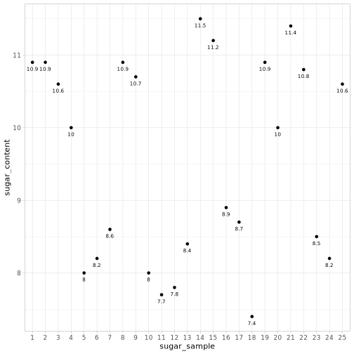

STAT 671: Statistical Learning

Support Vector Machines
========================================================
author: Di &Shen
date: Dec, 2019
autosize: true
font-family: 'Helvetica'
1. Introduction
2. Support Vector Classifiers - Linear Kernels
3. Polynomial Kernels
4. Radial Basis Function Kernels

Introduction
========================================================

1. Identifying decision boundaries

2. Find the maximal margin separator

3. Generating a linearly separable dataset

4. Generate a 2d uniformly distributed dataset.

5. Create a decision boundary

6. Introduce a margin in the dataset

Visualizing
========================================================

- a 1-dimensional scatter plot of 25 soft drink sugar content measurements. 
 
- visualize distinct clusters in the dataset as a first step towards identifying candidate decision boundaries.

Support Vector Classifiers - Linear Kernels
========================================================

# Polynomial Kernels

# Radial Basis Function Kernels
