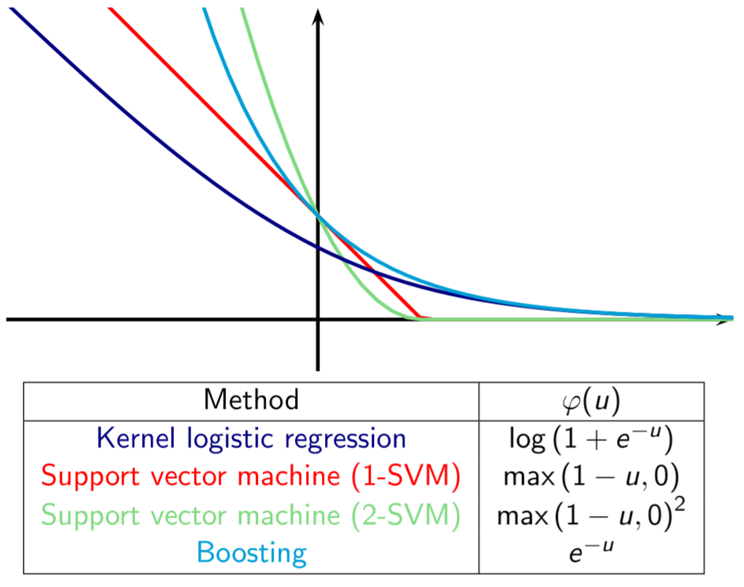

```{r setup, include=FALSE}
knitr::opts_chunk$set(echo=FALSE, message=FALSE, warning=F,fig.align='center')
options(scipen=100)
options(digits=3)

if (!require("pacman")) {install.packages("pacman"); library(pacman)}
# special installation process for printr as it is not available on CRAN
pacman::p_load(tidyverse, knitr, readr, pander, ggplot2)
library(e1071) 
panderOptions("digits", 2)
panderOptions('round', 2)
panderOptions('keep.trailing.zeros', TRUE)
panderOptions('keep.line.breaks', TRUE)
```


# 

- Kernel Methods: 
  * Supervised Learning 
    + Kernel ridge regression 
    + Kernel logistic regression 
    + Large-margin classifiers 
    + Interlude: convex optimization and duality 
    + Support vector machines


## Motivation: A 1-D Example

```{r, echo=F,out.width='75%'}
# Create the data frame.
sugar <- data.frame(
   sugar_sample = as.factor(c (1:25)),
   sugar_content=c(10.9,10.9,10.6,10.0,8.0,8.2,8.6,10.9,10.7,8.0,7.7,7.8,8.4,11.5,11.2,8.9,8.7,7.4,10.9,10.0,11.4,10.8,8.5,8.2,10.6)
)
plot_1 <- ggplot(data =sugar, aes(x = sugar_content, y =0)) + 
    geom_point() + theme_light()+
    geom_text(aes(label = sugar_content), size = 2.5, vjust = 2, hjust = 0.5)
plot_1
```

25 soft drink sugar content measurements. 
The distinct clusters for identifying candidate decision boundaries.

## The maximal margin separator

```{r,echo=T}
mm_separator <- (8.9 + 10)/2
```

```{r,echo=F,out.width='75%'}
#create data frame containing the maximum margin separator
separator <- data.frame(sep = mm_separator)
#add ggplot layer 
plot_sep <- plot_1 + geom_point(data = separator, aes(x = sep, y = 0), color = "blue", size = 4)
#display plot
plot_sep
```

The maximal margin separator is at the midpoint of the two extreme points in each cluster.

## Find the maximal margin separator

Identified two distinct clusters (classes).

A dataset in which the classes do not overlap is called separable, the classes being separated by a decision boundary. 

The maximal margin separator is the decision boundary that is furthest from both classes. 

The relevant points are the highest valued point in the low sugar content class and the lowest valued point in the high sugar content class. 


## Example 2: A 2d dataset. 

```{r, echo=F}
#set seed
set.seed(42)
#set number of data points. 
n <- 600
#Generate data frame with two uniformly distributed predictors.
df <- data.frame(x1 = runif(n,0,1),x2 = runif(n,0,1))
#classify data points depending on location
df$y <- factor(ifelse(df$x2 - 1.4*df$x1 < 0, -1, 1), 
    levels = c(-1, 1))
```


```{r,echo=F,out.width='75%'}
#set margin
delta <- 0.1
# retain only those points that lie outside the margin
df1 <- df[abs(1.4*df$x1 - df$x2) > delta, ]
#build plot
plot_margins <- ggplot(data = df1, aes(x = x1, y = x2, color = y)) + geom_point() + 
    scale_color_manual(values = c("red", "blue")) + 
    geom_abline(slope = 1.4, intercept = 0)+
    geom_abline(slope = 1.4, intercept = delta, linetype = "dashed") +
    geom_abline(slope = 1.4, intercept = -delta, linetype = "dashed")
#display plot 
plot_margins
```

A decision boundary and a margin. Add a class variable to that dataset by creating a variable y whose value is -1 or +1 depending on whether the point (x1, x2) lies below or above the straight line that passes through the origin and has slope 1.4.


## Definition 

Consider the $\ell_2$ regularized empirical risk function

$$J(\vec{w}, \lambda)=\sum\limits{i=1}^N L(y_i, \hat{y_i})+\lambda\lVert\vec{w}\rVert^2$$
where $\hat{y_i}=\vec{w}^T\vec{x}_i+w_0$.

If $L$ is <span class="red2">quadratic loss</span>, this is equivalent to ridge regression.  
If $L$ is the <span class="red2">log-loss</span>, this is equivalent to logistic regression.
If we replace the loss function with <span class="red2">hinge loss function</span>, we can ensure that the solution is sparse, so that predictions only depend on a subset of the training data, known as support vectors. This combination of the kernel trick plus a modified loss function is known as a <b>support vector machine</b> or SVM. 

## Hinge Loss
Linear support vector machines can also be interpreted as hinge loss minimization:
$$\min_{\vec{w},b} \sum\limits_{i=1}^N{L(y_i,f(\vec{x}_i))} + \lambda\|\vec{w}\|^2$$
where $L(y, f(\vec{x}))$ is a hinge loss function:

$$L(y, f(\vec{x})) = \begin{cases}1-yf(x),  & 1-yf(x) > 0 \\0,  & 1-yf(x) \leqslant 0\end{cases}$$

##

```{r  out.width = "75%"}
 
```


## Definition 

The hinge loss is the function $\mathbb{R}\to\mathbb{R}_+$: 

$$\varphi_{hinge}(u) = \max(1-u,0) =\begin{cases}0 &\text{if  } u\ge 1,\\ 1-u& \text{otherwise}. \end{cases}$$

SVM is the corresponding large-margin classifier, which solves:
$$\underset{f\in\mathcal{H}}{\min}\frac1n\sum_{i=1}^n\varphi_{hinge}(y_if(x_i)) + \lambda\|f\|^2_\mathcal{H}$$


## Support vectors 

The training points with $\alpha_i\neq0$ are called support vectors. 
Only support vectors are important for the classification of new points:

$$\forall x\in\mathcal{X},\ f (x) =\sum_{i=1}^n\alpha_i K (x_i,x)=\sum_{i\in SV}\alpha_i K (x_i,x) $$
where SV is the set of support vectors.

##

```{r  out.width = "75%"}
 
```


## Primal form
Representation

$$\mathcal{H}:y=f(\vec{x})=\text{sign}(\vec{w}\vec{x}+b)$$

Evaluation

$$\min_{\vec{w},b} \frac{1}{2}\|\vec{w}\|^2\quad \text{s.t.}\quad  y_i(\vec{w}\vec{x}_i+b)\geqslant 1, i=1,2, \dots , N$$

## Primal form

By the representer theorem, the solution satisfies
$$\hat f (x) =\sum_{i=1}^n\hat\alpha_i K (x_i,x) $$,
where $\hat\alpha$ solves

$$\underset{\alpha\in\mathbb{R^n}}{\min}\frac1n\sum_{i=1}^n\varphi_{hinge}(y_i[K\alpha]_i) + \lambda\alpha^TK\alpha$$

This is a convex optimization problem But the objective function is not smooth (because of the hinge loss)


<!--
## Solving the SVM problem

This is a classical quadratic program (minimization of a convex quadratic function with linear constraints) for which any out-of-the-box optimization package can be used. 

The dimension of the problem and the number of constraints, however, are 2n where n is the number of points. General-purpose QP solvers will have difficulties when n exceeds a few thousands. 

Solving the dual of this problem (also a QP) will be more convenient and lead to faster algorithms (due to the sparsity of the final solution).
-->

## Dual form {.smaller}
Representation
$\mathcal{H}:y=f(\vec{x})=\text{sign}\left(\sum\limits_{i=1}^N{\alpha_iy_i(\vec{x} \cdot \vec{x}_i)}+b\right)$

Evaluation
$$\min_{\alpha}  \frac{1}{2} \sum\limits_{i=1}^N\sum\limits_{j=1}^N \alpha_i\alpha_j y_i y_j (\vec{x}_i \cdot \vec{x}_j) - \sum\limits_{i=1}^N \alpha_i$$
s.t.  $\sum\limits_{i=1}^N\alpha_i y_i=0\quad \alpha_i \geqslant 0, i=1,2, \dots, N$

$$\underset{\alpha\in\mathbb{R^n}}{\max}2\sum_{i=1}^n\alpha_i y_i -\sum_{i,j=1}^n\alpha_i\alpha_j K(x_i,x_j)=2\alpha^Ty-\alpha^TK\alpha$$
subject to:
$0\le y_i\alpha_i\le\frac1{2\lambda n}, \text{for } i = 1,...,n$

<!--

## Primal and Dual

$$\alpha^\star\left[1-y_if^\star(x_i)\right]=0$$

$$\implies\begin{cases}\alpha^\star>0&\Rightarrow y_if^\star(x_i)=1\\ \alpha^\star=0&\Leftarrow y_if^\star(x_i)>1\\ \alpha^\star<0&\text{not exist}\\
\text{not exist}&\Leftarrow y_if^\star(x_i)<1\end{cases}$$

The examples in the first category, for which the scaled margin is 1 and the constraints are active are called support vectors. They are the closest to the decision boundary.

-->

## Slack variables {.smaller}

Let us introduce additional slack variables $\xi_1,...,\xi_n\in\mathbb{R}$. The problem is equivalent to:

$$\underset{\alpha\in\mathbb{R^n},\xi\in\mathbb{R^n}}{\min}\left\{\frac1n\sum_{i=1}^n\xi_i + \lambda\alpha^TK\alpha\right\}$$
subject to:
$$\xi_i\ge \varphi_{hinge}(y_i[K\alpha]_i)$$
The objective function is now smooth, but not the constraints 
However it is easy to replace the non-smooth constraint by a cunjunction of two smooth constraints, because: 

$$u \ge\varphi_{hinge}(v)\iff \begin{cases}u\ge 1-v \\u\ge 0\end{cases}$$

## slack variables

<div class="columns-2">
</div>

```{r  out.width = "75%"}
 
```

The solution is sparse in $\alpha$, leading to fast algorithms for training (use of decomposition methods). 

The classification of a new point only involves kernel evaluations with support vectors (fast).


##  Slack variables {.smaller}

Representation
$\mathcal{H}:y=f(\vec{x})=\text{sign}(\vec{w}\vec{x}+b)$

Evaluation
$\min_{\vec{w},b}  C \sum\limits_{i=1}^N\xi_i + \frac{1}{2}\|\vec{w}\|^2$

s.t. $$ y_i(\vec{w}\vec{x}_i+b)\geqslant 1-\xi_i\quad  \xi_i \geqslant 0, \quad i=1,2, \dots, N $$

the SVM solution is
$\hat f (x) =\sum_{i=1}^n\hat\alpha_i K (x_i,x)$,

where $\hat\alpha$ solves: 
$\underset{\alpha\in\mathbb{R^n},\xi\in\mathbb{R^n}}{\min}\left\{\frac1n\sum_{i=1}^n\xi_i + \lambda\alpha^TK\alpha\right\}$

subject to:
$\begin{cases}(y_i[K\alpha]_i +\xi_i -1\ge 0,& \text{for} i = 1,...,n,\\\xi_i\ge 0,& \text{for} i = 1,...,n\end{cases}$

<!--

## Dual form with slack variables {.smaller}
Representation
$\mathcal{H}:y=f(\vec{x})=\text{sign}\left(\sum\limits_{i=1}^N{\alpha_iy_i(\vec{x} \cdot \vec{x}_i)}+b\right)$

Evaluation
$\min_{\alpha} \frac{1}{2} \sum\limits_{i=1}^N\sum\limits_{j=1}^N \alpha_i\alpha_j y_i y_j (\vec{x}_i \cdot \vec{x}_j) - \sum\limits_{i=1}^N \alpha_i$

 s.t.  $\sum\limits_{i=1}^N\alpha_i y_i=0 \quad 0 \leqslant  \alpha_i \leqslant C, i=1,2, \dots, N$

$$\begin{align*}
\alpha_i=0 &\Rightarrow y_i(\vec{w} \cdot \vec{x}_i+b)\geqslant 1 \\
\alpha_i=C &\Rightarrow y_i(\vec{w} \cdot \vec{x}_i+b)\leqslant 1 \\
0<\alpha_i<C &\Rightarrow y_i(\vec{w} \cdot \vec{x}_i+b)= 1
\end{align*}$$

-->

## Soft margin classifiers and nonseparatable Data

```{r,echo=F}
set.seed(1) #set seed for reproducibility 
df[,"train"] <- ifelse(runif(nrow(df))<0.8,1,0) #assign rows to training/test sets randomly in 80/20 proportion 
trainset <- df[df$train==1,] #separate training and test sets 
testset <- df[df$train==0,] 
trainColNum <- grep("train", names(trainset)) 
trainset <- trainset[,-trainColNum] 
testset <- testset[,-trainColNum] 
```

```{r,echo=F}
library(e1071) 
svm_model<- svm(y ~ .,data = trainset,type = "C-classification",kernel = "linear",scale = FALSE) 
```

```{r,echo=F}
pred_train <- predict(svm_model,trainset) #training accuracy 
# mean(pred_train==trainset$y)
pred_test <- predict(svm_model,testset) 
# mean(pred_test==testset$y)#test accuracy 
```

```{r,out.width='75%'}
#visualize training data, distinguish classes using color 
p <- ggplot(data = trainset, aes(x = x1, y = x2, color = y)) +geom_point() +scale_color_manual(values = c("red","blue")) 
df_sv <- trainset[svm_model$index,] #identify support vectors 
p<-p+geom_point(data=df_sv,aes(x=x1,y=x2),color="purple",size=3,alpha=0.5) #mark out support vectors in plot 
w <- t(svm_model$coefs) %*% svm_model$SV #build weight vector 
slope_1 <- -w[1]/w[2] #calculate slope and save it to a variable 
intercept_1 <- svm_model$rho/w[2] #calculate intercept and save it to a variable 
#plot decision boundary based on  calculated slope and intercept 
p <-p+geom_abline(slope=slope_1,intercept = intercept_1) 
#add margins to plot 
p <- p +geom_abline(slope=slope_1,intercept=intercept_1-1/w[2],linetype="dashed")+geom_abline(slope=slope_1,intercept=intercept_1+1/w[2],linetype="dashed") 
p #display plot 
```


## C-SVM {.smaller}

Often the SVM optimization problem is written in terms of a regularization parameter $C$ instead of $\lambda$ as follows:

$$\underset{f\in\mathcal{H}}{\arg\min}\left\{\frac12\|f\|^2_\mathcal{H}+C\sum_{i=1}^nL_{hinge}(f(x_i),y_i)\right\}$$

This is equivalent to our formulation with $C=\frac1{2\lambda n}$. 

The SVM optimization problem is then:

$$\underset{\alpha\in\mathbb{R^d}}{\max}\left\{2\sum_{i=1}^n\alpha_i y_i -\sum_{i,j=1}^n\alpha_i\alpha_j K(x_i,x_j)\right\}$$

subject to:
$0\le y_i\alpha_i\le C, \text{for } i = 1,...,n$
This formulation is often called C-SVM.

## C-SVM


## 2-SVM

A variant of the SVM, sometimes called 2-SVM, is obtained by replacing the hinge loss by the square hinge loss:

$$\underset{f\in\mathcal{H}}{\min}\left\{\frac1n\sum_{i=1}^n\varphi_{hinge}(y_if(x_i))^2 + \lambda\|f\|^2_\mathcal{H}\right\}$$

The dual problem of the 2-SVM is:

$$\underset{\alpha\in\mathbb{R^d}}{\max}\left\{2\alpha^Ty-\alpha^T(K+n\lambda I)\alpha\right\}$$
$$0\le y_i\alpha_i,\ \text{for } i = 1,...,n$$

This is therefore equivalent to the previous SVM with the kernel $K + n\lambda I$ and $C=+\infty$


## A radially 2d non-linear Example
 
```{r,echo=F}
n <- 200 #set required number of datapoints 
set.seed(42)  #set seed to ensure reproducibility 
df <- data.frame(x1 = runif(n, min = -1, max = 1),x2 = runif(n, min = -1, max = 1)) #Generate dataframe with 2 predictors x1 and x2 in (-1,1) 
radius <- 0.7 
radius_squared <- radius^2 
#categorize data points depending on location wrt boundary 
df$y <- factor(ifelse(df$x1^2 + df$x2^2 < radius_squared, -1, 1),levels = c(-1,1)) 

# function generates dataframe with points lying on a circle of radius r 
circle <-function(x1_center, x2_center, r, npoint = 100){    #angular spacing of 2*pi/npoint between points   
  theta <- seq(0,2*pi,length.out = npoint)   
  x1_circ <- x1_center + r * cos(theta)   
  x2_circ <- x2_center + r * sin(theta) 
  return(data.frame(x1c = x1_circ, x2c = x2_circ)) } 
boundary <- circle(x1_center = 0,x2_center = 0,r = radius) #generate boundary 
```

<div class="columns-2">

```{r,out.width='100%'}
p <- ggplot(data = df, aes(x = x1, y = x2, color = y)) +geom_point() +scale_color_manual(values = c("-1" = "red","1" = "blue")) #build plot 
p <-p+geom_path(data = boundary,aes(x = x1c, y = x2c),inherit.aes = FALSE)  #add boundary to previous plot 
p #display plot
```


```{r,out.width='100%'}
#transform data
df1 <- data.frame(x1sq = df$x1^2, x2sq = df$x2^2, y = df$y)
p<-ggplot(data=df1,aes(x=x1sq,y=x2sq,color=y))+geom_point()+scale_color_manual(values=c("red","blue"))+geom_abline(slope=-1,intercept=0.49) 
p 
```

</div>

2 predictors x1 and x2, uniformly distributed between -1 and 1.

##

```{r,echo=F}
df[,"train"] <- ifelse(runif(nrow(df))<0.8,1,0) #assign rows to training/test sets randomly in 80/20 proportion 
trainset <- df[df$train==1,] #separate training and test sets 
testset <- df[df$train==0,] 
trainColNum <- grep("train", names(trainset)) 
trainset <- trainset[,-trainColNum] 
testset <- testset[,-trainColNum] 

tune_out <- 
  tune.svm(x = trainset[,-3], y = trainset[,3], 
        type = "C-classification", kernel = "polynomial", degree = 2,
        cost = 10^(-1:2), gamma = c(0.1,1,10), coef0 = c(0.1,1,10))

svm_model <- svm(y~ ., data = trainset, type = "C-classification",
        kernel = "polynomial", degree = 2,
        cost = tune_out$best.parameters$cost,
        gamma = tune_out$best.parameters$gamma,
        coef0 = tune_out$best.parameters$coef0)
```


```{r,echo=F,out.width='100%'}
pred_test <- predict(svm_model, testset)  #predictions 
mean(pred_test==testset$y)
plot(svm_model, trainset) #visualize model 
```

## A more complex Example


```{r,echo=F}
rm(list = ls())
n <- 600 
set.seed(42) 
df <- data.frame(x1 = rnorm(n, mean = -0.5, sd = 1),x2 = runif(n, min = -1, max = 1)) 
# Generate boundary
radius <- 0.7 #set radius and centers 
radius_squared <- radius^2 
center_1 <- c(-0.7,0) 
center_2 <- c(0.7,0) 

df$y<-factor(ifelse((df$x1-center_1[1])^2+(df$x2-center_1[2])^2<radius_squared|(df$x1-center_2[1])^2+(df$x2-center_2[2])^2 <radius_squared,-1,1), levels = c(-1,1)) #classify points 

df[,"train"] <- ifelse(runif(nrow(df))<0.8,1,0) #assign rows to training/test sets randomly in 80/20 proportion 
trainset <- df[df$train==1,] #separate training and test sets 
testset <- df[df$train==0,] 
trainColNum <- grep("train", names(trainset)) 
trainset <- trainset[,-trainColNum] 
testset <- testset[,-trainColNum] 

#tune parameters 
tune_out <- tune.svm(x = trainset[,-3],y = trainset[,3],gamma = 5*10^(-2:2),cost = c(0.01,0.1,1,10,100),type = "C-classification",kernel = "radial") 
svm_model <- svm(y~ .,data=trainset,type="C-classification",kernel="radial",cost=tune_out$best.parameters$cost, gamma=tune_out$best.parameters$gamma) 
```


```{r,echo=F,out.width='100%'}
#function to generate points on a circle 
circle <- function(x1_center, x2_center, r, npoint = 100){
  theta <- seq(0,2*pi, length.out = npoint)
  x1_circ <- x1_center+r*cos(theta)
  x2_circ <- x2_center + r * sin(theta)    
  return(data.frame(x1c = x1_circ, x2c = x2_circ)) } 
# generate boundary and plot it 
boundary_1 <- circle(x1_center = center_1[1],x2_center = center_1[2],r = radius) 
p <- ggplot(data = df, aes(x=x2,y=x1,color=y))+geom_point()+guides(color = FALSE)+scale_color_manual(values=c("red","blue"))
p <- p +geom_path(data = boundary_1,aes(x = x2c, y = x1c),inherit.aes = FALSE) 
boundary_2 <- circle(x2_center = center_2[1], x1_center = center_2[2],r = radius) 
p <- p + geom_path(data = boundary_2,aes(x = x1c, y = x2c),inherit.aes = FALSE) 
p 
```

600 points (x1,x2) x1 and x2 distributed differently

##

```{r,out.width='100%'}
pred_test <- predict(svm_model, testset)  #predictions 
mean(pred_test==testset$y)
plot(svm_model, trainset)
```


## Note

Historically the first “kernel method” for pattern recognition, still the most popular. 

Often state-of-the-art in performance. 

One particular choice of loss function (hinge loss).

Leads to a sparse solution, i.e., not all points are involved in the decomposition (compression). 

Particular algorithm for fast optimization (decomposition by chunking methods).


<!--

## Note


SVMs are very unnatural from a probabilistic point of view. 

- First, they encode sparsity in the loss function rather than the prior.

- Second, they encode kernels by using an algorithmic trick, rather than being an explicit part of the model.

- Finally, SVMs do not result in probabilistic outputs, which causes various difficulties, especially in the multi-class classification setting.


It is possible to obtain sparse, probabilistic, multi-class kernel-based classifiers, which work as well or better than SVMs, using techniques such as the L1VM or RVM.


-->


## Summary {.smaller}

SVM classifiers involve three key ingredients: <span class="red2"> the kernel trick, sparsity, and the large margin principle </span>. 

The kernel trick is necessary to prevent underfitting, i.e., to ensure that the feature vector is sufficiently rich that a linear classifier can separate the data. 

If the original features are already high dimensional, it suffices to use a linear kernel, $K(x,x') = x^Tx'$ , which is equivalent to working with the original features. 

The sparsity and large margin principles are necessary to prevent overfitting, i.e., to ensure that we do not use all the basis functions. 
These two ideas are closely related to each other,and both arise (in this case) from the use of the hinge loss function. 

However, there are other methods of achieving sparsity (such as $\ell_1$), and also other methods of maximizing the margin(such as boosting). 

## Experiments

Chapelle, O. (2007). Training a support vector machine in the primal. Neural computation, 19(5), 1155-1178.


## 

```{r  out.width = "75%"}
include_graphics("algorithm.png") 
```


#


<!--

# Backup


# Support Vector Classifiers - Linear Kernels

## Split into training and test sets

The dataset generated in previous chapter is in dataframe df. 

Split dataset into training and test sets 

Random 80/20 split 


## Decision boundaries and kernels

Decision boundaries can have different shapes - lines, polynomials or more complex functions. 

Type of decision boundary is called a kernel. 

Kernel must be specified upfront. 

This chapter focuses on linear kernels.

## SVM with Linear Kernel

We'll use the svm function from the e1071 library. 

The function has a number of parameters. We'll set the following explicitly: 

formula - a formula specifying the dependent variable. y in our case. 

data - dataframe containing the data - i.e. trainset. 

type - set to C-classification(classification problem). 

kernel - this is the form of the decision boundary, linear in this case. 

cost and gamma - these are parameters that are used to tune the model. 

scale - Boolean indicating whether to scale data.

## Building a Linear SVM


Model Accuracy

Obtain class predictions for training and test sets. 

Evaluate the training and test set accuracy of the model. 


## Soft margin classifiers

Allow for uncertainty in location / shape of boundary 

  Never perfectly linear 

  Usually unknown 

Our decision boundary is linear, so we can reduce margin


## Tuning linear SVMs

```{r,eval=F}
library(e1071) 
svm_model<- svm(y ~ .,data = trainset,type = "C-classification",kernel = "linear",cost = 100,scale = FALSE) 
#print model summary 
svm_model
pred_test <- predict(svm_model,testset) #test accuracy 
mean(pred_test==testset$y)
```

## Multiclass problems

150 measurements of 5 attributes;  
Petal width and length - number (predictor variables);  
Sepal width and length - number (predictor variables);  
Species - category: setosa, virginica or versicolor (predicted variable) 

```{r, eval=F,out.width='50%'}
#plot petal length vs width for dataset, distinguish species by color 
p <- ggplot(data = iris,aes(x = Petal.Width,y = Petal.Length,color = Species)) +geom_point() 
p  #display plot 
```

## How does the SVM algorithm deal with multiclass problems?

SVMs are essentially binary classifiers. 

Can be applied to multiclass problems using the following voting strategy: 

- Partition the data into subsets containing two classes each. 

- Solve the binary classification problem for each subset. 

- Use majority vote to assign a class to each data point. 

Called one-against-one classification strategy.


# Polynomial Kernels


Create a circular decision boundary of radius 0.7 units 

Categorical variable y is +1 or -1 depending on the point lies outside or within boundary


## Transforming the problem

Equation of boundary is x1^2 + x2^2 = 0.49 

Map x1^2 to a new variable X1 and x2^2 to X2 

The equation of boundary in the X1-X2 space becomes... X1 + X2 = 0.49 (a line!!)


## The Polynomial Kernel - Part 1

Polynomial kernel: (gamma*(u.v)+coef0)^degree 

- degree = degree of polynomial 

- gamma and coef0- tuning parameters 

- u, v - vectors (datapoints) belonging to the dataset 

We can guess we need a 2nd degree polynomial (transformation)

## Kernel functions

The math formulation of SVMs requires transformations with specific properties. 

Functions satisfying these properties are called kernel functions 

Kernel functions are generalizations of vector dot products 

Basic idea* - use a kernel that separates the data well!

## Radially separable dataset - quadratic kernel

80/20 train/test split 

Build a quadratic SVM for the radially separable dataset: 

- degree =2 

- default values of cost, gamma and coef0 (1, 1/2 and 0) 


# Radial Basis Function Kernels

## Generate a complex dataset

600 points (x1,x2) x1 and x2 distributed differently

```{r}
rm(list = ls())
n <- 600 
set.seed(42) 
df <- data.frame(x1 = rnorm(n, mean = -0.5, sd = 1),x2 = runif(n, min = -1, max = 1)) 
# Generate boundary
radius <- 0.7 #set radius and centers 
radius_squared <- radius^2 
center_1 <- c(-0.7,0) 
center_2 <- c(0.7,0) 

df$y<-factor(ifelse((df$x1-center_1[1])^2+(df$x2-center_1[2])^2<radius_squared|(df$x1-center_2[1])^2+(df$x2-center_2[2])^2 <radius_squared,-1,1), levels = c(-1,1)) #classify points 
```

```{r,echo=F}
df[,"train"] <- ifelse(runif(nrow(df))<0.8,1,0) #assign rows to training/test sets randomly in 80/20 proportion 
trainset <- df[df$train==1,] #separate training and test sets 
testset <- df[df$train==0,] 
trainColNum <- grep("train", names(trainset)) 
trainset <- trainset[,-trainColNum] 
testset <- testset[,-trainColNum] 
```


```{r,eval=F,out.width='50%'}
#function to generate points on a circle 
circle <- function(x1_center, x2_center, r, npoint = 100){
  theta <- seq(0,2*pi, length.out = npoint)
  x1_circ <- x1_center+r*cos(theta)
  x2_circ <- x2_center + r * sin(theta)    
  return(data.frame(x1c = x1_circ, x2c = x2_circ)) } 
# generate boundary and plot it 
boundary_1 <- circle(x1_center = center_1[1],x2_center = center_1[2],r = radius) 
p <- ggplot(data = df, aes(x=x2,y=x1,color=y))+geom_point()+guides(color = FALSE)+scale_color_manual(values=c("red","blue"))
p <- p +geom_path(data = boundary_1,aes(x = x2c, y = x1c),inherit.aes = FALSE) 
boundary_2 <- circle(x2_center = center_2[1], x1_center = center_2[2],r = radius) 
p <- p + geom_path(data = boundary_2,aes(x = x1c, y = x2c),inherit.aes = FALSE) 
p 
```


```{r,eval=F,out.width='50%'}
svm_model<- svm(y ~ .,data = trainset,type = "C-classification",kernel = "radial") 
pred_train <- predict(svm_model, trainset) 
mean(pred_train==trainset$y)
pred_test <- predict(svm_model, testset) 
mean(pred_test==testset$y) 
plot(svm_model, trainset) #plot decision boundary 
```


```{r,eval=F}
#tune parameters 
tune_out <- tune.svm(x = trainset[,-3],y = trainset[,3],gamma = 5*10^(-2:2),cost = c(0.01,0.1,1,10,100),type = "C-classification",kernel = "radial") 
svm_model <- svm(y~ .,data=trainset,type="C-classification",kernel="radial",cost=tune_out$best.parameters$cost, gamma=tune_out$best.parameters$gamma) 
mean(pred_test==testset$y)
```

```{r,eval=F,out.width='50%'}
plot(svm_model, trainset)
```

##

```{r,out.width='50%'}
#rbf function 
rbf <- function(r, gamma) exp(-gamma*r) 
ggplot(data.frame(r = c(-0, 10)), aes(r))+ggtitle("Radial basis function (gamma=0.2 to 2)") +
  stat_function(fun = rbf, args = list(gamma = 0.2), aes(color = "0.2")) +
  stat_function(fun = rbf, args = list(gamma = 0.4), aes(color = "0.4")) +
  stat_function(fun = rbf, args = list(gamma = 0.6), aes(color = "0.6")) +
  stat_function(fun = rbf, args = list(gamma = 0.8), aes(color = "0.8")) +
  stat_function(fun = rbf, args = list(gamma = 1), aes(color = "1")) +
  stat_function(fun = rbf, args = list(gamma = 2), aes(color = "2"))+
  scale_color_manual("gamma",values = c("red","orange","yellow","green","blue","violet"))
```


```{r, eval=F}
install.packages("e1071")
library(e1071)
methods(svm)
getAnywhere(svm.default)
getAnywhere(svm.formula)
```

<!--
https://youtu.be/QRjllL-MP0U

Clair de lune v.s. Mondscheinsonate

https://terrytao.wordpress.com/2019/08/13/eigenvectors-from-eigenvalues/

-->
